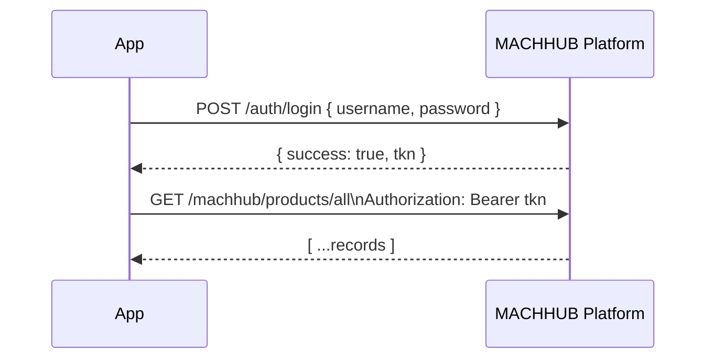

Every request to the management plane is authenticated with one of two credentials: a
**JWT** obtained by logging in, or an **API key**. This page documents the login and
permission endpoints and how to present each credential.

## Endpoints

| Method | Path | Purpose |
| --- | --- | --- |
| `POST` | `/auth/login` | Exchange username/password for a JWT |
| `POST` | `/machhub/auth/login` | Same login, mounted on the data plane (used by the SDK) |
| `GET` | `/auth/permission/action/feature/:feature/scope/:scope` | Check the caller's permission for a feature/scope |

`/auth/login` and `/machhub/auth/login` are the **same** handler mounted on two
prefixes — either works.

## Logging in

Send credentials as JSON:

```http
POST /auth/login
Content-Type: application/json

{ "username": "admin", "password": "••••••••" }
```

On success the response contains an EdDSA-signed JWT in the `tkn` field:

```json
{ "success": true, "tkn": "<jwt>" }
```

Bad credentials return `401 Unauthorized` with a plain-text body
(`Invalid Username or Password`); a malformed body returns `400 Bad Request`.



## Presenting a credential

Send **one** of these headers on each request.

### JWT (Bearer token)

```http
Authorization: Bearer <jwt>
```

The token is signed with **EdDSA** (Ed25519). MACHHUB verifies it against its
configured public key; the claims carry the user identity used for permission checks.

### API key

```http
X-Machhub-Api-Key: mchx_<key><secret>
```

API keys are prefixed `mchx_` and are created in the console or via
`POST /api/api-key/generate` (see the [Management API](/api/management/)). The full
key is shown **once** at creation — store it securely.

:::note[No refresh tokens]
MACHHUB does not issue refresh tokens. When a JWT expires, log in again to obtain a
new one. API keys do not expire on their own unless you set an expiration when
generating them.
:::

## Checking a permission

The permission endpoint reports the caller's effective access to a
[feature](/concepts/authorization/) within a scope. It is driven by
[Casbin](/concepts/authorization/) RBAC.

```http
GET /auth/permission/action/feature/users/scope/all
```

The response reports the list of actions the caller is granted for that
feature/scope:

```json
{ "actions": ["read", "create", "update"] }
```

`actions` is an array of the granted action verbs (an empty array `[]` means no
access). Actions are the domain's configured verbs — built-ins such as `read` and
`read-write`, plus any custom actions (e.g. `export`). The endpoint always returns
`200 OK`; inspect `actions` to decide what the caller may do.

## Related

- Concept: [Authentication](/concepts/authentication/) and
  [Authorization & Permissions](/concepts/authorization/)
- SDK: [Authentication](/sdk/authentication/)
- API: [Data plane](/api/data-plane/), [Management API](/api/management/),
  [Conventions & errors](/api/errors/)
