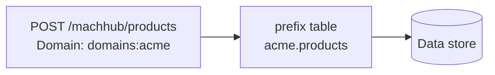

The `/machhub/*` surface is the **data plane**: generic record CRUD, tag reads,
historian access, flow/function execution, and code uploads. This is what the
[SDK](/sdk/architecture/), devices, and integrations mostly talk to. Every route in
this group reads the [`Domain`](#the-domain-header) header to select the active
tenant.

## Records (generic CRUD)

Create, read, update, and delete records in any [Collection](/concepts/collections/)
table by name.

| Method | Path | Purpose |
| --- | --- | --- |
| `GET` | `/machhub/:table_name/all` | List all records in a table (supports list query params) |
| `GET` | `/machhub/:table_name/count` | Count records in a table |
| `GET` | `/machhub/:id` | Get one record by its full [RecordID](/sdk/record-id/) |
| `POST` | `/machhub/:table_name` | Create a record in a table |
| `PUT` | `/machhub/:id` | Update a record by its full RecordID |
| `DELETE` | `/machhub/:id` | Delete a record by its full RecordID |

The list endpoint accepts filtering, sorting, and pagination parameters — see
[Conventions & errors](/api/errors/#list-query-parameters). For example:

```http
GET /machhub/products/all?filter[status][eq][string]=active&sort=[name][asc]&limit=20&offset=0
Authorization: Bearer <jwt>
Domain: domains:acme
```

A create posts a JSON object:

```http
POST /machhub/products
Content-Type: application/json
Domain: domains:acme

{ "name": "Widget", "price": 9.99 }
```

:::caution[`:id` operations need the full RecordID]
`GET`, `PUT`, and `DELETE` on `/machhub/:id` take a complete RecordID — the
table-prefixed form like `acme.products:abc123`, not the bare key. The same applies
to relation fields in a record body. See [Record IDs](/sdk/record-id/).
:::

## Tags

| Method | Path | Purpose |
| --- | --- | --- |
| `GET` | `/machhub/tag/list` | List the [tags](/concepts/unified-namespace/) for the active domain |

## Historian

| Method | Path | Purpose |
| --- | --- | --- |
| `GET` | `/machhub/historian/list` | List the historized tags for the active domain |
| `PATCH` | `/machhub/historian` | Query time-series data for a topic over a time range |

The `PATCH /machhub/historian` body selects a topic, a start time, and a range:

```http
PATCH /machhub/historian
Content-Type: application/json
Domain: domains:acme

{ "topic": "line1/oven/temperature", "start_time": "2026-06-01T00:00:00Z", "range": "24h" }
```

## Device & UNS info

| Method | Path | Purpose |
| --- | --- | --- |
| `GET` | `/machhub/` | Device name, UNS base path, MQTT/WS bind info, storage, and version |

The response reports the device identity and how to reach the embedded MQTT broker:

```json
{
  "device_name": "edge-01",
  "uns": {
    "basePath": "machhub",
    "bind": {
      "mqtt":  { "host": "127.0.0.1", "port": "1883", "enabled": true },
      "mqtts": { "host": "127.0.0.1", "port": "8883", "enabled": false },
      "ws":    { "host": "127.0.0.1", "port": "8083", "enabled": true },
      "wss":   { "host": "127.0.0.1", "port": "443",  "enabled": false }
    }
  },
  "version": "..."
}
```

The SDK calls this on initialization to discover the broker. In a browser, connect
over MQTT-WebSocket (`ws`/`wss`) rather than the raw TCP port — see
[Troubleshooting](/reference/troubleshooting/).

## The `Domain` header

MACHHUB is multi-tenant. Select the active [Domain](/concepts/domains/) with a header:

```http
Domain: domains:acme
```

If the header is omitted, requests default to the built-in admin domain
`domains:machhub_admin`. On the data plane the active domain also **name-prefixes**
your tables: a request to `/machhub/products/all` under `domains:acme` reads the table
`acme.products` — the prefix is `<domain>.<table>` (the domain's name, without the
`domains:` part).



## Related

- SDK: [Collections](/sdk/collections/), [Record IDs](/sdk/record-id/),
  [File handling](/sdk/file-handling/)
- API: [Authentication](/api/authentication/), [Conventions & errors](/api/errors/)
