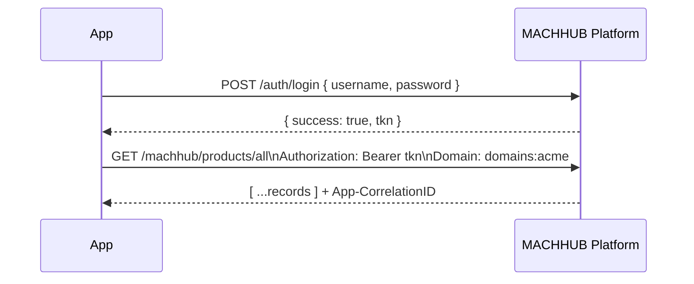

The MACHHUB SDK is a convenience layer over a plain **REST API**. You can call that
API directly — from a server, a script, another language, or an integration. This
section documents the endpoint surface.

## Base paths

| Prefix       | Plane                                                                             | Used by                        |
| ------------ | --------------------------------------------------------------------------------- | ------------------------------ |
| `/auth/*`    | Authentication                                                                    | everyone (login)               |
| `/machhub/*` | SDK / data plane (collections CRUD, tags, historian, processes, functions, flows) | the SDK, devices, integrations |

See [Authentication](/api/authentication/) and [Data plane](/api/data-plane/) for the
full catalogs.

## Authentication

Send **one** of these on each request:

```http
Authorization: Bearer <jwt>
```

or

```http
X-Machhub-Api-Key: mchx_<key-secret>
```

- **JWT** — obtained from `POST /auth/login` with `{ "username", "password" }`; the
  response contains `{ "success": true, "tkn": "<jwt>" }`.
- **API key** — created in the console (Account → Developer Keys). The full key
  (prefix `mchx_`) is shown **once** at creation.

Refresh tokens are **planned but not yet available** — for now, when a JWT expires,
log in again.

## The `Domain` header

MACHHUB is multi-tenant. Select the active [Domain](/concepts/domains/) with a header:

```http
Domain: domains:acme
```

If omitted, requests default to the built-in admin domain `domains:machhub_admin`.
On the data plane, the active domain also name-prefixes your tables
(`<domain>.<table>` — the domain's name, without the `domains:` part).

## Request flow



## Response conventions

- Successful responses are JSON, commonly shaped `{ "success": true, ... }`.
- Errors return an appropriate HTTP status with a plain-text message body.
- Every response includes an **`App-CorrelationID`** header you can use for tracing
  and log correlation.

## List query parameters

List endpoints accept query parameters for filtering, sorting, and pagination:

- `filter[field][op][type]=value`
- `sort=[field][dir]`
- `limit`, `offset`

The SDK builds these for you via its fluent query API — see
[SDK → Collections](/sdk/collections/).

:::caution[Security note]
In the current build, much of the `/machhub/*` data plane is **not** auth-gated by
default. Treat network exposure carefully and put the Platform behind appropriate
network controls. Confirm the enforcement state for your deployment.
:::

Continue to [Authentication endpoints](/api/authentication/) or the
[Data plane](/api/data-plane/).
