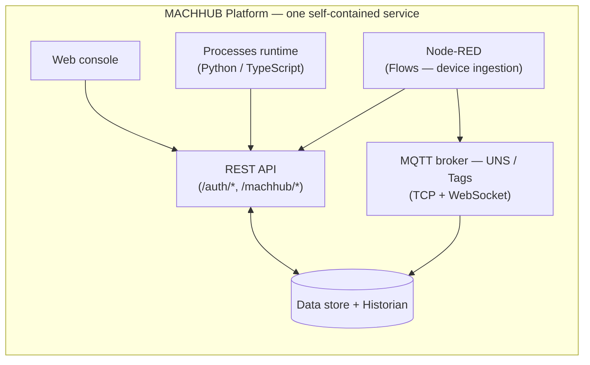
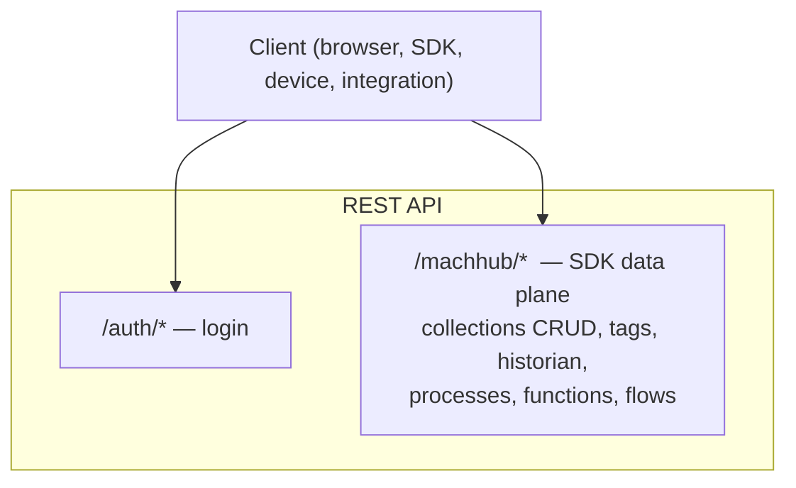
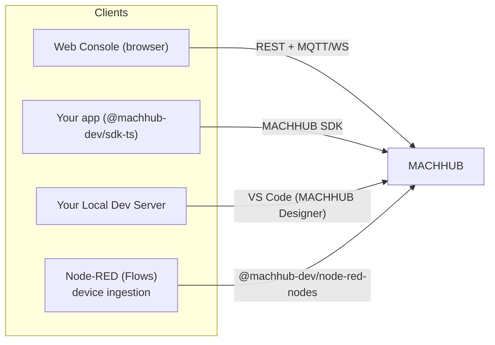
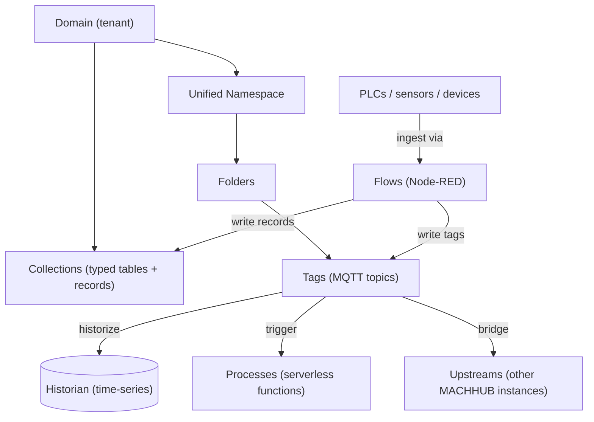

MACHHUB runs as a single self-contained service. Rather than assembling a database, a
message broker, an automation engine, and an API yourself, MACHHUB bundles them and
exposes one coherent surface — so you can run a complete data fabric on anything from
a server to a small edge device.

## What's inside

| Part                       | What it does                                                                                                                    |
| -------------------------- | ------------------------------------------------------------------------------------------------------------------------------- |
| **Web console**            | The browser app you use to operate MACHHUB.                                                                                     |
| **REST API**               | Authentication and the SDK data plane.                                                                                          |
| **MQTT broker**            | The realtime substrate for the Unified Namespace. Speaks MQTT over TCP (default `1883`) and over WebSocket for browsers.        |
| **Processes runtime**      | Run your [Processes](/processes/overview/) (Python or TypeScript).                                                              |
| **Node-RED (Flows)**       | Bundled [Flows](/concepts/processes-and-flows/) engine for ingesting device data via the `@machhub-dev/node-red-nodes` library. |
| **Data store & Historian** | Persists everything — collections and records, the Unified Namespace, users and groups, and time-series history.                |

## The two API surfaces

The REST API is organized into two groups. Knowing which is which makes the rest
of the docs click into place:

- **`/auth/*`** — authentication (e.g. `POST /auth/login`).
- **`/machhub/*`** — the **SDK / data plane**: generic record CRUD, tags, historian,
  processes, functions, and flow execution. This is what the SDK mostly talks to.

See the [REST API Reference](/api/overview/) for the full endpoint catalog.

## How clients connect

- The **web console** calls the REST API and subscribes to tags over
  MQTT-over-WebSocket. (It uses its own thin client — the SDK is for the apps *you*
  build.)
- **Your app** talks to MACHHUB through the **`@machhub-dev/sdk-ts`** SDK, which wraps
  the same REST + MQTT surfaces.
- **Your local dev server** reaches MACHHUB through the **MACHHUB Designer** (VS Code):
  the extension connects to the platform, proxies the dev server's SDK requests to it,
  and deploys your project from the editor.
- **Node-RED Flows** ingest data from physical devices (PLCs, sensors, unsupported
  protocols) and write it into MACHHUB tags and Collections using the
  `@machhub-dev/node-red-nodes` library.

## Data, in one picture

Continue with [Domains & Multi-tenancy](/concepts/domains/), or jump straight to
[Collections](/concepts/collections/).
