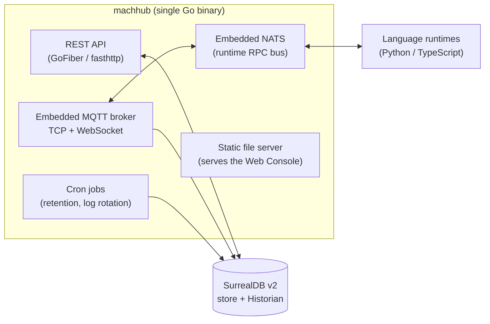
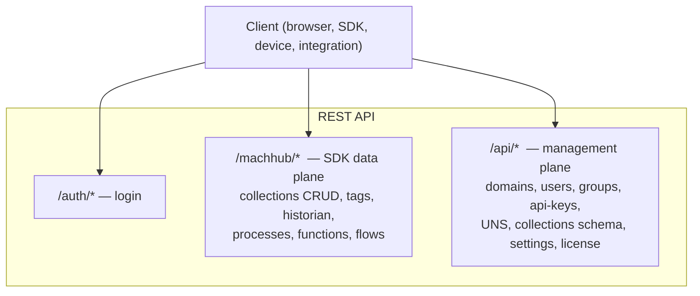
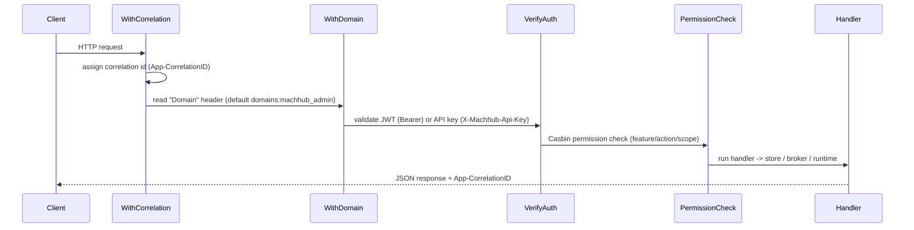
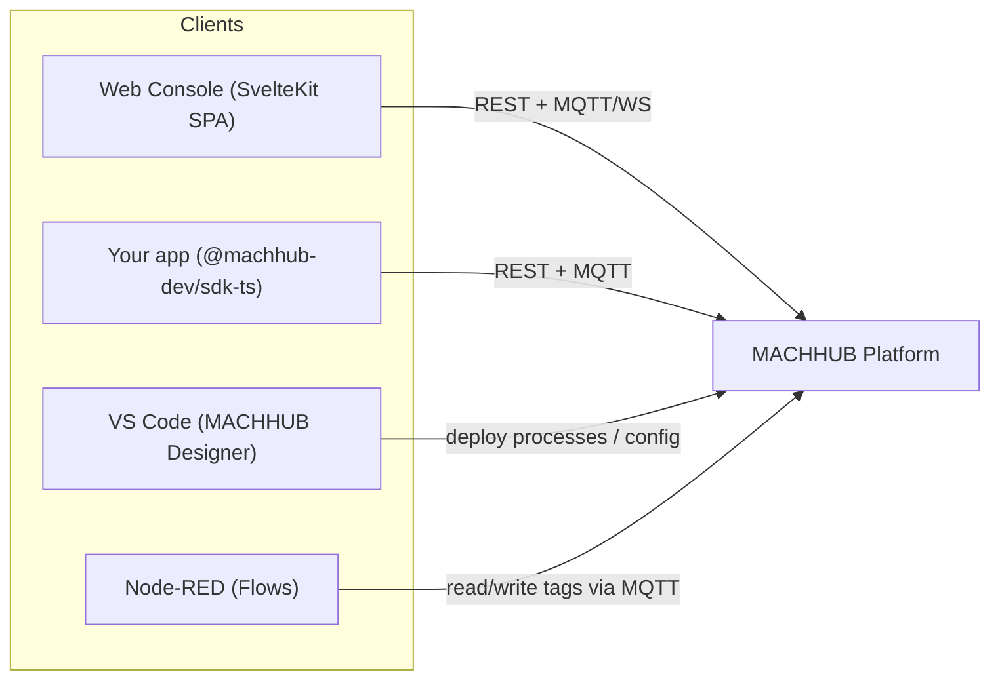
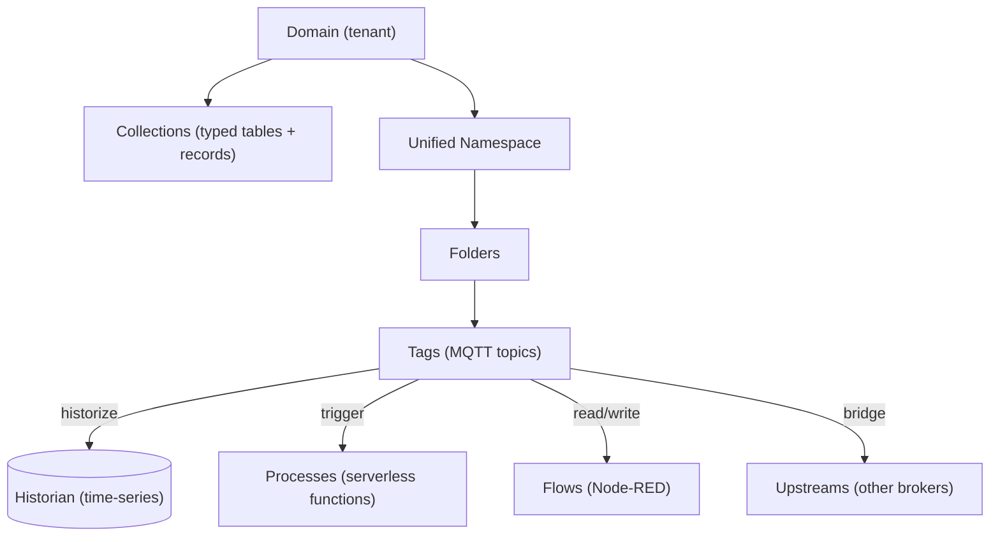

MACHHUB ships as **MACHHUB Platform**: a single Go binary that runs the entire stack.
Rather than wiring together a database, a message broker, a function runtime, and an
API gateway yourself, the Platform bundles them and exposes one coherent surface.

## Components inside MACHHUB Platform

| Component | Technology | Responsibility |
| --- | --- | --- |
| **REST API** | GoFiber (on fasthttp) | All HTTP endpoints: auth, the SDK data plane, and the management API. |
| **MQTT broker** | embedded [mochi-mqtt] | The realtime substrate for the Unified Namespace. Exposes TCP (default `:1883`) and MQTT-over-WebSocket for browsers. |
| **NATS** | embedded NATS + JetStream | The RPC bus that dispatches Process/function execution to language runtimes. |
| **Store + Historian** | SurrealDB v2 | The schemaless database for all entities, collection tables, and time-series history. |
| **Static server** | GoFiber | Serves the compiled web console as a single-page app. |
| **Cron** | robfig/cron | Background jobs such as Historian retention and log rotation. |

[mochi-mqtt]: https://github.com/mochi-mqtt/server

:::note[Edge-first]
The Platform is designed to run *next to your equipment*. Production builds target Linux
(including ARM64 / Raspberry Pi) and install as `systemd` services. See
[Install & Self-Hosting](/install/overview/).
:::

## The three API surfaces

The REST API is organized into three groups. Knowing which is which makes the rest
of the docs click into place:

- **`/auth/*`** — authentication (e.g. `POST /auth/login`).
- **`/machhub/*`** — the **SDK / data plane**: generic record CRUD, tags, historian,
  processes, functions, and flow execution. This is what the SDK mostly talks to.
- **`/api/*`** — the **management plane**: domains, users, groups, API keys, the UNS,
  collection schemas, settings, and licensing. This is what the **web console** uses.

See the [REST API Reference](/api/overview/) for the full endpoint catalog.

## Request lifecycle

Every request flows through a small middleware chain before reaching a handler:

- **Correlation** — each response carries an `App-CorrelationID` header for tracing.
- **Domain** — the `Domain` header selects the active tenant. See
  [Domains & Multi-tenancy](/concepts/domains/).
- **Authentication** — a JWT (`Authorization: Bearer …`) or an API key
  (`X-Machhub-Api-Key: mchx_…`). See [Authentication](/concepts/authentication/).
- **Authorization** — a Casbin RBAC check by *feature*, *action*, and *scope*. See
  [Authorization & Permissions](/concepts/authorization/).

## How clients connect

- The **web console** is a SvelteKit single-page app that calls the REST API and
  subscribes to tags over MQTT-WebSocket. (It uses its own thin API client — the SDK
  is for the apps *you* build.)
- **Your apps** use the SDK, which wraps the same REST + MQTT surfaces.
- **MACHHUB Designer** configures the SDK and helps deploy Processes.
- **Node-RED** reads and writes tags through custom MACHHUB nodes.

## Data, in one picture

Continue with [Domains & Multi-tenancy](/concepts/domains/), or jump straight to
[Collections](/concepts/collections/).
