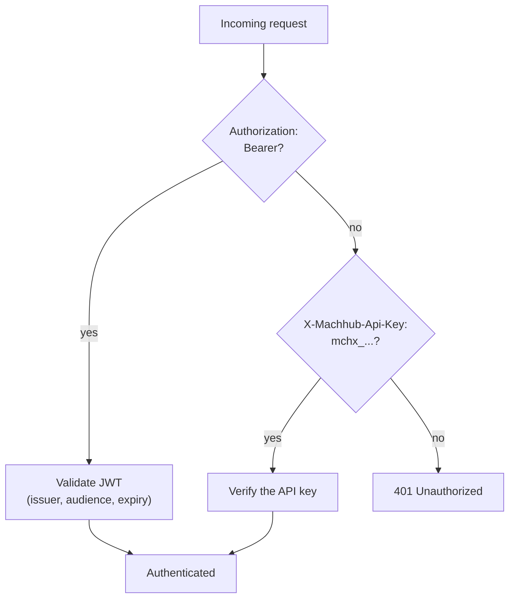

**Authentication** answers *who is making this request*. MACHHUB supports two
credentials: a short-lived **JWT** for interactive sessions (the console, your apps)
and a long-lived **API key** for machine-to-machine access. One of the two is
required before any protected route runs.

## Logging in: `POST /auth/login`

A user authenticates with a username and password. On success, MACHHUB returns a
signed **JWT** in the `tkn` field:

```http
POST /auth/login HTTP/1.1
Content-Type: application/json

{ "username": "admin", "password": "admin" }
```

```json
{ "success": true, "tkn": "<jwt>" }
```

The token carries the user's identity, groups, and domains, along with standard JWT
claims such as issuer, audience, and expiry.

## Using the token: `Authorization: Bearer`

Send the JWT on subsequent requests in the `Authorization` header with the `Bearer`
scheme:

```http
GET /machhub/production/all HTTP/1.1
Authorization: Bearer <jwt>
Domain: domains:machhub_admin
```

MACHHUB validates the token's signature, issuer, audience, and expiry on every
request.

## API keys: `X-Machhub-Api-Key: mchx_…`

For scripts, integrations, and services, MACHHUB issues **API keys**. They are sent
in their own header:

```http
GET /machhub/production/all HTTP/1.1
X-Machhub-Api-Key: mchx_AbC123dEf456...
Domain: domains:machhub_admin
```

API keys always begin with the **`mchx_`** prefix. A key is created with a name, an
expiration, and a set of [permissions](/concepts/authorization/) — so an integration
can be granted exactly the access it needs. The full key value is shown **once** at
creation, so store it securely. See [Developer Keys](/console/api-keys/) for
generating and using them.



:::caution
A request must present **either** a `Bearer` JWT **or** an `X-Machhub-Api-Key`. If
neither is present (on a protected route) the request is rejected with `401`.
:::

:::note[Stored securely]
MACHHUB never stores plaintext passwords or full API keys — only securely hashed
versions — so a leaked database cannot reveal them.
:::

## No refresh tokens (yet)

MACHHUB JWTs are **short-lived** (24 hours by default). Refresh tokens are **planned
but not yet available** — for now, when a token expires the client simply **logs in
again** via `POST /auth/login` to obtain a fresh one.

:::tip
Because there is no refresh flow, use an **API key** for long-running, unattended
processes rather than trying to keep a user JWT alive.
:::

Once MACHHUB knows *who* you are, it decides *what you may do* — continue with
[Authorization & Permissions](/concepts/authorization/).
