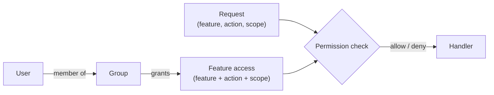

MACHHUB authorizes every protected request with **role-based access control (RBAC)**.
Access is decided by four things: **who** you are (subject), **what** you act on
(feature), **how** (action), and **where** (scope).

## The model

A permission rule binds a **subject** (a group) to a **feature**, an **action**, and a
**scope**. A user inherits the permissions of every group they belong to. When a user is
in **multiple groups in the same domain**, the
[group hierarchy](/console/groups/#group-hierarchy) sets priority — the **higher-level**
group's permissions win where they conflict.

### Features

A **feature** is a protected resource. Built-in features include:

`applications`, `users`, `groups`, `api_keys`, `upstreams`, `collections`, `flows`,
`historian`, `processes`, `manage_namespace`, `general_settings`, `gateway`, `logs`,
`license`, `integration`, `dashboard`.

You can also define your own features (see [Permission JSON](/config-formats/permission-json/)).

### Actions

| Action | Meaning |
| --- | --- |
| `read` | view the resource |
| `read-write` | both **read and write** the resource |

Custom action verbs (e.g. `view`, `export`) are also supported via imported features.

### Scopes

Scopes narrow *which records* an action applies to. **Scopes are domain-wide and
user-defined**: a domain starts with **no scopes**, and you add the ones you need from
the console's [Permissions](/console/permissions/) page (**Domain Scopes**). Once defined, a scope is
available to every feature when you assign permissions to groups.

Common scopes you might add:

- `all` — everything in the domain.
- `self` — only the user's own records.
- custom ones such as `company` or `department`.

:::caution[Scope enforcement is your app's job]
MACHHUB **stores and returns** a permission's scope, but it does **not** automatically
filter records by scope. Enforcing what a scope means (e.g. limiting `self` to the
caller's own rows) is the responsibility of the **application you build** — read the
scope from the permission check and apply it in your own queries.
:::

## The superuser bypass

A member of the reserved **`superuser`** group passes every check unconditionally —
use it sparingly. The `member` group name is also reserved.

## Where checks happen

- The server enforces permissions on the API (rules are stored per domain). A check
  resolves against the **target domain only** — the user's groups in *that* domain — so
  hierarchy priority never spans domains.
- The web console resolves a user's effective rights for a feature/scope via
  `GET /auth/permission/action/feature/:feature/scope/:scope`, and uses the result to
  show or hide actions.

## Managing permissions

- **In the console** — define features and scopes on the
  [Permissions](/console/permissions/) page, then assign access per group in the
  [Groups permission matrix](/console/groups/).
- **As JSON** — import features and scopes via [Permission JSON](/config-formats/permission-json/).
- **In code** — check and manage permissions with [SDK → Authorization](/sdk/authorization/).

:::caution[Current build]
Some routes have their permission checks disabled in the current build, and much of
the `/machhub/*` data plane is unauthenticated. Verify enforcement for your deployment
and keep the Platform behind appropriate network controls. See the [API overview](/api/overview/).
:::
