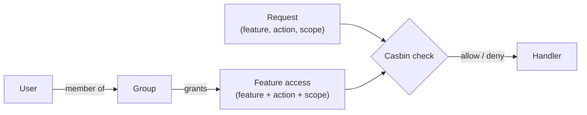

MACHHUB authorizes every protected request with **role-based access control (RBAC)**
built on [Casbin](https://casbin.org/). Access is decided by four things: **who** you
are (subject), **what** you act on (feature), **how** (action), and **where** (scope).

## The model



A permission rule binds a **subject** (a group) to a **feature**, an **action**, and a
**scope**. A user inherits the permissions of every group they belong to.

### Features

A **feature** is a protected resource. Built-in features include:

`applications`, `users`, `groups`, `api_keys`, `upstreams`, `collections`, `flows`,
`historian`, `processes`, `manage_namespace`, `general_settings`, `gateway`, `logs`,
`license`, `integration`, `dashboard`.

You can also define your own features (see [Permission JSON](/config-formats/permission-json/)).

### Actions

| Action | Meaning |
| --- | --- |
| `read` | view the resource |
| `read-write` | view **and** modify (read-write implies read) |

Custom action verbs (e.g. `view`, `export`) are also supported via imported features.

### Scopes

Scopes narrow *which records* an action applies to, in a hierarchy:

```
nil  <  self  <  domain  <  all
```

- `self` — only the user's own records
- `domain` — records within the active [domain](/concepts/domains/)
- `all` — everything
- `nil` — no scope constraint on the rule

A higher scope satisfies a lower one (granting `all` also satisfies `domain` and `self`).

## The superuser bypass

A member of the reserved **`superuser`** group passes every check unconditionally —
use it sparingly. The `member` group name is also reserved.

## Where checks happen

- The server enforces permissions in middleware and in handlers (Casbin rules are
  stored in the database).
- The web console resolves a user's effective rights for a feature/scope via
  `GET /auth/permission/action/feature/:feature/scope/:scope`, and uses the result to
  show or hide actions.

## Managing permissions

- **In the console** — assign access per group in the
  [Groups permission matrix](/console/groups/).
- **As JSON** — import features and scopes via [Permission JSON](/config-formats/permission-json/).
- **In code** — check and manage permissions with [SDK → Authorization](/sdk/authorization/).

:::caution[Current build]
Some routes have their permission checks disabled in the current build, and much of
the `/machhub/*` data plane is unauthenticated. Verify enforcement for your deployment
and keep EDGE behind appropriate network controls. See the [API overview](/api/overview/).
:::
