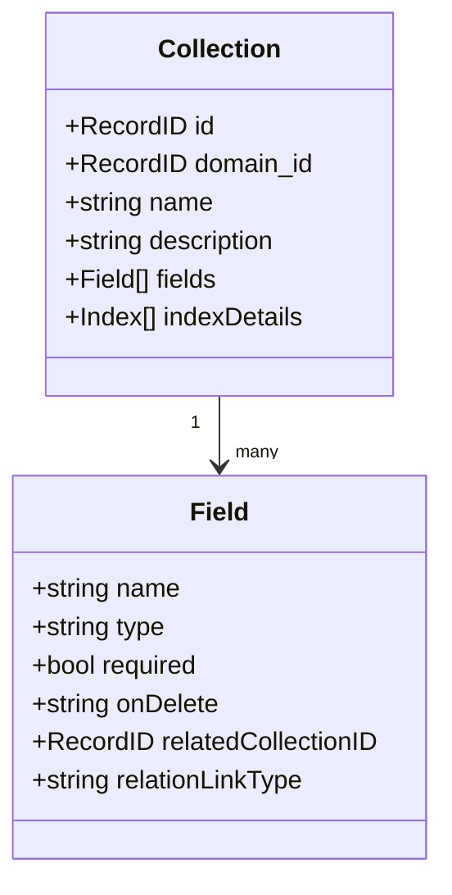

A **Collection** is a typed data table you define in MACHHUB: a **schema** (a set of
typed **fields**) plus its **records** (the rows). If you have used an
application database or a tool like Airtable or PocketBase, collections will feel
familiar — except they are first-class platform objects you manage in the console or
over the API, and they live inside a [Domain](/concepts/domains/).

## Anatomy of a collection



- **name** — unique within the domain. Internally a collection is namespaced as
  `<domain>.<name>` (e.g. `myapp.products`) so two domains can both have a `products`
  collection.
- **fields** — the typed columns (see below).
- **indexDetails** — optional indexes (unique or non-unique, single- or multi-field)
  for fast lookups and constraints.

## Field types

| Type | Stores | Notes |
| --- | --- | --- |
| `string` | text | |
| `number` | numeric | |
| `boolean` | true/false | |
| `date` | timestamp | |
| `url` | text URL | |
| `enum` | one of a fixed set | requires `enumOptions` |
| `json` | arbitrary JSON | objects and arrays |
| `editor` | rich text | |
| `file` | an uploaded file | see [File handling](/sdk/file-handling/) |
| `relation` | a link to another collection | use this for **all** foreign keys |
| `record` | the record id | reserved for the `id` field |

Every collection automatically has an **`id`** field (type `record`). The platform
also manages **`created_dt`** and **`updated_dt`** timestamps.

## Records and the RecordID format

Each record is identified by a **RecordID** of the form:

```
application_id.collection_name:record_id
```

For example, `myapp.products:PROD-001`. The SDK also accepts the structured form
`{ Table: "myapp.products", ID: "PROD-001" }` and ships helpers
(`RecordIDToString`, `StringToRecordID`) to convert between them. See
[SDK → Collections](/sdk/collections/) and the [RecordID reference](/sdk/record-id/).

## Relations

Use a **`relation`** field for links between collections (not a plain `string` or
`record`). A relation declares:

- **`relatedCollectionID`** — which collection it points to, and
- **`relationLinkType`** — `single` (one related record) or `multiple` (many).

When you write a relation in the SDK, you pass a reference object:

```ts
await sdk.collection('products').create({
  name: 'Wireless Mouse',
  sku: 'MOUSE-001',
  categoryId: { Table: 'myapp.categories', ID: 'CAT-002' }, // relation
});
```

On read, you can **expand** relations to embed the related record:

```ts
const product = await sdk
  .collection('products')
  .expand('categoryId')
  .getOne('myapp.products:PROD-001');
```

### Referential behavior — `onDelete`

Each field carries an `onDelete` rule that controls what happens to a record when a
record it points to is deleted:

| `onDelete` | Behavior |
| --- | --- |
| `ignore` | Do nothing. |
| `unset` | Clear (null) the reference. |
| `cascade` | Delete this record too. |
| `reject` | Block the parent deletion. |

:::caution[Naming difference]
The **Collection JSON** schema and console use `ignore` / `unset` / `cascade` /
`reject`. Some SDK examples describe the same idea with the words
`setNull` / `restrict`. They mean the same thing — prefer the console/JSON terms
when importing schemas.
:::

## Indexes

Indexes speed up queries and enforce uniqueness:

- **Unique** indexes for natural keys (e.g. a `sku` or `email`).
- **Non-unique** indexes for fields you filter on often (e.g. a status or a foreign key).
- **Composite** indexes (multiple fields) for combined lookups.

## Defining collections

You can define collections two ways:

1. **In the console** — the visual schema builder under **Database → Collections**.
   See [Build a Collection](/console/collections/).
2. **As JSON** — author or import a schema. See [Collection JSON](/config-formats/collection-json/).

## Working with records in code

Reading and writing records is the SDK's bread and butter:

```ts
// Create
await sdk.collection('products').create({ name: 'Keyboard', price: 49 });

// Read with a query
const list = await sdk.collection('products')
  .filter('price', '>', 20)
  .sort('price', 'asc')
  .offset(0).limit(25)
  .getAll();

// Update (PATCH — only the provided fields change)
await sdk.collection('products').update('myapp.products:PROD-001', { price: 44.99 });

// Delete
await sdk.collection('products').delete('myapp.products:PROD-001');
```

See [SDK → Collections](/sdk/collections/) for the complete query language
(operators, `orFilter`, `filterInArray`, field selection, pagination, and batch
operations).
