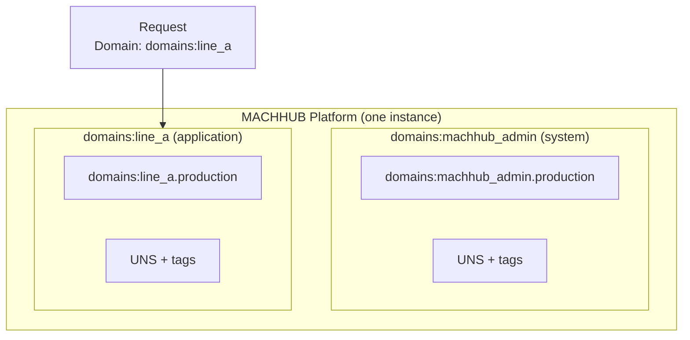

A **Domain** is a tenant in MACHHUB — an isolated workspace with its own users,
groups, Unified Namespace, collections, and settings. Every request runs *inside* a
domain, and a single MACHHUB Platform instance can host many of them.

## The default admin domain

Every install bootstraps one domain on first start: **`domains:machhub_admin`**
(display name *MACHHUB Administrator*). It is a `system` domain and owns the first
user. A second `nodered` domain (`domains:node_red`) is also created for Node-RED.

If a request does not specify a domain, MACHHUB falls back to `domains:machhub_admin`:

```go
// middleware.WithDomain — simplified
domain, ok := headers["Domain"]
if !ok || len(domain) == 0 {
    // No Domain in Request. 'domains:machhub_admin' will be used
    SetDomainID("domains:machhub_admin")
}
```

See [First login & bootstrap](/install/first-login/) for how the admin domain and
its first superuser are created.

## Selecting the active tenant: the `Domain` header

Clients choose which tenant to operate in with the **`Domain`** request header. The
value is the domain's record ID (e.g. `domains:machhub_admin`). The
[request lifecycle](/concepts/architecture/) reads this header early, before
authentication and authorization, and pins the rest of the request to that tenant.

```http
GET /api/uns/namespace HTTP/1.1
Host: edge.example.com
Authorization: Bearer <jwt>
Domain: domains:machhub_admin
```

:::note
The `Domain` header is **not** authentication — it only selects the workspace. The
JWT or API key still determines *who* you are, and Casbin still decides what you may
do. See [Authentication](/concepts/authentication/) and
[Authorization](/concepts/authorization/).
:::

## Domain types

A domain's `type` field tells MACHHUB how it is used:

| Type | Constant | Purpose |
| --- | --- | --- |
| `application` | `TypeApplication` | An **Application** — a user-built workspace (the most common type). |
| `system` | `TypeSystem` | A reserved, platform-managed domain (e.g. `domains:machhub_admin`). |
| `nodered` | `TypeNodeRED` | The workspace backing the Node-RED runtime (`domains:node_red`). |
| `custom` | `TypeCustom` | A general-purpose, user-defined domain. |

The domain record itself carries identity, ownership, and membership:

```go
type Domain struct {
    ID          *RecordID  // e.g. domains:machhub_admin
    Name        string     // display name; the ID is derived from this
    Type        string     // application | system | nodered | custom
    Description string
    OwnerID     *RecordID  // the user who owns the domain
    UserIDs     []RecordID // members
    Groups      []Group    // groups defined in this domain
    // ...
}
```

The record ID is derived from the name — spaces become underscores and the string is
lower-cased, then prefixed with the `domains` table (so *"My Plant"* becomes
`domains:my_plant`).

## Data isolation: name-prefixed tables

Tenants are kept apart at the storage layer. Data-plane tables (collections, the UNS,
the Historian) are **name-prefixed** with the domain ID:

```
<domainID>.<name>
```

So a `production` collection in `domains:machhub_admin` lives in a table named
`domains:machhub_admin.production`, while the same-named collection in another domain
is a completely separate table. This keeps one tenant's records, tags, and history
from colliding with another's.



## Applications

An **Application** is simply a domain whose `type` is `application`. In the console
and the management API, application-type domains are surfaced as "Applications" — the
self-contained workspaces your teams build in. The management API exposes them at
`GET /api/application`, distinct from the full domain list at `GET /api/domain`.

<figure>
  <div class="mh-shot">📷 Screenshot to capture: <strong>The Applications list in the console, plus the domain switcher</strong></div>
</figure>

## Where domains show up

- **Groups** belong to a domain — a group's `domain_id` scopes its
  [permissions](/concepts/authorization/) to that tenant.
- **Collections** and the **Unified Namespace** are created per domain. See
  [Collections](/concepts/collections/) and
  [Unified Namespace](/concepts/unified-namespace/).
- The **`Domain` header** chooses which of these you read and write on each request.

Continue with the [Unified Namespace](/concepts/unified-namespace/), or see how
permissions are scoped per domain in [Authorization](/concepts/authorization/).
