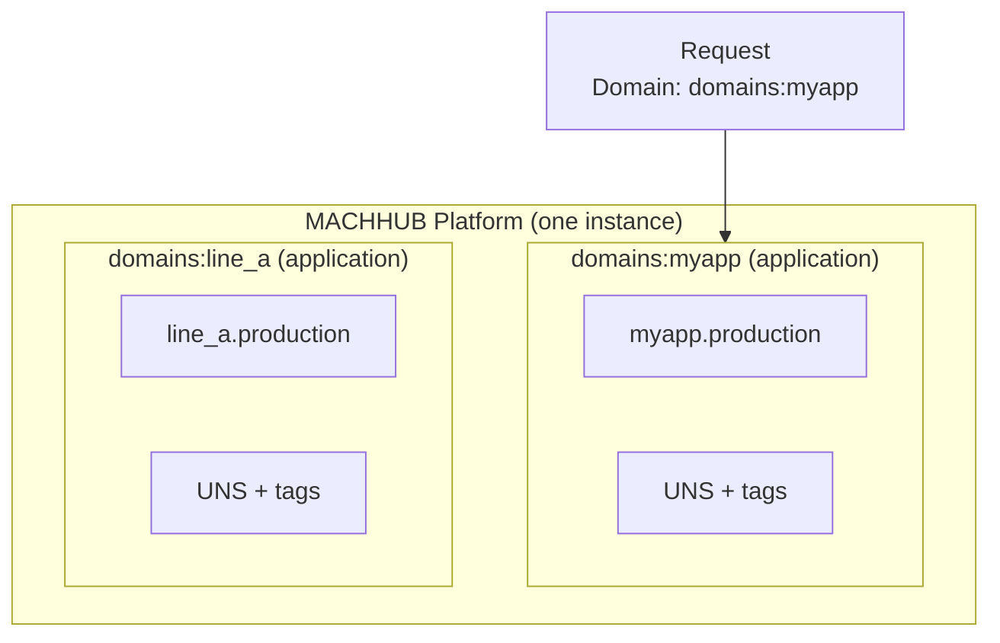

A **Domain** is a tenant in MACHHUB — an isolated workspace with its own users,
groups, Unified Namespace, collections, and settings. Every request runs *inside* a
domain, and a single MACHHUB Platform instance can host many of them.

## The default admin domain

Every install bootstraps one domain on first start: **`domains:machhub_admin`**
(display name *MACHHUB Administrator*). It is a `system` domain and owns the first
user. A second `system` domain (`domains:node_red`) is also created for Node-RED.

If a request does not specify a domain, MACHHUB falls back to `domains:machhub_admin`.

See [First login & bootstrap](/install/first-login/) for how the admin domain and
its first superuser are created.

## Selecting the active tenant: the `Domain` header

Clients choose which tenant to operate in with the **`Domain`** request header. The
value is the domain's record ID (e.g. `domains:machhub_admin`). MACHHUB reads this
header early, before authentication and authorization, and pins the rest of the
request to that tenant.

```http
GET /machhub/production/all HTTP/1.1
Host: edge.example.com
Authorization: Bearer <jwt>
Domain: domains:machhub_admin
```

:::note
The `Domain` header is **not** authentication — it only selects the workspace. The
JWT or API key still determines *who* you are, and your permissions still decide what
you may do. See [Authentication](/concepts/authentication/) and
[Authorization](/concepts/authorization/).
:::

## Domain types

A domain's `type` field tells MACHHUB how it is used:

| Type | Purpose |
| --- | --- |
| `application` | An application-type domain that backs a user-developed [Application](#applications) (the most common type). |
| `system` | A reserved, platform-managed domain (e.g. `domains:machhub_admin`). |

Each domain carries its identity and membership: an **ID** (e.g.
`domains:machhub_admin`), a display **name**, a **type**, an optional description, the
**owner** (the user who owns it), its **members**, and the **groups** defined in it.

The record ID is derived from the name — spaces become underscores and the string is
lower-cased, then prefixed with the `domains` table (so *"My Plant"* becomes
`domains:my_plant`).

## Data isolation: name-prefixed tables

Tenants are kept apart at the storage layer. Data-plane tables (collections, the UNS,
the Historian) are **name-prefixed** with the domain's name (the part after
`domains:`):

```
<domain>.<name>
```

So a `production` collection in the `domains:myapp` domain lives in a table named
`myapp.production`, while the same-named collection in another domain is a completely
separate table. This keeps one tenant's records, tags, and history from colliding with
another's.



:::note
You *can* use the built-in admin domain for your own data, but it's **not
recommended** — create an [Application](#applications) domain so your records, tags,
and history stay isolated.
:::

## Applications

An **Application** is a **user-developed application** — your own deployed app, with
its own runtime that you can start, stop, and reach on a port (the console shows each
one's status, e.g. *Running: 8080*).

Today each Application is **backed by an application-type domain** (you can even add
domains from the **Applications** view), so the two are closely linked. But they are
**distinct concepts** — an Application is your deployed app, not the domain itself —
and full separation of the two is planned.

:::note[Application vs. Domain]
A **Domain** is a tenant/workspace that scopes data, users, and groups. An
**Application** is the app you build and run on top of one. They overlap today but are
being separated.
:::

<figure>
  <div class="mh-shot">📷 Screenshot to capture: <strong>The Applications list in the console, plus the domain switcher</strong></div>
</figure>

## Where domains show up

- **Groups** belong to a domain — a group's `domain_id` scopes its
  [permissions](/concepts/authorization/) to that tenant.
- **Collections** and the **Unified Namespace** are created per domain. See
  [Collections](/concepts/collections/) and
  [Unified Namespace](/concepts/unified-namespace/).
- The **`Domain` header** chooses which of these you read and write on each request.

Continue with the [Unified Namespace](/concepts/unified-namespace/), or see how
permissions are scoped per domain in [Authorization](/concepts/authorization/).
