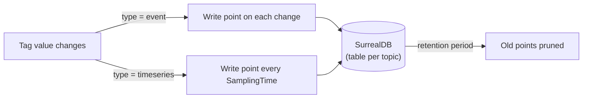
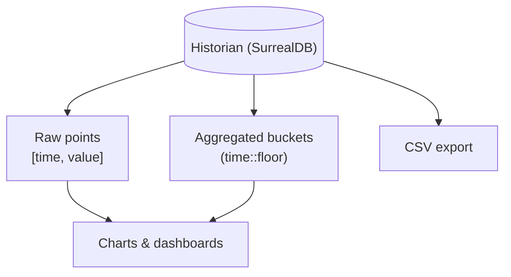

The **Historian** is MACHHUB's time-series store. Live [tag](/concepts/unified-namespace/)
values are transient — they exist only as long as a subscriber is listening. The
Historian keeps a durable, queryable record of how a tag's value changed over time.

## Historizing a tag

Any tag can be historized by enabling its `Historize` block (you do this in the
[Unified Namespace](/concepts/unified-namespace/)). Each historized tag chooses a
**type**, a **sampling time**, and a **retention period**:

```go
type Historize struct {
    On              bool   // historization enabled for this tag
    Type            string // "event" or "timeseries"
    SamplingTime    string // how often to sample (timeseries)
    RetentionPeriod string // how long to keep points
}
```

| Type | Behavior |
| --- | --- |
| `event` | **On-change.** A point is written every time the value changes. Best for state, setpoints, and discrete signals. |
| `timeseries` | **Sampled.** The value is recorded on a fixed cadence given by `SamplingTime`. Best for continuous analog signals. |

The **retention period** bounds how long points are kept; a background job
periodically removes points older than the retention window.



## How points are stored

History lives in **SurrealDB**, with **one table per tag topic**. Each point is a
small array of `[time, value]` — the record's id *is* the timestamp/value pair:

```surql
-- a point is created as topic:[ time, value ]
CREATE `Plant1/LineA/Temperature`:[ time::now(), 72.4 ];
```

This keeps points compact and naturally ordered by time within the topic's table.

## Querying history

Because points are `[time, value]` arrays, a read projects `id[0]` as the timestamp
and `id[1]` as the value. You can query with **SurrealQL** directly:

```surql
SELECT id[0] AS timestamp, id[1] AS value
FROM `Plant1/LineA/Temperature`
WHERE id[0] >= d'2026-06-01T00:00:00Z'
  AND id[0] <= d'2026-06-03T00:00:00Z';
```

MACHHUB also supports **time-bucketed aggregation** (flooring timestamps into
intervals) for charting dense data over long ranges, and can **export to CSV** for
offline analysis and reporting.



:::note
Historian tables are created and read per topic. Aggregation intervals are chosen
to match the requested range (for example, a 1-hour range buckets at 1-minute
resolution) so charts stay responsive on large datasets.
:::

## Reading history from your app

The SDK exposes the Historian so apps can pull history without writing SurrealQL by
hand — fetch raw or aggregated points for a tag over a time range. See
[SDK Historian](/sdk/historian/).

In the console, the Historian view lets you browse historized tags, chart them, and
export CSV. See [Console Historian](/console/historian/).

<figure>
  <div class="mh-shot">📷 Screenshot to capture: <strong>The Historian view charting a historized tag with a time-range selector and CSV export</strong></div>
</figure>

Continue with [Upstreams](/concepts/upstreams/) to relay tags across brokers, or
revisit the [Unified Namespace](/concepts/unified-namespace/) to enable historization
on a tag.
