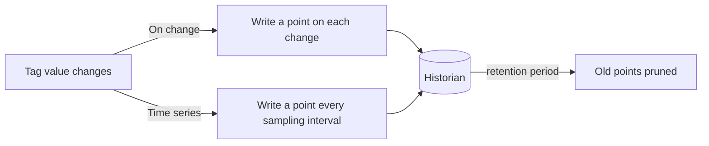
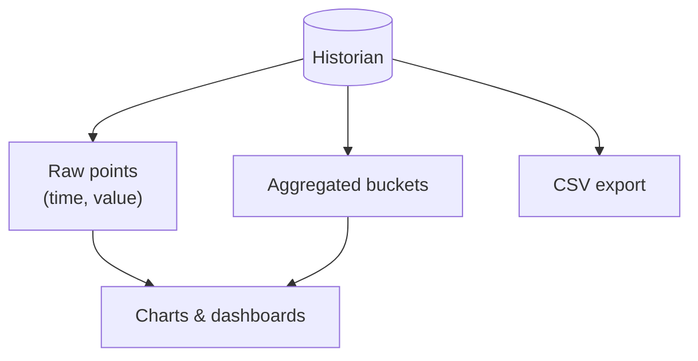

The **Historian** is MACHHUB's time-series store. Live [tag](/concepts/unified-namespace/)
values are transient — they exist only while a subscriber is listening. The Historian
keeps a durable, queryable record of how a tag's value changed over time.

## Historizing a tag

Any tag can be historized by turning on its **Historize** setting (you do this in the
[Unified Namespace](/concepts/unified-namespace/)). Each historized tag chooses a
**type**, a **sampling time**, and a **retention period**:

| Type | Behavior |
| --- | --- |
| **On change** (`event`) | A point is written every time the value changes. Best for state, setpoints, and discrete signals. |
| **Time series** (`timeseries`) | The value is recorded on a fixed cadence given by the **sampling time**. Best for continuous analog signals. |

The **retention period** controls how long points are kept; a background job
periodically removes points older than the retention window.

## Querying history

MACHHUB stores each historized point as a timestamp/value pair, ordered by time. You
read history two ways:

- **In the console** — the Historian view lets you browse historized tags, chart them
  over a time range, and export to **CSV**. See [Console Historian](/console/historian/).
- **From your app** — the [SDK Historian](/sdk/historian/) fetches points for a tag
  over a time range, so apps can render their own charts.

MACHHUB also supports **time-bucketed aggregation** — grouping points into intervals
(for example, one-minute buckets over a one-hour range) — so charts stay responsive
over long ranges and large datasets.

Continue with [Upstreams](/concepts/upstreams/) to relay tags to another MACHHUB
instance, or revisit the [Unified Namespace](/concepts/unified-namespace/) to enable
historization on a tag.
