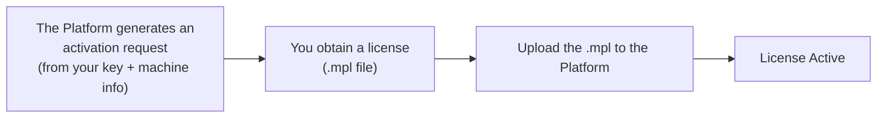

:::note[Commercial product with a free trial]
MACHHUB Platform is a **commercial product** developed by Intellogic Technology. You can
**evaluate it for free** right away with the built-in, **fully featured 2-hour trial** —
no license or key required (see [Trial mode](#trial-mode) below). A license is needed for continued
and production use. (The publicly available [AI agent skills](/skills/overview/) and
this documentation are separate from the licensed platform.)
:::

MACHHUB Platform uses **node-locked licensing**: a license is bound to the specific machine
it runs on, identified by hardware characteristics (such as the CPU). This fits the
edge deployment model, where each device runs its own MACHHUB Platform instance.

## How activation works

1. **Generate an activation request.** The Platform combines your license key with the
   machine's hardware fingerprint into an activation-request string.
2. **Obtain a license file.** That request is exchanged for a license file with the
   `.mpl` extension.
3. **Upload the `.mpl`.** Uploading the file to the Platform activates it.

:::note[Getting a license today]
For now, license keys and `.mpl` files are issued **with the help of the MACHHUB team** —
[contact us](https://machhub.dev/contact) to obtain one. A **self-service license management
platform** is currently in development.
:::

## Trial mode

You can evaluate the platform **for free**, with no license or key. The trial is
**fully featured** — every capability is available, with no feature limits; the only
limit is the 2-hour session length.

1. Log in to the web console.
2. On the **License** banner (**Settings → License**), click **Start 2-Hour Trial**.
3. A **2-hour trial session** starts immediately — the whole platform is usable.

When the 2 hours are up, just **log in again and start another 2-hour trial** to keep
evaluating. For uninterrupted or production use, activate a
[license](#how-activation-works).

## Checking and activating in the console

- The **Home** dashboard shows a **License Status** card (Active / Inactive).
- Under **Settings → License**, upload your `.mpl` file to activate.

See [Console → Settings & licensing](/console/settings/).
