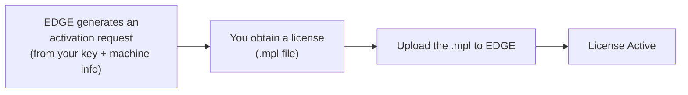

MACHHUB EDGE uses **node-locked licensing**: a license is bound to the specific machine
it runs on, identified by hardware characteristics (such as the CPU). This fits the
edge deployment model, where each device runs its own EDGE instance.

## How activation works

1. **Generate an activation request.** EDGE combines your license key with the
   machine's hardware fingerprint into an activation-request string.
2. **Obtain a license file.** That request is exchanged for a license file with the
   `.mpl` extension.
3. **Upload the `.mpl`.** Uploading the file to EDGE activates it.

## Trial licenses

A trial activation is available to evaluate the platform without a purchased key.

## Checking and activating in the console

- The **Home** dashboard shows a **License Status** card (Active / Inactive).
- Under **Settings → License**, upload your `.mpl` file to activate.

See [Console → Settings & licensing](/console/settings/).

:::note[Current build]
In the current console build, license activation is performed by **uploading the
`.mpl` file**. The on-screen activation-code (OTP) field is not yet wired.
:::

## API

Licensing is also exposed over the REST API — status, activation-request generation,
trial activation, and file upload. See [Management API → License](/api/management/).
