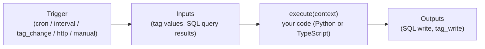
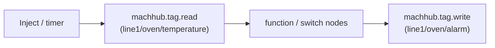

MACHHUB has **two distinct automation features**, and it is important not to confuse
them:

- **Processes** are **serverless functions** — you write code (Python or TypeScript)
  that runs on the platform, triggered by a schedule, a tag change, an HTTP call, or
  manually.
- **Flows** are **Node-RED** visual pipelines — you wire nodes together in the
  Node-RED editor, using custom MACHHUB nodes to read and write UNS tags.

:::tip[One-line rule of thumb]
Reach for a **Process** when the logic is best expressed in **code**. Reach for a
**Flow** when you want a **visual, low-code** pipeline (or you are already a Node-RED
shop).
:::

## At a glance

| | **Processes** | **Flows** |
| --- | --- | --- |
| Authoring | Code (Python / TypeScript) | Node-RED visual editor |
| Mental model | Serverless function: `execute(context)` | Wired graph of nodes |
| Triggers | `cron`, `interval`, `tag_change`, `http`, `manual` | Node-RED triggers + MACHHUB tag nodes |
| Inputs | Declared inputs resolved before run (`tag`, `sql`) | Messages flowing into nodes |
| Outputs | Declared outputs applied after run (`sql`, `tag_write`) | Node outputs (incl. `machhub.tag.write`) |
| Run from SDK | `sdk.processes.execute(name, input)` | `sdk.flow.execute(id, payload)` |
| Best for | Custom logic, integrations, transforms, scheduled jobs | Visual orchestration, rapid wiring, Node-RED ecosystem |

## Processes (serverless functions)

A **Process** is a function the platform runs for you in an isolated worker. You
write only the function **body**; MACHHUB resolves your declared **inputs**
beforehand and applies your declared **outputs** afterward.



A TypeScript process body looks like this — note the SDK is injected for you as a
global `sdk`, so there is no import or initialization:

```ts
async function execute(context: ProcessContext): Promise<any> {
  const { inputs, trigger } = context;

  // The SDK is available as a global inside a TypeScript process.
  const readings = await sdk.collection('myapp.readings').getAll();

  // ...your logic...
  return { count: readings.length };
}
```

Triggers, inputs, outputs, Python processes, packaging, and deployment are covered in
[Authoring Processes](/processes/overview/). To invoke a process from an app, see
[SDK → Processes](/sdk/processes/).

## Flows (Node-RED)

A **Flow** is a **Node-RED** flow. MACHHUB ships custom Node-RED nodes that connect
to the platform's MQTT broker so your flows can read and write **UNS tags**:

- **`machhub.tag.read`** — subscribe to a tag and emit its values into the flow.
- **`machhub.tag.write`** — write a value to a tag from the flow.

The nodes discover the broker and the available tags from the platform automatically,
so you drag, drop, and wire — no connection boilerplate.



Because both Processes and Flows operate on the same UNS tags, they interoperate
cleanly: a Flow can write a tag that triggers a Process, and vice versa.

## Which should I use?

- **Use a Process** for anything you'd naturally write as code: calling an external
  API, transforming data, scheduled batch jobs, or logic that benefits from version
  control and testing.
- **Use a Flow** for visual orchestration, quick wiring between tags, or when your
  team already lives in Node-RED.

Next: learn to [author Processes](/processes/overview/), or read about the
[Unified Namespace](/concepts/unified-namespace/) that both features build on.
