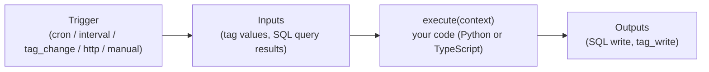
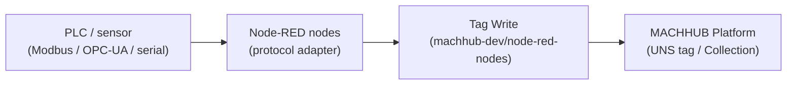

MACHHUB has **two distinct features** for running logic on the platform, and it is
important not to confuse them:

- **Processes** are **serverless functions** — you write code (Python or TypeScript)
  that runs on the platform, triggered by a schedule, a tag change, an HTTP call, or
  manually.
- **Flows** are **Node-RED** pipelines — primarily used to **ingest data from physical
  devices** (PLCs, sensors, industrial controllers) and other sources not natively
  supported by MACHHUB's data connectors.

:::tip[One-line rule of thumb]
Reach for a **Process** when the logic is best expressed in **code** (transforms,
alerts, integrations). Reach for a **Flow** when you need to **bridge a device or
protocol** into the platform.
:::

## At a glance

| | **Processes** | **Flows** |
| --- | --- | --- |
| Authoring | Code (Python / TypeScript) | Node-RED visual editor |
| Mental model | Serverless function: `execute(context)` | Wired graph of nodes |
| Primary purpose | Business logic, automation, transforms, scheduled jobs | Device data ingestion, protocol bridging |
| Triggers | `cron`, `interval`, `tag_change`, `http`, `manual` | Device events, timers, incoming messages |
| Inputs | Declared inputs resolved before run (`tag`, `sql`) | Messages flowing into nodes from devices |
| Outputs | Declared outputs applied after run (`sql`, `tag_write`) | Tag writes, collection inserts via MACHHUB nodes |
| Run from SDK | `sdk.processes.execute(name, input)` | — (not run from the SDK) |
| Best for | Custom logic, integrations, transforms, scheduled jobs | PLCs, Modbus, OPC-UA, serial, HTTP devices |

## Processes (serverless functions)

A **Process** is a function the platform runs for you in an isolated worker. You
write only the function **body**; MACHHUB resolves your declared **inputs**
beforehand and applies your declared **outputs** afterward.



A TypeScript process body looks like this — note the SDK is injected for you as a
global `sdk`, so there is no import or initialization:

```ts
async function execute(context: ProcessContext): Promise<any> {
  const { inputs, trigger } = context;

  // The SDK is available as a global inside a TypeScript process.
  const readings = await sdk.collection('myapp.readings').getAll();

  // ...your logic...
  return { count: readings.length };
}
```

Triggers, inputs, outputs, Python processes, packaging, and deployment are covered in
[Authoring Processes](/processes/overview/). To invoke a process from an app, see
[SDK → Processes](/sdk/processes/).

## Flows (Node-RED)

A **Flow** is a **Node-RED** pipeline. In the MACHHUB ecosystem, Flows are the
primary way to **ingest data from physical devices** — PLCs, sensors, and any source
using a protocol (Modbus, OPC-UA, serial, HTTP, etc.) that MACHHUB does not natively
support as a data connector.

MACHHUB provides the [`@machhub-dev/node-red-nodes`](https://flows.nodered.org/node/@machhub-dev/node-red-nodes)
library, which adds the following nodes to your Node-RED palette:

| Node | What it does |
| ---- | ------------ |
| **MACHHUB Config** | Stores connection details (host, credentials) shared by all other nodes. **Optional** when Flows run from the MACHHUB Platform web console — the connection is already managed by MACHHUB. |
| **Tag Read** | Subscribes to a MACHHUB tag (or wildcard MQTT topic) and emits values into the flow. |
| **Tag Write** | Publishes `msg.payload` to a selected MACHHUB tag. |
| **Bulk Tag Write** | Writes to multiple tags simultaneously from a single object payload. |
| **Collection** | Runs CRUD operations (Select / Create / Update / Delete) on a MACHHUB Collection. |
| **DB Query** | Executes a raw SurrealQL query against the MACHHUB database. |

:::note[Industrial protocol connectors]
MACHHUB also contributes **open-source industrial protocol connectors** to the Node-RED
ecosystem. The first is
[`@machhub-dev/node-red-lib-comm-omron-fins`](https://flows.nodered.org/node/@machhub-dev/node-red-lib-comm-omron-fins)
(Omron **FINS**) — with **more protocols to come**. Install them from the Node-RED
palette alongside `@machhub-dev/node-red-nodes`.
:::

A typical ingestion flow reads from a device, transforms the raw value, then writes
it into MACHHUB as a tag or collection record:



Because Flows write into the same UNS tags as the rest of the platform, a tag
populated by a Flow can trigger a Process, feed the Historian, or be subscribed to
by your SDK app — all without any extra wiring.

:::note[Node-RED authentication]
Authentication is **enabled by default** for Flows and uses MACHHUB's own auth. You log
into the Node-RED editor with your **MACHHUB credentials** — access is granted to users
who have permission to the **domain** the flow runs in **and** the **flow** permission.
:::

## Which should I use?

- **Use a Process** for business logic, alerts, data transforms, scheduled batch jobs,
  or any integration you would naturally write as code.
- **Use a Flow** when you need to pull data from a physical device or a protocol that
  MACHHUB does not natively support — bridge the data in, then let the platform handle
  the rest.

Next: learn to [author Processes](/processes/overview/), or read about the
[Unified Namespace](/concepts/unified-namespace/) that both features build on.
