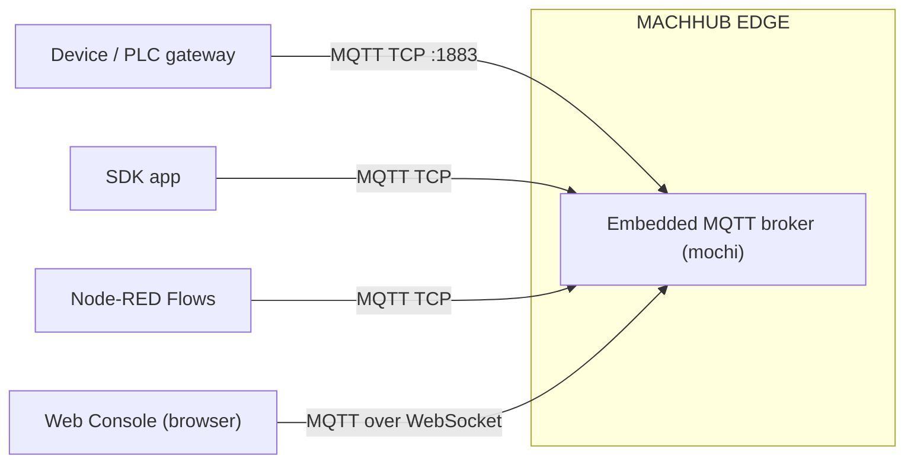
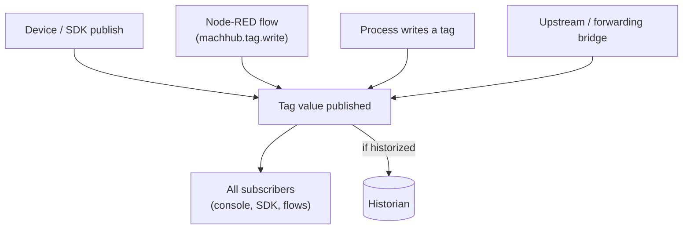

MACHHUB is realtime by default. The platform embeds an MQTT broker
([mochi-mqtt](https://github.com/mochi-mqtt/server)) directly inside the
[MACHHUB EDGE binary](/concepts/architecture/), and it is the substrate that carries
every [tag](/concepts/unified-namespace/) value as it changes.

## The embedded broker

There is no separate broker to install or operate — mochi runs in-process. It exposes
two listeners:

| Listener | Default | Used by |
| --- | --- | --- |
| **MQTT over TCP** | `:1883` | Devices, the SDK, Node-RED, and any native MQTT client. |
| **MQTT over WebSocket** | configurable (`ws_port`) | Browsers — the web console subscribes to tags over WebSocket. |

Both ports come from the [configuration](/install/configuration/) `app.mochi`
section (`tcp_port` and `ws_port`). The web console relies on MQTT-over-WebSocket
because browsers cannot open raw TCP sockets.



## Publish / subscribe on tag topics

The broker speaks ordinary MQTT, and **tag topics are ordinary MQTT topics**. A tag's
path in the UNS tree is its topic (for example `Plant1/LineA/Temperature`). To work
with live values you simply:

- **Publish** to a tag topic to set its value (subject to the tag's `RW`
  [access level](/concepts/unified-namespace/)).
- **Subscribe** to a tag topic — or an MQTT wildcard like `Plant1/LineA/+` — to
  receive every update.

The SDK wraps this pub/sub so you work in terms of tags rather than raw MQTT. See
[SDK Tags](/sdk/realtime/).

## Discovering the broker: `GET /machhub/`

Clients do not hard-code broker ports. They call the data-plane root **`GET /machhub/`**
endpoint (with the SDK's developer key), which reports the device name and the broker
bind information so a client can connect correctly:

```jsonc
{
  "device_name": "edge-01",
  "uns": {
    "basePath": "",
    "bind": {
      "mqtt":  { "host": "127.0.0.1", "port": 1883, "enabled": true },
      "ws":    { "host": "127.0.0.1", "port": 180,  "enabled": true },
      "mqtts": { "host": "127.0.0.1", "port": "8883", "enabled": false },
      "wss":   { "host": "127.0.0.1", "port": "443",  "enabled": false }
    }
  },
  "storage": { /* ... */ },
  "version": "1.0.0"
}
```

The `mqtt` and `ws` ports mirror your `app.mochi.tcp_port` / `app.mochi.ws_port`
config. The TLS listeners (`mqtts` / `wss`) are reported but disabled by default.

:::tip
The SDK calls `GET /machhub/` during initialization so your code never needs to
know the broker's port ahead of time. See [SDK Initialization](/sdk/initialization/).
:::

## What triggers realtime events

A new value lands on a tag topic — and fans out to every subscriber — whenever any of
these happen:



- **A device or SDK client publishes** a value to the topic.
- **A Flow** writes a tag with the `machhub.tag.write` node, or a
  [Process](/concepts/processes-and-flows/) writes one through the SDK.
- **Historization** records the value to the [Historian](/concepts/historian/) when
  the tag has historize enabled.
- **Forwarding / upstream bridging** relays values to or from another broker. See
  [Upstreams](/concepts/upstreams/).

Because all of these publish to the same topics, a subscriber sees one consistent
stream regardless of which source produced the change.

Continue with the [Historian](/concepts/historian/) to persist these values, or
[Upstreams](/concepts/upstreams/) to bridge them across brokers.
