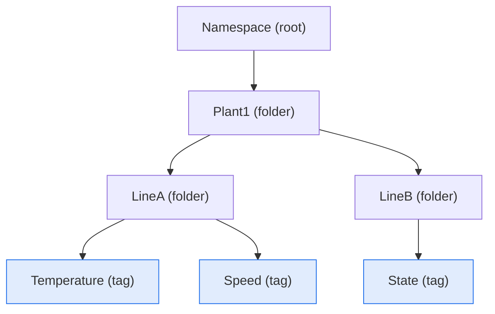
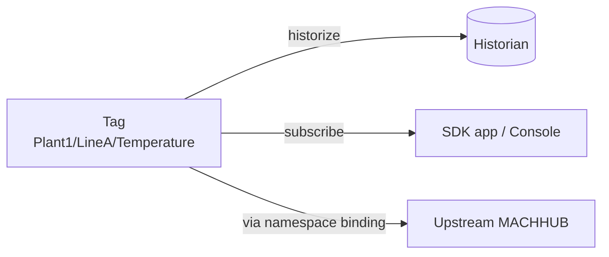
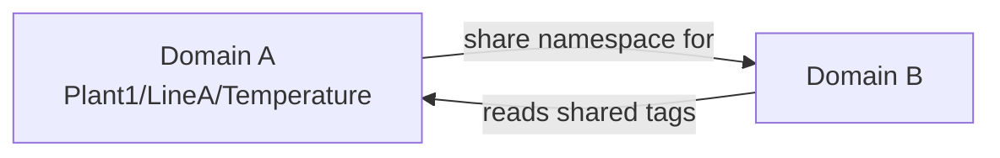

The **Unified Namespace (UNS)** is MACHHUB's single, hierarchical view of everything
happening in a [domain](/concepts/domains/). Instead of scattering signals across
disconnected systems, the UNS arranges them into one tree — and every leaf in that
tree is a live **Tag** delivered over MQTT.

## The tree: Namespace → Folders → Tags

A UNS is a tree of **levels**. Each level has a name and may contain child levels.
A level is either a **Folder** (a grouping node) or a **Tag** (a leaf that carries a
value):



Folders and tags share the same shape — a level differs only by whether it is marked
as a tag. Each level has a **name** and description, an optional **Historize**
setting, and its **child** folders and tags. A Tag also exposes its current **value**.

**Import / Export** works on the **tree structure**, not values: Export saves a
folder/tag subtree (the shape, without any tag data), and Import re-creates that
structure under another namespace or folder.

## Tags are MQTT topics

A Tag's position in the tree **is** its MQTT topic. The path from the root down to
the leaf, joined with `/`, is the topic that devices, the SDK, flows, and the console
publish and subscribe to. The tree above yields topics such as:

```
Plant1/LineA/Temperature
Plant1/LineA/Speed
Plant1/LineB/State
```

Because tags are plain MQTT topics, anything that speaks MQTT can read or write them.
The realtime delivery of these topics is covered in [Realtime & MQTT](/concepts/realtime/).

## Mirroring a tag upstream

A tag's value can be relayed to another MACHHUB instance. Mirroring is configured per
**namespace** through [Upstreams](/concepts/upstreams/): you bind a branch of the UNS
to a remote MACHHUB and the tags under it mirror together — there is no per-tag rule.



## Sharing a namespace across domains

**Namespace sharing** lets you grant another [domain](/concepts/domains/) access to
part of your domain's UNS. You share access to your namespace **for another domain**,
so that domain can read and use your tags without owning them — useful when one
Application needs live signals that live in a different domain.



## Historizing a tag

Any tag can be recorded to the [Historian](/concepts/historian/) by enabling its
`Historize` block (on-change `event` or sampled `timeseries`, with a sampling time
and retention period). The UNS is where you turn historization on; the Historian
concept page covers how the data is stored and queried.

## Working with the UNS

- In the console, the UNS is the namespace editor where you build the tree and toggle
  historization.
- From the SDK, you read and write tag values by topic. See
  [SDK Tags](/sdk/realtime/) and [SDK Historian](/sdk/historian/).

<figure>
  <div class="mh-shot">📷 Screenshot to capture: <strong>The namespace tree editor showing folders, a tag, and its access/historize settings</strong></div>
</figure>

Continue with [Realtime & MQTT](/concepts/realtime/) to see how tag values flow, or
[Upstreams](/concepts/upstreams/) to bridge them to another MACHHUB instance.
