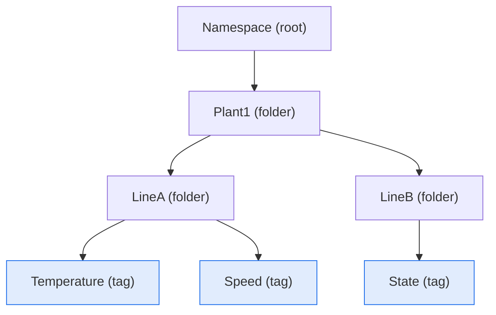
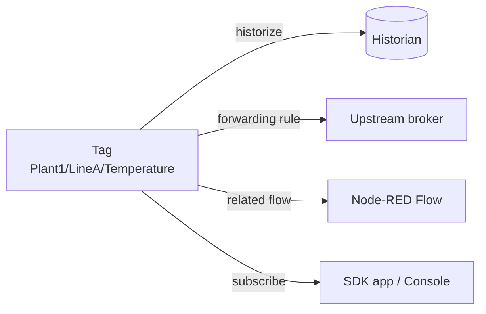

The **Unified Namespace (UNS)** is MACHHUB's single, hierarchical view of everything
happening in a [domain](/concepts/domains/). Instead of scattering signals across
disconnected systems, the UNS arranges them into one tree — and every leaf in that
tree is a live **Tag** delivered over MQTT.

## The tree: Namespace → Folders → Tags

A UNS is a tree of **levels**. Each level has a name and may contain child levels.
A level is either a **Folder** (a grouping node) or a **Tag** (a leaf that carries a
value). A level is a Tag when its `tag` flag is `true`:



In the data model, every level is the same `Level` type — folders and tags differ
only by the `Tag` boolean:

```go
type Level struct {
    Name            string
    Description     string
    Access          string           // "R" or "RW"
    Tag             bool             // true => this level is a Tag (a leaf)
    Historize       Historize        // see the Historian
    ForwardingRules []ForwardingRule // bridge this tag's topic to an upstream
    RelatedFlows    []Flow           // Node-RED flows attached to this level
    Children        []Level          // child folders/tags
}
```

## Tags are MQTT topics

A Tag's position in the tree **is** its MQTT topic. The path from the root down to
the leaf, joined with `/`, is the topic that devices, the SDK, flows, and the console
publish and subscribe to. The tree above yields topics such as:

```
Plant1/LineA/Temperature
Plant1/LineA/Speed
Plant1/LineB/State
```

Because tags are plain MQTT topics, anything that speaks MQTT can read or write them.
The realtime delivery of these topics is covered in [Realtime & MQTT](/concepts/realtime/).

## Access levels

Each level carries an `Access` field that governs how it may be used:

| Value | Meaning |
| --- | --- |
| `R` | **Read-only** — the value can be subscribed to but not written. |
| `RW` | **Read/Write** — the value can be both subscribed to and published. |

Newly created levels default to `R`. **Folders** are organizational, so they are
read-only (`R`); the meaningful read/write distinction applies to **Tags**.

:::note
This per-level access is a property of the UNS structure. It is separate from
Casbin [authorization](/concepts/authorization/), which gates the
`manage_namespace` feature (who may *edit the tree*) at the API level.
:::

## Forwarding rules and related flows

Two things can be attached to a level to make it do more than hold a value:

- **Forwarding rules** bridge a tag's internal topic to an **upstream** broker. A
  rule maps an internal `topic` to an `upstreamTopic` and is bound to a namespace:

  ```go
  type ForwardingRule struct {
      Topic         string    // internal UNS topic
      UpstreamTopic string    // topic on the upstream broker
      NamespaceID   *RecordID
      Bind          bool
  }
  ```

  Forwarding is how edge tags fan out to a central broker. See
  [Upstreams](/concepts/upstreams/).

- **Related flows** are the Node-RED [Flows](/concepts/processes-and-flows/)
  associated with a level (`RelatedFlows` / `RelatedFlowsID`). Flows read and write
  tags through the `machhub.tag.read` and `machhub.tag.write` nodes, so a level can
  surface the visual logic that reacts to or produces its value.



## Historizing a tag

Any tag can be recorded to the [Historian](/concepts/historian/) by enabling its
`Historize` block (on-change `event` or sampled `timeseries`, with a sampling time
and retention period). The UNS is where you turn historization on; the Historian
concept page covers how the data is stored and queried.

## Working with the UNS

- In the console, the UNS is the namespace editor where you build the tree, set
  access, attach forwarding rules, and toggle historization.
- From the SDK, you read and write tag values by topic. See
  [SDK Tags](/sdk/tags/) and [SDK Historian](/sdk/historian/).

<figure>
  <div class="mh-shot">📷 Screenshot to capture: <strong>The namespace tree editor showing folders, a tag, and its access/historize settings</strong></div>
</figure>

Continue with [Realtime & MQTT](/concepts/realtime/) to see how tag values flow, or
[Upstreams](/concepts/upstreams/) to bridge them to other brokers.
