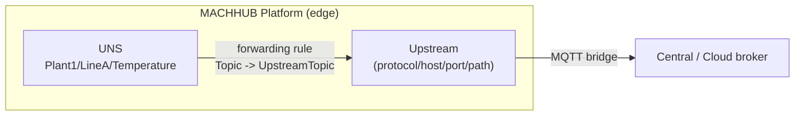
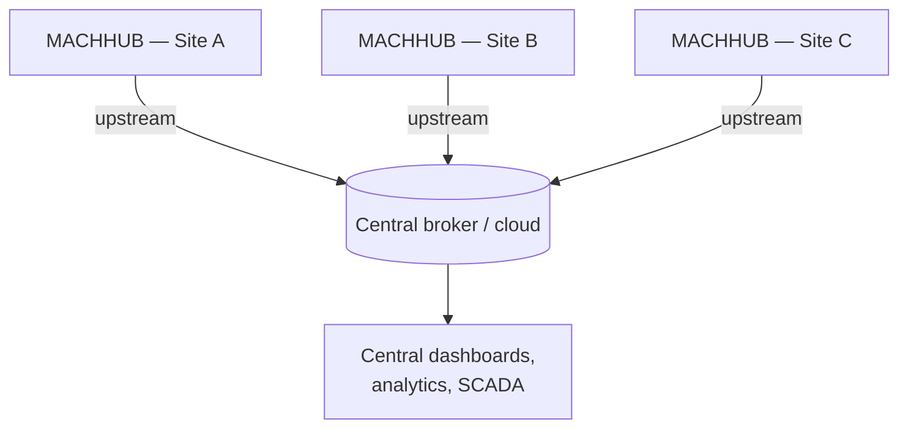

An **Upstream** is an MQTT **bridge** between this MACHHUB instance and another
broker. Where the [embedded broker](/concepts/realtime/) carries tags *inside* a
[domain](/concepts/domains/), an upstream connects that domain's
[Unified Namespace](/concepts/unified-namespace/) outward — typically from an edge
device up to a central or cloud broker.

## What an upstream connects to

An upstream is defined by its connection details, the namespaces it binds, and an
on/off switch:

```go
type Upstream struct {
    On               bool
    Protocol         string             // e.g. mqtt / ws
    Host             string
    Port             int
    Path             string             // for WebSocket transports
    Username         string
    Password         string
    NamespaceBinding []NamespaceBinding // which UNS branches to bridge
}
```

The `protocol`, `host`, `port`, and `path` describe *where* to connect; `username`
and `password` authenticate to the remote broker.

## Namespace bindings

A **namespace binding** ties a branch of this instance's UNS to a branch on the
remote broker. It maps an internal namespace to a target namespace, so a whole
subtree of tags can be mirrored across the bridge:

```go
type NamespaceBinding struct {
    InternalNamespace string // a branch in this UNS
    TargetNamespace   string // where it lands on the upstream
}
```

## Forwarding rules

Within a bound namespace, **forwarding rules** map individual internal topics to
upstream topics. A rule is the per-tag wiring that the bridge uses to relay messages:

```go
type ForwardingRule struct {
    Topic         string // internal UNS topic
    UpstreamTopic string // topic on the upstream broker
    NamespaceID   *RecordID
    Bind          bool
}
```

Forwarding rules are attached to UNS levels — see
[Unified Namespace](/concepts/unified-namespace/) — and an upstream applies them to
decide what flows over the bridge and under which topic it appears remotely.



## Edge-to-cloud fan-out

Upstreams are how MACHHUB scales from a single machine to a fleet. Each edge instance
forwards its tags up to a shared broker, so a central system sees data from many
sites through one namespace:



Because the bridge is plain MQTT with explicit topic mappings, the central broker can
be MACHHUB, a cloud IoT broker, or any MQTT-compatible system.

:::note
Upstreams move tag *messages* over MQTT. To persist values long-term, historize the
tags on the instance that owns them — see the [Historian](/concepts/historian/).
:::

## Managing upstreams

In the console, upstreams are configured under the UNS / connectivity settings: add
the broker connection, bind namespaces, and toggle the bridge on. The management API
exposes them under the `upstreams` feature, gated by
[authorization](/concepts/authorization/).

<figure>
  <div class="mh-shot">📷 Screenshot to capture: <strong>The upstream configuration form — connection details, namespace bindings, and the on/off toggle</strong></div>
</figure>

Continue with [Authentication](/concepts/authentication/) and
[Authorization](/concepts/authorization/), or revisit
[Realtime & MQTT](/concepts/realtime/).
