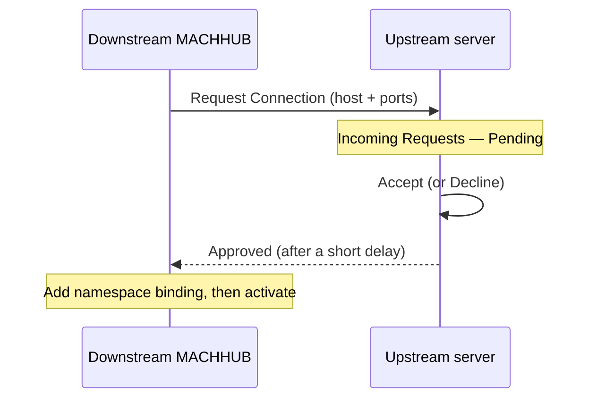
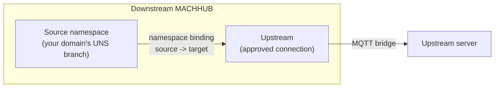
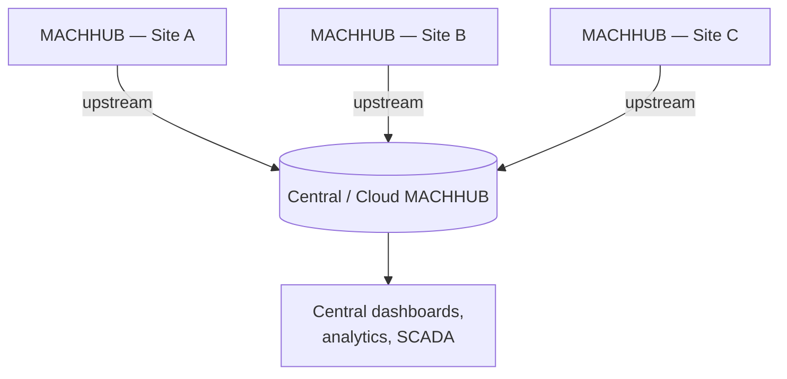

An **Upstream** is an MQTT **bridge** between this MACHHUB instance and **another
MACHHUB instance**. Where the [embedded broker](/concepts/realtime/) carries tags
*inside* a [domain](/concepts/domains/), an upstream connects that domain's
[Unified Namespace](/concepts/unified-namespace/) outward — typically from an edge
MACHHUB up to a central or cloud MACHHUB.

:::note[MACHHUB-to-MACHHUB only]
In the current build, an upstream bridges to **another MACHHUB instance**, not to an
arbitrary third-party MQTT broker. Both ends of the bridge run MACHHUB.
:::

## What an upstream connects to

An upstream points at another MACHHUB instance by its **connection details**: the
**protocol** (`mqtt` / `mqtts` / `ws` / `wss`), **broker host**, **broker port**
(default `1883`), and the **HTTP port** (default `80`). There is **no username or
password** — instead, the connection is established by a **request-and-approve**
handshake between the two instances.

The instance that creates the upstream is the **downstream** (also called the
**upstream client**); the instance it connects to is the **upstream server**.

## Connecting: request and approve

1. On the **downstream**, create the upstream with the remote's host and ports, then
   click **Request Connection**. The status starts as **Pending** until the upstream
   server responds.
2. On the **upstream server**, an operator opens **Incoming Requests**, sees the
   pending request (the requester's instance ID and source IP), and clicks **Accept**
   (or **Decline**).
3. After a short delay, the downstream sees the upstream's status turn **Approved** in
   the Upstreams table.

## Namespace bindings

Once approved, what mirrors over the bridge is controlled by **namespace bindings**. A
binding maps a **source** namespace (a branch of a domain's UNS on the downstream) to a
**target** namespace on the upstream server, so the **whole subtree** of tags under it
mirrors across. There is no per-tag rule: bind the branch and its tags mirror together.

With a binding set, **activate** the connection from the downstream (the on/off toggle
on the Upstreams row).

## Edge-to-cloud fan-out

Upstreams are how MACHHUB scales from a single machine to a fleet. Each edge instance
mirrors its tags up to a central MACHHUB, so a central system sees data from many
sites through one namespace:

Each edge site runs MACHHUB and bridges up to a central MACHHUB over MQTT with
explicit topic mappings, giving one namespace across the fleet.

:::note
Upstreams move tag *messages* over MQTT. To persist values long-term, historize the
tags on the instance that owns them — see the [Historian](/concepts/historian/).
:::

## Managing upstreams

In the console, upstreams live under **Connections → Upstreams**: create the
connection and **Request Connection**, **Accept** the request on the upstream server
(via **Incoming Requests**), add **namespace bindings** once approved, then **activate**
the bridge with the row toggle. Access is gated by
[authorization](/concepts/authorization/) under the `upstreams` feature. See
[Upstreams in the console](/console/upstreams/) for the full walkthrough.

<figure>
  
📷 Screenshot to capture: <strong>The Upstreams table and the Create / Edit Upstream dialog — connection details, Request Connection, namespace bindings, and the activate toggle</strong>

</figure>

Continue with [Authentication](/concepts/authentication/) and
[Authorization](/concepts/authorization/), or revisit
[Realtime & MQTT](/concepts/realtime/).
