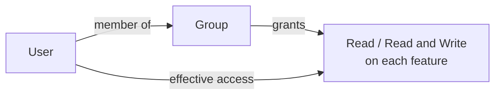

**Groups** are how MACHHUB grants access. Each group holds a set of permissions, and
users inherit the permissions of every group they belong to. Manage them under
**Account → Groups**.

<figure>
  
📷 Screenshot to capture: <strong>Groups grid at /account/groups</strong> — permission cards (the RBAC visual).

</figure>

## Create a group

1. Click **Add Group**.
2. Give it a **name** (the names `Superuser` and `Member` are reserved).
3. Set permissions in the matrix — for each **feature**, choose **No Access**,
   **Read**, or **Read and Write**.

The permission matrix covers these features:

| | |
| --- | --- |
| Applications | Manage Namespace |
| Users | Historian |
| Groups | Collections |
| Manage Own API Keys | Logs |
| Manage All API Keys | General Settings |
| Upstreams | Gateway Settings |
| | License |

🎞️ *GIF to capture: Add Group → name it → toggle a few features to Read / Read and Write → Save.*

## How it maps to the model

Each cell is an **action** (`read` or `read-write`) on a **feature**. Read-and-write
implies read. See [Authorization & Permissions](/concepts/authorization/) for scopes
and the full model, and [Permission JSON](/config-formats/permission-json/) to import
custom features.

## Reserved groups

- **Superuser** — full access (bypasses checks). Assign with care.
- **Member** — the baseline group.

## Related

- [Users](/console/users/)
- [API Keys](/console/api-keys/)
- [SDK → Authorization](/sdk/authorization/)
