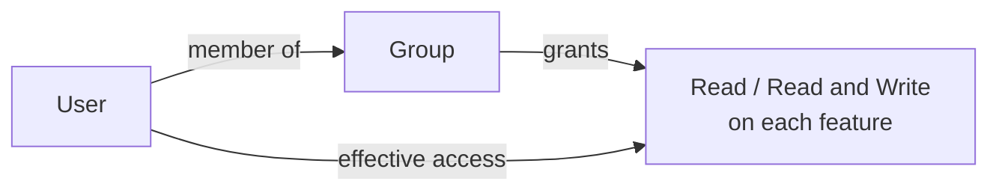

**Groups** are how MACHHUB grants access. Each group holds a set of permissions, and
users inherit the permissions of every group they belong to. Manage them under
**Account → Groups**.

<figure>
  
📷 Screenshot to capture: <strong>Groups grid at /account/groups</strong> — permission cards (the RBAC visual).

</figure>

## Create a group

1. Click **Add Group**.
2. Give it a **Group Name** (the names `Superuser` and `Member` are reserved).
3. Set permissions. Each feature has an access-level dropdown — pick **No Access**,
   **Read**, or **Read and Write**. (`read-write` allows both reading and writing.)
4. **Save**.

Permissions are organized into three collapsible sections. Each section header has a
**Set All …** control to apply one level to every feature in it at once.

### Global permissions

Platform-wide features (apply across all of MACHHUB):

| Feature | Covers |
| --- | --- |
| **Applications** | View / manage all applications in MACHHUB. |
| **Logs** | View / manage system logs. |
| **General Settings** | View / manage general system settings. |
| **Gateway Settings** | View / manage gateway settings. |
| **License** | View / manage MACHHUB licensing. |
| **Integrations** | View / manage MACHHUB integrations. |

### Domain permissions

Per-domain features (scoped to the **active domain**):

| Feature | Covers |
| --- | --- |
| **Users** | View / manage user accounts in this domain. |
| **Groups** | View / manage user groups in this domain. |
| **Upstreams** | View / manage upstream configurations. |
| **Manage Namespace** | View / manage namespaces in this domain. |
| **Historian** | View / manage historian data in this domain. |
| **Collections** | View / manage collections in this domain. |
| **Dashboard** | View / manage dashboards in this domain. |
| **Flows** | View / manage flows in this domain. |

### User-defined permissions

Custom features you create on the [Permissions](/console/permissions/) page. A fresh
install has none — the section reads *"No user-defined features available. Create them
in the Permissions page first."*

Once you've added features (e.g. `company_profile`, `contacts`), each appears here with
a **+ Add rules** dropdown instead of a single access level. A rule is an
**`action:scope`** pair built from the feature's custom **actions** and the domain's
**scopes** — for example `read:all`, `read:self`, `update:all`, or `update:self`. Add as
many rules as the group needs.

See [Authorization & Permissions](/concepts/authorization/) and
[Permission JSON](/config-formats/permission-json/) to define and import features,
actions, and scopes.

<figure>
  
🎞️ GIF to capture: Add Group → name it → set a few features to Read / Read and Write → Save.

</figure>

## How it maps to the model

For **global** and **domain** features, each cell is an access level — **No Access**,
**Read** (`read`), or **Read and Write** (`read-write`) — on that feature. **User-defined**
features work differently: you add **`action:scope`** rules instead (see above). See
[Authorization & Permissions](/concepts/authorization/) for the full model.

## Group hierarchy

Click **Configure Hierarchy** to order your groups top-to-bottom by level (drag and
drop). A user can only be assigned to groups at **their own level or lower** in the
hierarchy. The built-in groups anchor the ends: **Superuser** is the highest level and
**Member** is the lowest.

Hierarchy also sets **priority**: when a user belongs to **multiple groups in the same
domain**, the **higher-level** group's permissions take precedence over the lower-level
group's where they conflict.

<figure>
  
📷 Screenshot to capture: <strong>Configure Group Hierarchy</strong> — drag-and-drop list with Superuser (highest) and Member (lowest).

</figure>

## Reserved groups

- **Superuser** — full access; bypasses all permission checks. Assign with care.
- **Member** — the baseline group, with no permissions assigned by default.

## Related

- [Permissions](/console/permissions/)
- [Users](/console/users/)
- [API Keys](/console/api-keys/)
- [SDK → Authorization](/sdk/authorization/)
