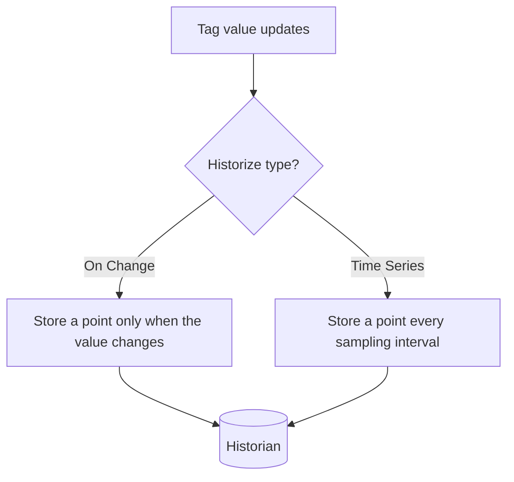

**Historizing** a tag tells MACHHUB to record its values over time so you can chart and
export them later in the [Historian](/console/historian/).

## Enable history

1. Open **Namespace → Manage** and select a tag.
2. In the tag-details pane, open the **Historize** dialog.
3. Toggle history **on** and choose a **Type**:
   - **On Change** (`event`) — record a point each time the value changes.
   - **Time Series** (`timeseries`) — record on a fixed schedule.
4. For Time Series, set the **Sampling Time** and unit (second / minute / hour).
5. Set a **Retention Period** and unit (day / week / month / year).
6. Save. The tag now shows a history icon in the tree.

<figure>
  
📷 Screenshot to capture: <strong>Historize dialog</strong> — Time Series selected with sampling + retention fields.

</figure>

<figure>
  
🎞️ GIF to capture: select a tag → open Historize → toggle on → choose Time Series + sampling/retention → Save.

</figure>

## On-change vs. time series

- Use **On Change** for state-like or sparse signals.
- Use **Time Series** for continuous signals you want sampled at a steady rate.

## Retention

The **retention period** controls how long history is kept before old points are
pruned. Choose a period that matches your analysis and compliance needs.

## Next

- View and export history → [Historian](/console/historian/)
- Query history in code → [SDK → Historian](/sdk/historian/)
- Concept → [Historian](/concepts/historian/)
