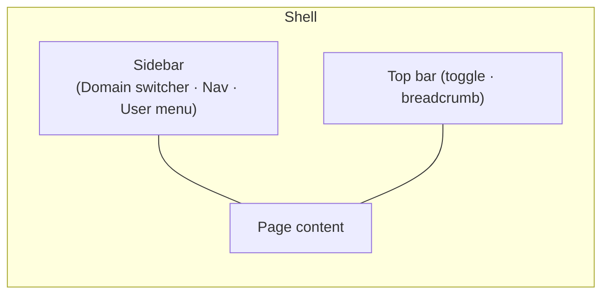

The **MACHHUB web console** is the browser app you use to operate the platform: build
collections, manage the Unified Namespace, view the Historian, and administer users.
It is a single-page app that talks to the REST API and subscribes to tags over
MQTT-over-WebSocket.

:::note[Screenshots]
This page (and the rest of this section) includes placeholders for screenshots and
short GIFs. See the [capture checklist](/reference/shot-list/) for exactly which
screens to grab. Replace the placeholders below with real images when available.
:::

<figure>
  
📷 Screenshot to capture: <strong>Console home / dashboard</strong> after login (the four stat cards). See shot-list.

</figure>

## Signing in

Open the console URL and sign in with your username and password. On success you land
on the **Home** dashboard. Your session (a JWT) is kept in the browser; signing out
clears it. See [Logging in & domains](/console/login-and-domains/).

## The shell

Every authenticated page shares the same shell:

- a collapsible **sidebar** on the left,
- a top bar with the sidebar toggle and an auto-generated **breadcrumb**, and
- the page content.

### Domain switcher

At the top of the sidebar is the **domain switcher**. A [Domain](/concepts/domains/)
is a tenant: the built-in **MACHHUB / Administrator** domain, plus any **Application**
domains you create. Switching domains changes what data and which navigation sections
you see.

### Navigation

The sidebar groups the platform into sections:

| Section | Pages | What you do there |
| --- | --- | --- |
| **Home** | dashboard | See counts (users, groups, tags) and license status. |
| **Applications** *(admin domain)* | list | Create and manage Application domains. |
| **Account** | Users, Groups, API Keys | Manage people, permissions, and machine credentials. |
| **Namespace** | Manage, Historian, Upstreams | Edit the UNS, view history, bridge brokers. |
| **Database** | Collections | Build schemas and edit records. |
| **Settings** | General, Gateway, License | Device settings and licensing. |
| **Support** | Logs | Inspect server logs. |

:::note[What you see depends on your domain]
In the **admin** domain you see all sections (plus Applications). In an
**Application** domain the navigation focuses on **Account** and **Namespace**.
:::

### User menu

At the bottom of the sidebar, the user menu shows your name and email, a light/dark
theme toggle, **Edit Profile**, and **Log out**.

## Where to go next

Pick the task you came to do:

- [Build a Collection](/console/collections/)
- [Manage the Unified Namespace](/console/namespace/)
- [Historize a tag](/console/historize/) and [view the Historian](/console/historian/)
- [Create an Upstream (MQTT bridge)](/console/upstreams/)
- [Manage users](/console/users/) and [groups & permissions](/console/groups/)
- [Settings & licensing](/console/settings/)
