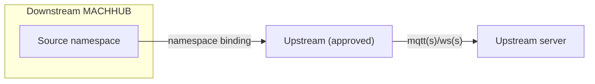

**Upstreams** bridge your MACHHUB broker to **another MACHHUB instance**, mirroring
parts of your [Unified Namespace](/concepts/unified-namespace/) for edge-to-cloud or
site-to-site data flow. Manage them under **Connections → Upstreams**.

There is **no username or password**. Instead you **request** a connection from the
downstream and an operator **accepts** it on the upstream server. The instance creating
the upstream is the **downstream**; the one it connects to is the **upstream server**.

<figure>
  
📷 Screenshot to capture: <strong>Upstreams list at /connections/upstreams</strong> — Host, Namespace Binding, Status (Approved), and the activate toggle.

</figure>

## 1. Request a connection (downstream)

1. Click **Create Upstream**.
2. Set the **Broker Host**: protocol (`mqtt://`, `mqtts://`, `ws://`, `wss://`) and the
   upstream server's host.
3. Set the **Broker Port** (default `1883`) and **HTTP Port** (default `80`).
4. Click **Request Connection**. The **Connection Status** starts at **Pending** and
   the request is sent to the upstream server.
5. **Save**. The upstream appears in the table with a **Pending** status.

## 2. Accept the request (upstream server)

On the **upstream server**, open **Incoming Requests** from the Upstreams page:

1. Find the pending request — it shows the requester's **instance ID** (e.g.
   `MACHHUB_ARJgkJ`) and its **source IP**.
2. Click **Accept** (or **Decline**). Use **Refresh** to update the list.

## 3. Bind namespaces (downstream)

After acceptance, the downstream's upstream request turns **Approved** in the table (after a
short delay — use **Refresh Connection** in **Edit Upstream** to check). Now define what
mirrors:

1. **Edit** the upstream and open **Upstream Binding**.
2. Pick a **source** namespace (a branch of your domain's UNS) → a **target** namespace
   on the upstream server. Use **Add Binding** for more.
3. **Update**.

## 4. Activate

With at least one binding set, flip the row **toggle** to activate the bridge. The
whole subtree under each bound namespace then mirrors to the upstream. Delete a bridge
from the same row.

See the [Upstreams concept](/concepts/upstreams/) for the model.
