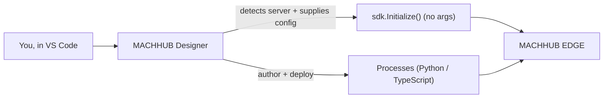

**MACHHUB Designer** is the official **Visual Studio Code** extension for MACHHUB
developers. Its headline feature is **zero-config** SDK setup: with the extension
installed, your app can call `sdk.Initialize()` with no arguments and the extension
supplies the connection details by detecting your MACHHUB server.

:::note[Help wanted — assets & marketplace link]
This page is written from how the extension is used across the SDK guides. A few
details still need to be filled in from the published extension. If you can provide
them, drop them in here:

- the **Marketplace listing URL** and the exact **extension ID** (`publisher.name`);
- screenshots / a short GIF of the extension in action (see the placeholders below);
- the precise command names and any settings the extension contributes.

Source repository (internal): the **MACHHUB Designer** project on Azure DevOps.
:::

## What it does

- **Zero-config initialization.** In development you don't manage connection URLs or
  keys — the extension provides them, so `await sdk.Initialize()` just works. (For
  production you still use [manual config](/sdk/initialization/) from environment
  variables.)
- **Process authoring.** Write and deploy [Processes](/processes/overview/) (serverless
  functions) directly from the editor; the extension uploads your code bundle to the
  platform.

## Install

<ol>
  <li>Open the Extensions view in VS Code.</li>
  <li>Search for <strong>MACHHUB Designer</strong>.</li>
  <li>Install it, then reload VS Code.</li>
</ol>

<figure>
  
📷 Screenshot to capture: <strong>MACHHUB Designer on the VS Code Marketplace</strong> (listing page).

</figure>

<figure>
  
🎞️ GIF to capture: <strong>Zero-config init</strong> — open a project, run <code>sdk.Initialize()</code>, and show it connecting via the extension.

</figure>

## Typical workflow

1. Install the extension and open your app project.
2. Install the SDK: `npm install @machhub-dev/sdk-ts`.
3. Initialize with zero-config: `await sdk.Initialize();`.
4. Build your app using the [SDK](/sdk/initialization/) and your
   [framework guide](/frameworks/overview/).
5. Author and deploy [Processes](/processes/overview/) from the editor.

## See also

- [Install & initialize the SDK](/sdk/initialization/)
- [Authoring Processes](/processes/overview/)
- [AI Agent Skills](/skills/overview/) — the Designer pairs with editor AI skills for
  even faster scaffolding.
