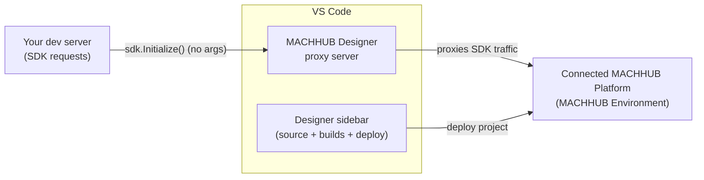

**MACHHUB Designer** is the official **Visual Studio Code** extension for MACHHUB
application developers. It connects VS Code to a **MACHHUB Platform server** (local or remote) —
the active connection is your **MACHHUB Environment** — and gives you an in-editor
workflow to develop, build, and deploy applications against it.

Get it from the
[Visual Studio Marketplace](https://marketplace.visualstudio.com/items?itemName=machhub.machhub-designer)
— extension ID `machhub.machhub-designer`.

## What it does

- **Remote platform connection.** Connect VS Code to a MACHHUB Platform server (local
  or remote), authenticating with a [Developer Key](/console/api-keys/); the connected
  server is your active **MACHHUB Environment**.
- **Source & build sidebar.** A sidebar segments your project's source and builds and
  lets you **deploy the project to the connected platform** without leaving the editor.
- **Dev-server proxy.** The extension proxies your dev server's SDK requests to the
  connected platform, so `await sdk.Initialize()` works with **no connection config**
  in development. In production the app is hosted on the MACHHUB Platform, so the SDK
  resolves its connection from the host — [manual config](/sdk/initialization/) is only
  for self-hosting, a different server/domain, or hardcoding.

## Connection configuration

The **MACHHUB Runtime Connection** panel is where you configure and switch
environments. A status badge (**Connected** / disconnected) shows the current state.

<figure>
  
📷 Screenshot to capture: <strong>MACHHUB Runtime Connection</strong> panel — Configuration Profiles list + connection fields.

</figure>

### Configuration Profiles

Each **profile** is a saved connection. The list supports **+ New Profile**, and per
row: **Switch** (make it active), **Rename**, and **Delete**. The active profile is
marked **(Active)**. Use profiles to keep separate setups (e.g. `nonprod`,
`nonprod/oee-enterprise`, `site.intellogic`) and switch between them.

### Connection fields

| Field | Required | Notes |
| --- | --- | --- |
| **Developer Token** | yes | A [Developer Key](/console/api-keys/) (`mchx_…`) used to authenticate. |
| **Application ID** | yes | Target application ID of your project (e.g. `oee_enterprise`). |
| **HTTP API URL** | no | Defaults to `http://localhost:6188`. |
| **MQTT URL** | no | Defaults to `ws://localhost:180`. |
| **Build Folder Path** | no | Build output folder, relative to workspace root. Defaults to `build`. |

The URLs are optional — leave them empty to use the defaults. Actions:

- **Save & Connect** — save the profile and connect.
- **Test Connection** — verify the settings without switching.
- **Disconnect** — drop the active connection.

### Development Server Logs

The panel also exposes the dev server's logs: **View Logs**, **Clear Logs**,
**Refresh**, and **Restart Server**.

## Install

<ol>
  <li>Open the Extensions view in VS Code.</li>
  <li>Search for <strong>MACHHUB Designer</strong> (extension ID <code>machhub.machhub-designer</code>), or install it from the <a href="https://marketplace.visualstudio.com/items?itemName=machhub.machhub-designer">Marketplace listing</a>.</li>
  <li>Install it, then reload VS Code.</li>
</ol>

:::caution[Open the sidebar so the extension loads]
MACHHUB Designer does **not** auto-activate if its **sidebar is closed** when VS Code
starts. After launching the IDE, open the **MACHHUB Designer sidebar** to load the
extension (run **View: Show MACHHUB** from the Command Palette if you don't see it).
:::

<figure>
  
📷 Screenshot to capture: <strong>MACHHUB Designer on the VS Code Marketplace</strong> (listing page).

</figure>

<figure>
  
🎞️ GIF to capture: <strong>Connect → develop → deploy</strong> — connect to a MACHHUB Environment, run <code>sdk.Initialize()</code> (proxied to the platform), then deploy the project from the Designer sidebar.

</figure>

<figure>
  
📷 Screenshot to capture: <strong>The Designer sidebar</strong> — source and builds sections, the connected MACHHUB Environment, and the deploy action.

</figure>

## Typical workflow

1. Install the extension and open your app project.
2. *(Optional)* For AI-assisted development (Claude Code, GitHub Copilot, Antigravity
   AI, or Cursor), clone the [`@machhub-dev/skills`](/skills/overview/) repo and place
   the skill folders where your assistant looks for them — see
   [AI Agent Skills](/skills/overview/).
3. **Connect** the Designer to your MACHHUB Platform server, authenticating with a
   [Developer Key](/console/api-keys/) — this becomes your active **MACHHUB
   Environment**. The proxy uses that key for all SDK traffic it forwards.
4. Install the SDK: `npm install @machhub-dev/sdk-ts`.
5. Initialize with zero-config: `await sdk.Initialize();` — the Designer proxy routes
   your dev server's SDK requests to the connected platform.
6. Build your app using the [SDK](/sdk/initialization/) and your
   [framework guide](/frameworks/overview/).
7. **Deploy** your project to MACHHUB from the Designer sidebar.

## Commands

Run these from the VS Code **Command Palette** (`Ctrl/Cmd + Shift + P`):

| Command | What it does |
| --- | --- |
| **MACHHUB: Configure API Connection** | Open the Runtime Connection panel (profiles, token, URLs). |
| **MACHHUB: Restart Extension Server** | Restart the Designer's local dev/proxy server. |
| **MACHHUB: Focus on Build View** | Reveal the Build view. |
| **MACHHUB: Focus on Collections View** | Reveal the Collections view. |
| **MACHHUB: Focus on Processes View** | Reveal the Processes view. |
| **MACHHUB: Focus on NODE-RED Flows View** | Reveal the Node-RED Flows view. |
| **View: Show MACHHUB** | Show the MACHHUB sidebar container. |
| **View: Toggle MACHHUB ATTRIBUTES** Deprecated | Toggle the Attributes view. |
| **View: Toggle MACHHUB Flow Palette** Deprecated | Toggle the Flow Palette view. |

For anything not listed here, see the
[Marketplace listing](https://marketplace.visualstudio.com/items?itemName=machhub.machhub-designer).

## See also

- [Install & initialize the SDK](/sdk/initialization/)
- [Authoring Processes](/processes/overview/)
- [AI Agent Skills](/skills/overview/) — the Designer pairs with editor AI skills for
  even faster scaffolding.
