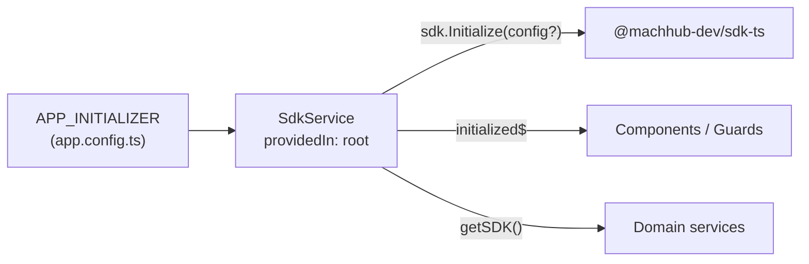
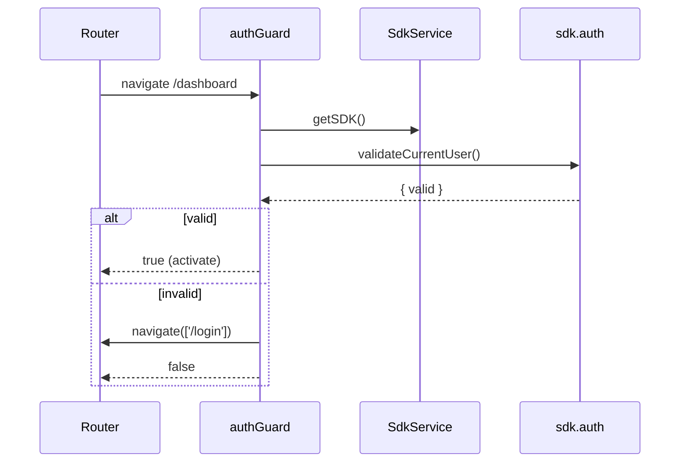

This guide shows the idiomatic way to use [`@machhub-dev/sdk-ts`](/sdk/initialization/)
in an Angular application: a singleton `SdkService` provided in `root`, initialized
through `APP_INITIALIZER` so the SDK is ready before your components render, plus a
Signals-based data service and a functional route guard.

See the [Framework Guides Overview](/frameworks/overview/) for the shared patterns. The
SDK works in **both client and server** contexts, so you can use it during Angular
Universal SSR as well as in the browser.

## 1. Install

Scaffold an app with the Angular CLI and add the SDK:

```bash
# Create Angular app
ng new my-machhub-app
cd my-machhub-app

# Install MACHHUB SDK
npm install @machhub-dev/sdk-ts
```

## 2. Initialize

There are two ways to initialize, and both flow through the same `SdkService`
(below). The choice is simply whether you pass a config to `sdk.Initialize()`.

### No connection config (recommended)

Call `Initialize` with **no arguments** — in both development and production. In
development the [MACHHUB Designer](/designer/overview/) (connected to a MACHHUB
Platform) proxies your dev server's SDK requests to the connected platform; in
production the app is hosted on the MACHHUB Platform, so the SDK resolves its
connection from the host:

```ts
const success = await this.sdk.Initialize();
```

The matching `app.config.ts` factory passes nothing:

```ts
// filepath: src/app/app.config.ts
import { ApplicationConfig, APP_INITIALIZER } from '@angular/core';
import { provideRouter } from '@angular/router';
import { routes } from './app.routes';
import { SdkService } from './services/sdk.service';

/**
 * SDK Initialization Factory
 * Initializes MACHHUB SDK before app bootstrap using Designer Extension (zero-config)
 */
export function initializeSDK(sdkService: SdkService) {
  return () => sdkService.initialize();
}

export const appConfig: ApplicationConfig = {
  providers: [
    provideRouter(routes),
    {
      provide: APP_INITIALIZER,
      useFactory: initializeSDK,
      deps: [SdkService],
      multi: true
    }
  ]
};
```

### Manual (environment variables)

Read connection details from Angular's `environment.ts` and pass them to `initialize`
**only** when you self-host the app, target a different server/domain, or want to
hardcode the connection:

```ts
// filepath: src/app/app.config.ts
import { ApplicationConfig, APP_INITIALIZER } from '@angular/core';
import { provideRouter } from '@angular/router';
import { routes } from './app.routes';
import { SdkService } from './services/sdk.service';
import { environment } from '../environments/environment';

function initializeApp(sdkService: SdkService) {
  return () => sdkService.initialize({
    application_id: environment.machhubAppId,
    httpUrl: environment.machhubHttpUrl,
    mqttUrl: environment.machhubMqttUrl
  });
}

export const appConfig: ApplicationConfig = {
  providers: [
    provideRouter(routes),
    {
      provide: APP_INITIALIZER,
      useFactory: initializeApp,
      deps: [SdkService],
      multi: true
    }
  ]
};
```

:::tip[Why APP_INITIALIZER]
`APP_INITIALIZER` runs the returned promise **before** Angular bootstraps the
application. Returning `sdkService.initialize(...)` guarantees the SDK is connected by
the time any component, guard, or resolver runs — so `getSDK()` never throws "not
initialized".
:::

## 3. Shared SDK instance — `SdkService`

Wrap the SDK in a service provided in `root` so the whole app shares one instance and
one connection. It exposes an `initialized$` observable so components can react to
readiness, and an `initialize(config?)` method used by `APP_INITIALIZER`.

```ts
// filepath: src/app/services/sdk.service.ts
import { Injectable } from '@angular/core';
import { SDK, type SDKConfig } from '@machhub-dev/sdk-ts';
import { BehaviorSubject, Observable } from 'rxjs';

@Injectable({
  providedIn: 'root' // Singleton service
})
export class SdkService {
  private sdk: SDK | null = null;
  private isInitialized = false;
  private initPromise: Promise<boolean> | null = null;

  // Observable for initialization state
  private initializedSubject = new BehaviorSubject<boolean>(false);
  public initialized$ = this.initializedSubject.asObservable();

  constructor() {
    this.sdk = new SDK();
  }

  /**
   * Initialize SDK with configuration
   */
  async initialize(config?: SDKConfig): Promise<boolean> {
    if (this.isInitialized) {
      return true;
    }

    if (this.initPromise) {
      return this.initPromise;
    }

    this.initPromise = (async () => {
      try {
        if (!this.sdk) {
          this.sdk = new SDK();
        }

        const success = await this.sdk.Initialize(config);
        this.isInitialized = success;
        this.initializedSubject.next(success);

        if (success) {
          console.log('MACHHUB SDK initialized successfully');
        }

        return success;
      } catch (error) {
        console.error('Error initializing SDK:', error);
        this.isInitialized = false;
        this.initializedSubject.next(false);
        return false;
      } finally {
        this.initPromise = null;
      }
    })();

    return this.initPromise;
  }

  /**
   * Get SDK instance
   */
  getSDK(): SDK {
    if (!this.isInitialized || !this.sdk) {
      throw new Error('SDK not initialized. Call initialize() first.');
    }
    return this.sdk;
  }

  /**
   * Get or initialize SDK
   */
  async getOrInitializeSDK(config?: SDKConfig): Promise<SDK> {
    if (!this.isInitialized) {
      await this.initialize(config);
    }
    return this.getSDK();
  }
}
```



:::note[Works during SSR too]
`APP_INITIALIZER` bootstraps the SDK on the client, but the SDK also runs server-side,
so you can call `getSDK()` from Angular Universal server rendering when you need data
there. See [SSR notes](#6-ssr-notes) below.
:::

## 4. Reactive data helper

Domain services use Angular **Signals** for reactive state (`products`, `loading`) and
delegate every call to `sdkService.getSDK()`. This is the Angular equivalent of a
`useCollection` hook.

```ts
// filepath: src/app/services/product.service.ts
import { Injectable, signal } from '@angular/core';
import { SdkService } from './sdk.service';

export interface Product {
  id: string;
  name: string;
  price: number;
  description?: string;
}

@Injectable({
  providedIn: 'root'
})
export class ProductService {
  private collectionName = 'products';
  products = signal<Product[]>([]);
  loading = signal(false);

  constructor(private sdkService: SdkService) { }

  async getAll(): Promise<Product[]> {
    this.loading.set(true);
    try {
      const sdk = this.sdkService.getSDK();
      const items = await sdk.collection(this.collectionName).getAll();
      const products = items.map(this.transform);
      this.products.set(products);
      return products;
    } catch (error) {
      console.error('Failed to fetch products:', error);
      throw error;
    } finally {
      this.loading.set(false);
    }
  }

  async create(data: Omit<Product, 'id'>): Promise<Product> {
    const sdk = this.sdkService.getSDK();
    const created = await sdk.collection(this.collectionName).create(data);
    const product = this.transform(created);
    this.products.update(products => [...products, product]);
    return product;
  }

  async update(id: string, updates: Partial<Product>): Promise<Product> {
    const sdk = this.sdkService.getSDK();
    const fullId = `myapp.${this.collectionName}:${id}`;
    const updated = await sdk.collection(this.collectionName).update(fullId, updates);
    const product = this.transform(updated);
    this.products.update(products => products.map(p => p.id === id ? product : p));
    return product;
  }

  async delete(id: string): Promise<void> {
    const sdk = this.sdkService.getSDK();
    const fullId = `myapp.${this.collectionName}:${id}`;
    await sdk.collection(this.collectionName).delete(fullId);
    this.products.update(products => products.filter(p => p.id !== id));
  }

  private transform(raw: any): Product {
    return {
      id: this.extractId(raw.id),
      name: raw.name,
      price: raw.price,
      description: raw.description
    };
  }

  private extractId(value: any): string {
    if (typeof value === 'object' && value?.ID) {
      return value.ID;
    }
    if (typeof value === 'string' && value.includes(':')) {
      return value.split(':')[1];
    }
    return value;
  }
}
```

A component consumes the signals directly in its template:

```ts
// filepath: src/app/components/products/products.component.ts
import { Component, OnInit } from '@angular/core';
import { CommonModule } from '@angular/common';
import { ProductService } from '../../services/product.service';

@Component({
  selector: 'app-products',
  standalone: true,
  imports: [CommonModule],
  template: `
    <div *ngIf="productService.loading()">Loading...</div>
    <div *ngFor="let product of productService.products()">
      {{ product.name }} - {{ product.price | currency }}
    </div>
  `
})
export class ProductsComponent implements OnInit {
  constructor(public productService: ProductService) {}

  ngOnInit() {
    this.productService.getAll();
  }
}
```

:::tip[Prefer RxJS?]
If your codebase is RxJS-first, expose a `BehaviorSubject` and convert SDK promises
with `from(...)`. Wrap reads in `pipe(map(...), catchError(...))` and unsubscribe in
`ngOnDestroy` with the `takeUntil` pattern. Signals are recommended for new
(Angular 16+) code.
:::

## 5. Auth + route guard

Use a functional `CanActivateFn`. Call `sdk.auth.validateCurrentUser()`, and redirect
to `/login` when the session is invalid:

```ts
// filepath: src/app/guards/auth.guard.ts
import { inject } from '@angular/core';
import { Router, CanActivateFn } from '@angular/router';
import { SdkService } from '../services/sdk.service';

export const authGuard: CanActivateFn = async (route, state) => {
  const sdkService = inject(SdkService);
  const router = inject(Router);

  try {
    const sdk = sdkService.getSDK();
    const { valid } = await sdk.auth.validateCurrentUser();

    if (!valid) {
      router.navigate(['/login']);
      return false;
    }

    return true;
  } catch (error) {
    console.error('Auth guard error:', error);
    router.navigate(['/login']);
    return false;
  }
};
```

Attach it to protected routes. You can also build a `permissionGuard(permission)`
factory on top of `sdk.auth.hasPermission(...)`:

```ts
// filepath: src/app/app.routes.ts
import { Routes } from '@angular/router';
import { authGuard } from './guards/auth.guard';

export const routes: Routes = [
  { path: 'login', component: LoginComponent },
  {
    path: 'dashboard',
    component: DashboardComponent,
    canActivate: [authGuard]
  },
  { path: '**', redirectTo: '/login' }
];
```



## 6. SSR notes

The SDK runs in **both client and server** contexts, so it works with Angular Universal
/ SSR:

- `APP_INITIALIZER` initializes the SDK as the app bootstraps; `SdkService` then exposes
  the shared instance to components, guards, and resolvers on either side.
- For server-rendered data you can call `getSDK()` directly from a resolver or server
  code path — no need to drop to the REST API.
- The [REST API](/api/overview/) remains available if you prefer a raw `fetch` with an
  auth header for a given server call.

## 7. Environment variables

Angular reads config from `environment.ts` (development) and `environment.prod.ts`
(production). The keys consumed by `app.config.ts` are `machhubAppId`,
`machhubHttpUrl`, and `machhubMqttUrl`:

```ts
// filepath: src/environments/environment.ts
export const environment = {
  production: false,
  machhubAppId: 'your-app-id',
  machhubHttpUrl: 'http://localhost:80',
  machhubMqttUrl: 'mqtt://localhost:1883'
};

// filepath: src/environments/environment.prod.ts
export const environment = {
  production: true,
  machhubAppId: 'your-production-app-id',
  machhubHttpUrl: 'https://api.machhub.io',
  machhubMqttUrl: 'mqtts://mqtt.machhub.io'
};
```

| `environment` key | Maps to `SDKConfig` | Purpose |
| --- | --- | --- |
| `machhubAppId` | `application_id` | Your application identifier. |
| `machhubHttpUrl` | `httpUrl` | REST API endpoint. |
| `machhubMqttUrl` | `mqttUrl` | MQTT broker (use `wss://`/`mqtts://` in production). |

:::note[Dev vs prod URLs]
Local dev uses `http://localhost:80` and `mqtt://localhost:1883`. In the browser and
production, use secure transports such as `mqtts://` or `wss://`.
:::

## Next

- SDK reference: [Install & Initialize the SDK](/sdk/initialization/).
- Compare frameworks: [Framework Guides Overview](/frameworks/overview/).
