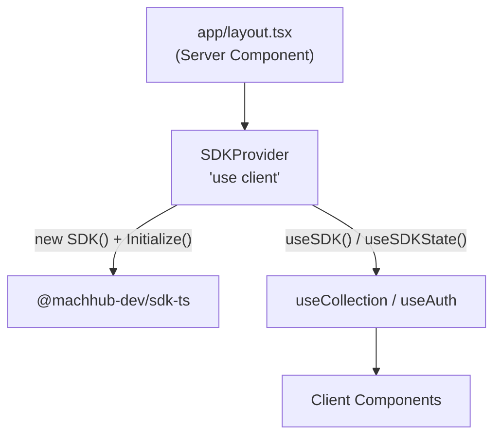
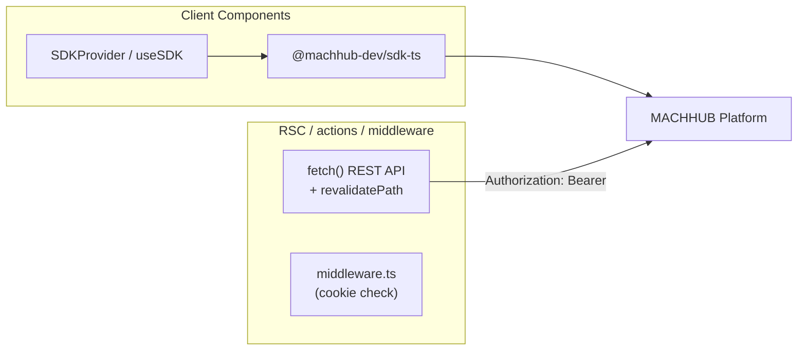

This guide shows the idiomatic way to use [`@machhub-dev/sdk-ts`](/sdk/initialization/)
in a Next.js 14+ (App Router) or React application: a `'use client'` Context that owns
the single SDK instance, a `useCollection` hook for CRUD, a `useAuth` hook, and the
server-side patterns for Server Components and route protection.

See the [Framework Guides Overview](/frameworks/overview/) for the shared rules. The
key one for Next.js: **the SDK runs only in Client Components**.

## 1. Install

Scaffold an app and add the SDK:

```bash
# Create Next.js app
npx create-next-app@latest my-machhub-app
cd my-machhub-app

# Install MACHHUB SDK
npm install @machhub-dev/sdk-ts
```

## 2. Initialize

Initialization happens inside the `SDKProvider` (below) — a Client Component that
calls `sdk.Initialize()` in a `useEffect`. The only difference between no-config and
manual is whether you pass a config object.

### No connection config (recommended)

Call `Initialize` with **no arguments** — in both development and production. In
development the [MACHHUB Designer](/designer/overview/) proxies your dev server's SDK
requests to the connected platform; in production the app is hosted on the MACHHUB
Platform, so the SDK resolves its connection from the host:

```tsx
const success = await sdk.Initialize();
```

### Manual (environment variables)

Pass connection details read from `NEXT_PUBLIC_*` environment variables **only** when
you self-host the app, target a different server/domain, or want to hardcode the
connection:

```tsx
const success = await sdk.Initialize({
  application_id: process.env.NEXT_PUBLIC_MACHHUB_APP_ID!,
  httpUrl: process.env.NEXT_PUBLIC_MACHHUB_HTTP_URL!,
  mqttUrl: process.env.NEXT_PUBLIC_MACHHUB_MQTT_URL!,
  natsUrl: process.env.NEXT_PUBLIC_MACHHUB_NATS_URL!
});
```

:::caution[Only NEXT_PUBLIC_* reaches the browser]
This guide initializes the SDK in a **client** provider, so its config uses the
`NEXT_PUBLIC_` prefix — only those variables are bundled into the browser. When you use
the SDK **server-side** (Server Components, actions, Route Handlers), read config from
**unprefixed** server-only env vars. Never expose a developer key with `NEXT_PUBLIC_`;
keep secrets unprefixed.
:::

## 3. Shared SDK instance — `SDKProvider` + `useSDK`

Create the SDK once in a React **Context**. The provider is a Client Component
(`'use client'`) that creates the instance with `useState(() => new SDK())`,
initializes it in `useEffect`, and exposes `{ sdk, initialized, error }`. `useSDK()`
returns the ready SDK; `useSDKState()` returns the raw context for loading/error UI.

```tsx
// filepath: src/contexts/SDKContext.tsx
'use client';

import React, { createContext, useContext, useEffect, useState } from 'react';
import { SDK } from '@machhub-dev/sdk-ts';

interface SDKContextType {
    sdk: SDK | null;
    initialized: boolean;
    error: Error | null;
}

const SDKContext = createContext<SDKContextType>({
    sdk: null,
    initialized: false,
    error: null
});

export function SDKProvider({ children }: { children: React.ReactNode; }) {
    const [sdk] = useState(() => new SDK());
    const [initialized, setInitialized] = useState(false);
    const [error, setError] = useState<Error | null>(null);

    useEffect(() => {
        let mounted = true;

        async function initializeSDK() {
            try {
                const success = await sdk.Initialize();

                if (mounted) {
                    if (success) {
                        setInitialized(true);
                        console.log('MACHHUB SDK initialized successfully!');
                    } else {
                        setError(new Error('SDK initialization returned false'));
                    }
                }
            } catch (err) {
                if (mounted) {
                    setError(err instanceof Error ? err : new Error('Unknown error'));
                    console.error('MACHHUB SDK initialization error:', err);
                }
            }
        }

        initializeSDK();

        return () => {
            mounted = false;
        };
    }, [sdk]);

    return (
        <SDKContext.Provider value={{ sdk, initialized, error }}>
            {children}
        </SDKContext.Provider>
    );
}

export function useSDK() {
    const context = useContext(SDKContext);

    if (!context.initialized) {
        throw new Error('SDK not initialized yet');
    }

    if (!context.sdk) {
        throw new Error('SDK is null');
    }

    return context.sdk;
}

export function useSDKState() {
    return useContext(SDKContext);
}
```

For the manual variant, accept an optional `config` prop and fall back to
`NEXT_PUBLIC_*` env vars:

```tsx
// filepath: src/contexts/SDKContext.tsx (manual)
const sdkConfig = config || {
    application_id: process.env.NEXT_PUBLIC_MACHHUB_APP_ID!,
    httpUrl: process.env.NEXT_PUBLIC_MACHHUB_HTTP_URL!,
    mqttUrl: process.env.NEXT_PUBLIC_MACHHUB_MQTT_URL!,
    natsUrl: process.env.NEXT_PUBLIC_MACHHUB_NATS_URL!
};

const success = await sdk.Initialize(sdkConfig);
```

Wrap the entire app in the provider from the **root layout**:

```tsx
// filepath: src/app/layout.tsx
import type { Metadata } from 'next';
import { SDKProvider } from '@/contexts/SDKContext';
import './globals.css';

export const metadata: Metadata = {
    title: 'MACHHUB App',
    description: 'Built with MACHHUB SDK',
};

export default function RootLayout({
    children,
}: {
    children: React.ReactNode;
}) {
    return (
        <html lang="en">
            <body>
                <SDKProvider>
                    {children}
                </SDKProvider>
            </body>
        </html>
    );
}
```



:::note[layout.tsx stays a Server Component]
`app/layout.tsx` itself has no `'use client'` directive — only `SDKProvider` does. The
`'use client'` boundary lives inside the provider, so the rest of your tree can still
use Server Components freely.
:::

## 4. Reactive data helper — `useCollection`

`useCollection<T>` wraps a collection and returns `items`, `loading`, `error`, plus
`getAll`/`getOne`/`create`/`update`/`remove`. All methods are memoized with
`useCallback` and call the SDK from `useSDK()`.

```ts
// filepath: src/hooks/useCollection.ts
'use client';

import { useState, useCallback } from 'react';
import { useSDK } from '@/contexts/SDKContext';

export function useCollection<T = any>(collectionName: string) {
    const sdk = useSDK();
    const [items, setItems] = useState<T[]>([]);
    const [loading, setLoading] = useState(false);
    const [error, setError] = useState<Error | null>(null);

    const transform = useCallback((raw: any): T => {
        if (raw.id && typeof raw.id === 'object' && raw.id.ID) {
            return { ...raw, id: raw.id.ID } as T;
        }
        if (raw.id && typeof raw.id === 'string' && raw.id.includes(':')) {
            return { ...raw, id: raw.id.split(':')[1] } as T;
        }
        return raw as T;
    }, []);

    const getAll = useCallback(async () => {
        setLoading(true);
        setError(null);

        try {
            const rawItems = await sdk.collection(collectionName).getAll();
            const transformed = rawItems.map(transform);
            setItems(transformed);
            return transformed;
        } catch (err) {
            const error = err instanceof Error ? err : new Error('Unknown error');
            setError(error);
            throw error;
        } finally {
            setLoading(false);
        }
    }, [sdk, collectionName, transform]);

    const create = useCallback(async (data: Partial<T>): Promise<T> => {
        setLoading(true);
        setError(null);

        try {
            const created = await sdk.collection(collectionName).create(data);
            const item = transform(created);
            setItems(prev => [...prev, item]);
            return item;
        } catch (err) {
            const error = err instanceof Error ? err : new Error('Unknown error');
            setError(error);
            throw error;
        } finally {
            setLoading(false);
        }
    }, [sdk, collectionName, transform]);

    const update = useCallback(async (id: string, updates: Partial<T>): Promise<T> => {
        const fullId = `myapp.${collectionName}:${id}`;
        const updated = await sdk.collection(collectionName).update(fullId, updates);
        const item = transform(updated);
        setItems(prev => prev.map(i => (i as any).id === id ? item : i));
        return item;
    }, [sdk, collectionName, transform]);

    const remove = useCallback(async (id: string): Promise<void> => {
        const fullId = `myapp.${collectionName}:${id}`;
        await sdk.collection(collectionName).delete(fullId);
        setItems(prev => prev.filter(i => (i as any).id !== id));
    }, [sdk, collectionName]);

    return { items, loading, error, getAll, create, update, remove };
}
```

A Client Component consumes it directly:

```tsx
// filepath: src/components/ProductList.tsx
'use client';

import { useEffect } from 'react';
import { useCollection } from '@/hooks/useCollection';

interface Product {
    id: string;
    name: string;
    price: number;
    description?: string;
}

export function ProductList() {
    const { items: products, loading, error, getAll, remove } = useCollection<Product>('products');

    useEffect(() => {
        getAll();
    }, [getAll]);

    if (loading) {
        return <div>Loading products...</div>;
    }

    if (error) {
        return <div>Error: {error.message}</div>;
    }

    return (
        <ul>
            {products.map(product => (
                <li key={product.id}>
                    <h3>{product.name}</h3>
                    <p>${product.price}</p>
                    <button onClick={() => remove(product.id)}>Delete</button>
                </li>
            ))}
        </ul>
    );
}
```

## 5. Auth + route guard

A `useAuth` hook centralizes login/logout and current-user state. For a hard
client-side guard, validate the session with `sdk.auth.validateCurrentUser()` and push
to `/login` when invalid:

```ts
// filepath: src/hooks/useAuthGuard.ts
'use client';

import { useEffect, useState } from 'react';
import { useRouter } from 'next/navigation';
import { useSDK } from '@/contexts/SDKContext';

export function useAuthGuard() {
    const sdk = useSDK();
    const router = useRouter();
    const [checking, setChecking] = useState(true);

    useEffect(() => {
        let mounted = true;

        async function check() {
            try {
                const { valid } = await sdk.auth.validateCurrentUser();
                if (mounted && !valid) {
                    router.push('/login');
                }
            } catch {
                if (mounted) router.push('/login');
            } finally {
                if (mounted) setChecking(false);
            }
        }

        check();
        return () => { mounted = false; };
    }, [sdk, router]);

    return { checking };
}
```

Use it at the top of any protected Client Component page:

```tsx
// filepath: src/app/dashboard/page.tsx
'use client';

import { useAuthGuard } from '@/hooks/useAuthGuard';

export default function DashboardPage() {
    const { checking } = useAuthGuard();

    if (checking) return <div>Loading...</div>;

    return <div>Dashboard Content</div>;
}
```

The reusable login/logout hook (`useAuth`) wraps `sdk.auth`:

```ts
// filepath: src/hooks/useAuth.ts
'use client';

import { useState, useCallback, useEffect } from 'react';
import { useSDK } from '@/contexts/SDKContext';

export function useAuth() {
    const sdk = useSDK();
    const [user, setUser] = useState<any>(null);
    const [loading, setLoading] = useState(true);

    const checkAuth = useCallback(async () => {
        try {
            const currentUser = await sdk.auth.getCurrentUser();
            setUser(currentUser);
        } catch {
            setUser(null);
        } finally {
            setLoading(false);
        }
    }, [sdk]);

    useEffect(() => { checkAuth(); }, [checkAuth]);

    const login = useCallback(async (username: string, password: string) => {
        const success = await sdk.auth.login(username, password);
        if (success) setUser(await sdk.auth.getCurrentUser());
        return success;
    }, [sdk]);

    const logout = useCallback(async () => {
        await sdk.auth.logout();
        setUser(null);
    }, [sdk]);

    return { user, loading, isAuthenticated: !!user, login, logout, checkAuth };
}
```

## 6. SSR notes

The SDK runs in **both client and server** contexts, so you can use it in Server
Components, Server Actions, Route Handlers, and `middleware.ts` — initialize it there
with server-only config. The [REST API](/api/overview/) with `fetch` + revalidate is
also a fine choice for server work, as shown below.

### Server Components and Server Actions: fetch + revalidatePath

```ts
// filepath: src/app/products/actions.ts
'use server';

import { revalidatePath } from 'next/cache';

export async function getProducts() {
  const response = await fetch(`${process.env.MACHHUB_HTTP_URL}/collections/products`, {
    headers: {
      'Authorization': `Bearer ${process.env.MACHHUB_DEVELOPER_KEY}`
    }
  });
  return response.json();
}

export async function createProduct(formData: FormData) {
  const name = formData.get('name') as string;
  const price = Number(formData.get('price'));

  await fetch(`${process.env.MACHHUB_HTTP_URL}/collections/products`, {
    method: 'POST',
    headers: {
      'Content-Type': 'application/json',
      'Authorization': `Bearer ${process.env.MACHHUB_DEVELOPER_KEY}`
    },
    body: JSON.stringify({ name, price })
  });

  revalidatePath('/products');
}
```

After a mutation, `revalidatePath('/products')` invalidates the cached render so the
next request re-fetches fresh server data.

### Route protection: middleware.ts

`middleware.ts` runs on the Edge — no SDK there either. Check an auth cookie and
redirect:

```ts
// filepath: src/middleware.ts
import { NextResponse } from 'next/server';
import type { NextRequest } from 'next/server';

export function middleware(request: NextRequest) {
  const authToken = request.cookies.get('auth-token');

  if (!authToken && request.nextUrl.pathname.startsWith('/dashboard')) {
    return NextResponse.redirect(new URL('/login', request.url));
  }

  return NextResponse.next();
}

export const config = {
  matcher: '/dashboard/:path*'
};
```



## 7. Environment variables

Put client config in `.env.local` with the `NEXT_PUBLIC_` prefix; keep server secrets
(like the developer key) unprefixed:

```bash
# filepath: .env.local
# Client-side (bundled into the browser) — consumed by SDKProvider
NEXT_PUBLIC_MACHHUB_APP_ID=your-app-id
NEXT_PUBLIC_MACHHUB_HTTP_URL=http://localhost:80
NEXT_PUBLIC_MACHHUB_MQTT_URL=mqtt://localhost:1883

# Server-only (NOT exposed to the browser) — used by actions & middleware
MACHHUB_HTTP_URL=http://localhost:80
MACHHUB_DEVELOPER_KEY=your-developer-key
```

| Variable | Side | Purpose |
| --- | --- | --- |
| `NEXT_PUBLIC_MACHHUB_APP_ID` | Client | `application_id` for the SDK. |
| `NEXT_PUBLIC_MACHHUB_HTTP_URL` | Client | REST API endpoint for the SDK. |
| `NEXT_PUBLIC_MACHHUB_MQTT_URL` | Client | MQTT broker (use `wss://` in production). |
| `MACHHUB_HTTP_URL` | Server | REST endpoint for `fetch` in actions/RSC. |
| `MACHHUB_DEVELOPER_KEY` | Server | Bearer token for server-side REST calls. |

## Next

- SDK reference: [Install & Initialize the SDK](/sdk/initialization/).
- Compare frameworks: [Framework Guides Overview](/frameworks/overview/).
