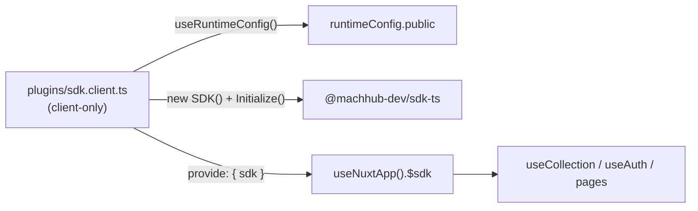
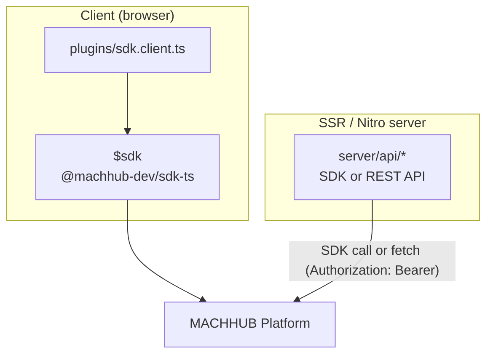

This guide shows the idiomatic way to use [`@machhub-dev/sdk-ts`](/sdk/initialization/)
in a Nuxt 3 / Vue 3 application: a **client plugin** that initializes the SDK and
provides it as `$sdk`, a `useCollection` composable for CRUD, and route middleware for
auth.

The SDK runs in **both client and server** contexts. This guide wires it up as a
client plugin (so `$sdk` is provided in the browser); see the
[Framework Guides Overview](/frameworks/overview/) for the shared patterns and the
[SSR notes](#6-ssr-notes) below for using the SDK server-side.

## 1. Install

Scaffold an app with Nuxi and add the SDK:

```bash
# Create Nuxt app
npx nuxi@latest init my-machhub-app
cd my-machhub-app

# Install MACHHUB SDK
npm install @machhub-dev/sdk-ts

# Install dependencies
npm install
```

## 2. Initialize

Initialization lives in the plugin (below). Because the file is named
`sdk.client.ts`, Nuxt runs it **only on the client** — never on the server. No-config
vs manual is just whether you pass a config to `sdk.Initialize()`.

### No connection config (recommended)

Call `Initialize` with **no arguments** — in both development and production. In
development the [MACHHUB Designer](/designer/overview/) proxies your dev server's SDK
requests to the connected platform; in production the app is hosted on the MACHHUB
Platform, so the SDK resolves its connection from the host:

```ts
// filepath: plugins/sdk.client.ts
import { SDK } from '@machhub-dev/sdk-ts';

export default defineNuxtPlugin(async () => {
    const sdk = new SDK();

    try {
        const success = await sdk.Initialize();

        if (success) {
            console.log('MACHHUB SDK initialized successfully!');
        } else {
            console.error('MACHHUB SDK initialization failed');
        }

        return {
            provide: {
                sdk
            }
        };
    } catch (error) {
        console.error('Error initializing MACHHUB SDK:', error);
        throw error;
    }
});
```

### Manual (environment variables)

Read connection details from `useRuntimeConfig()` (populated from
`NUXT_PUBLIC_MACHHUB_*` env vars) and pass them to `Initialize` **only** when you
self-host the app, target a different server/domain, or want to hardcode the
connection:

```ts
// filepath: plugins/sdk.client.ts (manual)
import { SDK, type SDKConfig } from '@machhub-dev/sdk-ts';

export default defineNuxtPlugin(async () => {
    const config = useRuntimeConfig();
    const sdk = new SDK();

    try {
        const sdkConfig: SDKConfig = {
            application_id: config.public.machhubAppId,
            httpUrl: config.public.machhubHttpUrl,
            mqttUrl: config.public.machhubMqttUrl
        };

        const success = await sdk.Initialize(sdkConfig);

        if (success) {
            console.log('MACHHUB SDK initialized successfully');
        } else {
            console.error('MACHHUB SDK initialization failed');
        }

        return {
            provide: {
                sdk
            }
        };
    } catch (error) {
        console.error('Error initializing MACHHUB SDK:', error);
        throw error;
    }
});
```

:::note[Why .client.ts here]
The `.client.ts` suffix tells Nuxt to bundle and run this plugin **only in the
browser**, so `$sdk` is a client-side provide. The SDK itself also runs server-side —
if you want it available during SSR, set up a universal/server plugin or initialize the
SDK directly in a Nitro route (see [SSR notes](#6-ssr-notes)).
:::

## 3. Shared SDK instance — `$sdk` plugin + `useSDK`

The plugin's `provide: { sdk }` makes the initialized SDK available everywhere as
`$sdk` via `useNuxtApp()`. Wrap that access in a thin composable so components import a
typed helper instead of reaching into `useNuxtApp()` directly:

```ts
// filepath: composables/useSDK.ts
import type { SDK } from '@machhub-dev/sdk-ts';

export const useSDK = () => {
  const { $sdk } = useNuxtApp();

  return {
    sdk: $sdk as SDK
  };
};
```



The matching `runtimeConfig` reads public values from `NUXT_PUBLIC_MACHHUB_*` and keeps
the developer key server-only:

```ts
// filepath: nuxt.config.ts
export default defineNuxtConfig({
  runtimeConfig: {
    // Server-side only
    machhubDeveloperKey: process.env.MACHHUB_DEVELOPER_KEY,

    // Public - exposed to client
    public: {
      machhubAppId: process.env.NUXT_PUBLIC_MACHHUB_APP_ID,
      machhubHttpUrl: process.env.NUXT_PUBLIC_MACHHUB_HTTP_URL,
      machhubMqttUrl: process.env.NUXT_PUBLIC_MACHHUB_MQTT_URL
    }
  }
});
```

## 4. Reactive data helper — `useCollection`

`useCollection<T>` reads `$sdk` from `useNuxtApp()` and returns reactive `items`,
`loading`, `error` (as `readonly` refs) plus `getAll`/`getOne`/`create`/`update`/`remove`.

```ts
// filepath: composables/useCollection.ts
import type { SDK } from '@machhub-dev/sdk-ts';

export function useCollection<T = any>(collectionName: string) {
    const { $sdk } = useNuxtApp();
    const sdk = $sdk as SDK;

    const items = ref<T[]>([]);
    const loading = ref(false);
    const error = ref<Error | null>(null);

    function transform(raw: any): T {
        if (raw.id && typeof raw.id === 'object' && raw.id.ID) {
            return { ...raw, id: raw.id.ID } as T;
        }
        if (raw.id && typeof raw.id === 'string' && raw.id.includes(':')) {
            return { ...raw, id: raw.id.split(':')[1] } as T;
        }
        return raw as T;
    }

    async function getAll(): Promise<T[]> {
        loading.value = true;
        error.value = null;

        try {
            const rawItems = await sdk.collection(collectionName).getAll();
            const transformed = rawItems.map(transform);
            items.value = transformed;
            return transformed;
        } catch (err) {
            const e = err instanceof Error ? err : new Error('Unknown error');
            error.value = e;
            throw e;
        } finally {
            loading.value = false;
        }
    }

    async function create(data: Partial<T>): Promise<T> {
        try {
            const created = await sdk.collection(collectionName).create(data);
            const item = transform(created);
            items.value.push(item);
            return item;
        } catch (err) {
            const e = err instanceof Error ? err : new Error('Unknown error');
            error.value = e;
            throw e;
        }
    }

    async function update(id: string, updates: Partial<T>): Promise<T> {
        const fullId = `myapp.${collectionName}:${id}`;
        const updated = await sdk.collection(collectionName).update(fullId, updates);
        const item = transform(updated);

        const index = items.value.findIndex((i: any) => i.id === id);
        if (index !== -1) {
            items.value[index] = item;
        }

        return item;
    }

    async function remove(id: string): Promise<void> {
        const fullId = `myapp.${collectionName}:${id}`;
        await sdk.collection(collectionName).delete(fullId);
        items.value = items.value.filter((i: any) => i.id !== id);
    }

    return {
        items: readonly(items),
        loading: readonly(loading),
        error: readonly(error),
        getAll,
        create,
        update,
        remove
    };
}
```

Because the SDK only exists on the client, call `getAll()` inside `onMounted` (not
`useAsyncData`):

```vue
<!-- filepath: pages/products.vue -->
<script setup lang="ts">
interface Product {
  id: string;
  name: string;
  price: number;
  description?: string;
}

const {
  items: products,
  loading,
  error,
  getAll,
  remove,
} = useCollection<Product>("products");

onMounted(() => {
  getAll();
});

async function deleteProduct(id: string) {
  if (confirm("Delete this product?")) {
    await remove(id);
  }
}
</script>

<template>
  <div>
    <h1>Products</h1>
    <div v-if="loading">Loading products...</div>
    <div v-else-if="error" class="error">Error: {{ error.message }}</div>
    <div v-else>
      <div v-for="product in products" :key="product.id" class="product-card">
        <h3>{{ product.name }}</h3>
        <p class="price">${{ product.price }}</p>
        <button @click="deleteProduct(product.id)">Delete</button>
      </div>
    </div>
  </div>
</template>
```

## 5. Auth + route guard

Protect routes with named route middleware. Call
`$sdk.auth.validateCurrentUser()` and redirect with `navigateTo`:

```ts
// filepath: middleware/auth.ts
export default defineNuxtRouteMiddleware(async (to, from) => {
  const { $sdk } = useNuxtApp();

  try {
    const { valid } = await $sdk.auth.validateCurrentUser();

    if (!valid && to.path !== '/login') {
      return navigateTo('/login');
    }

    if (valid && to.path === '/login') {
      return navigateTo('/dashboard');
    }
  } catch (error) {
    console.error('Auth middleware error:', error);
    if (to.path !== '/login') {
      return navigateTo('/login');
    }
  }
});
```

Opt a page into the guard with `definePageMeta`:

```vue
<!-- filepath: pages/dashboard.vue -->
<script setup lang="ts">
definePageMeta({
  middleware: 'auth'
});
</script>

<template>
  <div>
    <h1>Protected Dashboard</h1>
  </div>
</template>
```

:::note[Route middleware and `$sdk`]
`defineNuxtRouteMiddleware` runs on both server and client by default — but `$sdk` is
provided by the **client** plugin in this guide, so it's only present on the client.
Keep auth checks that read `$sdk` in route middleware and rely on the redirect. To run
SDK auth in `server/middleware/` (Nitro), initialize the SDK there yourself rather than
reaching for `$sdk`.
:::

## 6. SSR notes

The SDK runs in **both client and server** contexts. The one caveat in this guide is
that `$sdk` is provided by a **client** plugin, so it isn't injected during SSR. Two
ways to get data on the server:

- **Initialize the SDK in a Nitro server route** and use it there directly — the SDK
  works server-side, so the same collection/tag calls apply.
- Or call the [REST API](/api/overview/) directly from a Nitro route, reading the
  developer key from the **server-only** runtime config.

```ts
// $sdk is client-only in this setup, so don't read it during SSR:
const { data } = await useAsyncData(async () => {
  const { $sdk } = useNuxtApp(); // undefined on the server here
  return await $sdk.collection('products').getAll();
});
```

```ts
// Server data in a Nitro route — initialize the SDK there, or use the REST API
// filepath: server/api/products.get.ts
export default defineEventHandler(async () => {
  const config = useRuntimeConfig();
  return await $fetch(`${config.public.machhubHttpUrl}/collections/products`, {
    headers: { Authorization: `Bearer ${config.machhubDeveloperKey}` }
  });
});
```



## 7. Environment variables

Nuxt exposes public config via `runtimeConfig.public` (declared in `nuxt.config.ts`,
shown above) and reads the values from `.env` keys prefixed `NUXT_PUBLIC_MACHHUB_`:

```bash
# filepath: .env
NUXT_PUBLIC_MACHHUB_APP_ID=your-app-id
NUXT_PUBLIC_MACHHUB_HTTP_URL=http://localhost:80
NUXT_PUBLIC_MACHHUB_MQTT_URL=mqtt://localhost:1883

# Server-only (NOT exposed to the browser)
MACHHUB_DEVELOPER_KEY=your-developer-key
```

| `.env` variable | `runtimeConfig` key | Maps to `SDKConfig` |
| --- | --- | --- |
| `NUXT_PUBLIC_MACHHUB_APP_ID` | `public.machhubAppId` | `application_id` |
| `NUXT_PUBLIC_MACHHUB_HTTP_URL` | `public.machhubHttpUrl` | `httpUrl` |
| `NUXT_PUBLIC_MACHHUB_MQTT_URL` | `public.machhubMqttUrl` | `mqttUrl` |
| `MACHHUB_DEVELOPER_KEY` | `machhubDeveloperKey` (server-only) | — (server REST calls) |

:::note[NUXT_PUBLIC_ overrides at runtime]
Nuxt automatically maps environment variables prefixed `NUXT_PUBLIC_` onto matching
`runtimeConfig.public` keys at runtime, so you can change endpoints per deployment
without rebuilding.
:::

## Next

- SDK reference: [Install & Initialize the SDK](/sdk/initialization/).
- Compare frameworks: [Framework Guides Overview](/frameworks/overview/).
