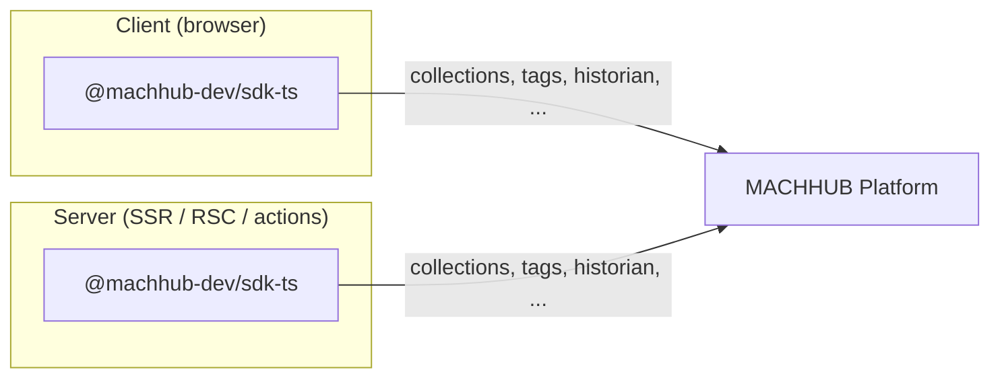
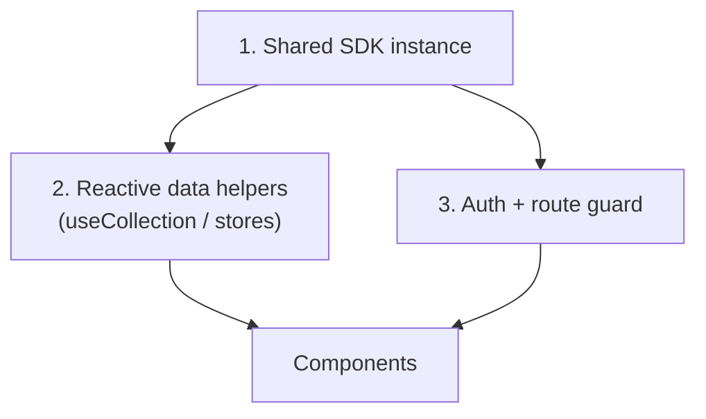

The MACHHUB SDK is framework-agnostic, but each framework has idiomatic ways to
initialize it, share it, and expose reactive helpers. There is **one SDK package** —
`@machhub-dev/sdk-ts` — and a guide per framework.

## Choose your framework

| Framework | Guide |
| --- | --- |
| Angular (DI, RxJS, Signals, guards) | [Angular](/frameworks/angular/) |
| Next.js 14+ / React (App Router, hooks, Context) | [Next.js / React](/frameworks/nextjs-react/) |
| Nuxt 3 / Vue 3 (composables, plugins) | [Nuxt / Vue](/frameworks/nuxt-vue/) |
| SvelteKit / Svelte 5 (runes, stores, load functions) | [SvelteKit / Svelte](/frameworks/sveltekit-svelte/) |

## Client and server both work

**The SDK works in both client and server contexts**, so use it in either — including
during server-side rendering (Server Components, server actions, `load`/`asyncData`).
You don't need to drop to the REST API for server-side data; the same SDK calls work
there. Each framework guide shows the idiomatic setup.

## The common shape

Whichever framework you use, the integration has the same three parts:

1. **A shared SDK instance** — initialized once (a service, plugin, context, or store).
2. **Reactive data helpers** — a `useCollection`/`createCollectionStore`-style wrapper
   exposing `items`, `loading`, `error`, and CRUD methods.
3. **An auth/route guard** — that calls `sdk.auth.validateCurrentUser()` and redirects
   when the session is invalid.

## No connection config (recommended)

In all frameworks, the recommended default is `sdk.Initialize()` **with no
arguments** — in both development and production. In development the
[MACHHUB Designer](/designer/overview/) proxies your dev server's SDK requests to the
connected platform; in production the app is hosted on the MACHHUB Platform, so the
SDK resolves its connection from the host. Use **manual** config (environment
variables) only when you self-host the app, target a different server/domain, or want
to hardcode the connection. Each guide includes both a no-config and a manual template.

Continue to your framework: [Angular](/frameworks/angular/),
[Next.js / React](/frameworks/nextjs-react/), [Nuxt / Vue](/frameworks/nuxt-vue/), or
[SvelteKit / Svelte](/frameworks/sveltekit-svelte/).
