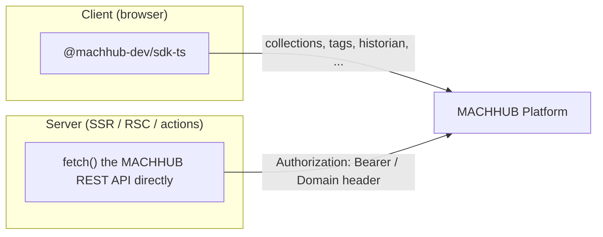
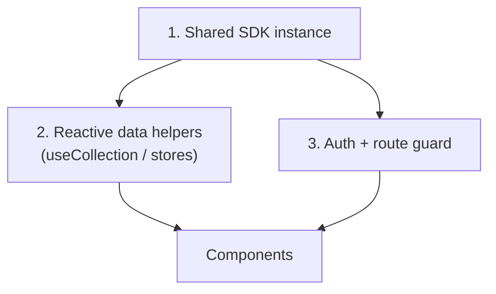

The MACHHUB SDK is framework-agnostic, but each framework has idiomatic ways to
initialize it, share it, and expose reactive helpers. There is **one SDK package** —
`@machhub-dev/sdk-ts` — and a guide per framework.

## Choose your framework

| Framework | Guide |
| --- | --- |
| Angular (DI, RxJS, Signals, guards) | [Angular](/frameworks/angular/) |
| Next.js 14+ / React (App Router, hooks, Context) | [Next.js / React](/frameworks/nextjs-react/) |
| Nuxt 3 / Vue 3 (composables, plugins) | [Nuxt / Vue](/frameworks/nuxt-vue/) |
| SvelteKit / Svelte 5 (runes, stores, load functions) | [SvelteKit / Svelte](/frameworks/sveltekit-svelte/) |

## The one rule that applies everywhere

**The SDK is client-side only.** Initialize it in the browser, never during
server-side rendering. When you need data on the server (Server Components, server
actions, `load`/`asyncData` on the server), call the **REST API directly** with
`fetch` and an auth header. Every framework guide shows both halves.

## The common shape

Whichever framework you use, the integration has the same three parts:

1. **A shared SDK instance** — initialized once (a service, plugin, context, or store).
2. **Reactive data helpers** — a `useCollection`/`createCollectionStore`-style wrapper
   exposing `items`, `loading`, `error`, and CRUD methods.
3. **An auth/route guard** — that calls `sdk.auth.validateCurrentUser()` and redirects
   when the session is invalid.

## Zero-config in development

In all frameworks, you can develop with the [MACHHUB Designer](/designer/overview/)
zero-config flow (`sdk.Initialize()` with no arguments) and switch to environment
variables for production builds. Each guide includes both a zero-config and a manual
template.

Continue to your framework: [Angular](/frameworks/angular/),
[Next.js / React](/frameworks/nextjs-react/), [Nuxt / Vue](/frameworks/nuxt-vue/), or
[SvelteKit / Svelte](/frameworks/sveltekit-svelte/).
