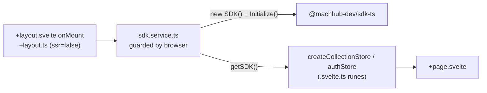
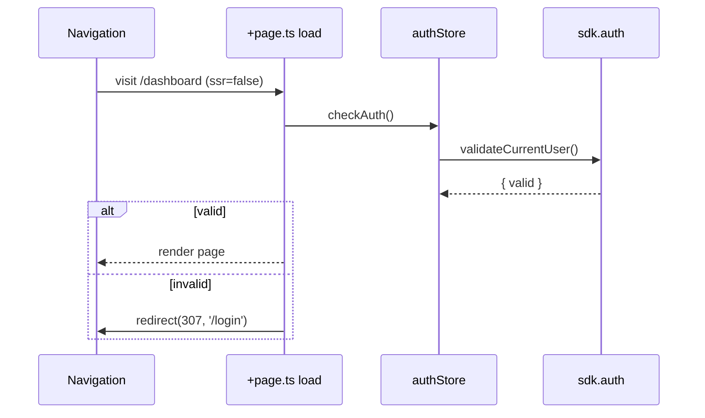
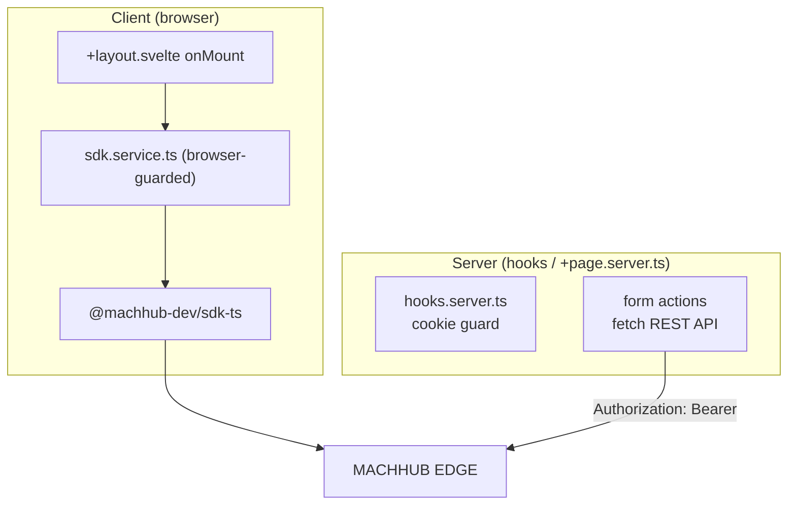

This guide shows the idiomatic way to use [`@machhub-dev/sdk-ts`](/sdk/initialization/)
in a SvelteKit / Svelte 5 application: an `sdk.service.ts` guarded by `browser`,
initialized in `+layout.svelte` `onMount`, a runes-based collection store
(`createCollectionStore`), and a `hooks.server.ts` route guard.

See the [Framework Guides Overview](/frameworks/overview/) for the shared rules. For
SvelteKit the key ones are: guard with `browser`, and set
`export const ssr = false` for SDK-backed routes.

## 1. Install

Scaffold an app and add the SDK:

```bash
# Create SvelteKit app
npm create svelte@latest my-machhub-app
cd my-machhub-app

# Install MACHHUB SDK
npm install @machhub-dev/sdk-ts

# Install dependencies
npm install
```

## 2. Initialize

Initialization goes through `initializeSDK()` in the service (below) and runs in the
browser. Zero-config vs manual is just whether you pass a config to `sdk.Initialize()`.

### Zero-config (MACHHUB Designer)

During development with the [MACHHUB Designer](/designer/overview/) VS Code extension,
`initializeSDK()` calls `Initialize` with **no arguments**:

```ts
sdk = new SDK();
const success = await sdk.Initialize();
```

### Manual (environment variables)

For production, read values from `$env/static/public` and pass them to `Initialize`.
This is the `sdk.service.manual.ts` variant:

```ts
// filepath: src/lib/services/sdk.service.ts (manual)
import { SDK, type SDKConfig } from '@machhub-dev/sdk-ts';
import {
  PUBLIC_MACHHUB_APP_ID,
  PUBLIC_MACHHUB_HTTP_URL,
  PUBLIC_MACHHUB_MQTT_URL,
  PUBLIC_MACHHUB_NATS_URL
} from '$env/static/public';

// ...inside initializeSDK(config?):
const sdkConfig = config || {
  application_id: PUBLIC_MACHHUB_APP_ID,
  httpUrl: PUBLIC_MACHHUB_HTTP_URL,
  mqttUrl: PUBLIC_MACHHUB_MQTT_URL,
  natsUrl: PUBLIC_MACHHUB_NATS_URL
};

sdk = new SDK();
const success = await sdk.Initialize(sdkConfig);
```

:::tip[Use the typed $env/static/public import]
Import `PUBLIC_*` values from `$env/static/public` rather than `import.meta.env`.
SvelteKit statically analyzes them, gives you type safety, and fails the build if a
declared variable is missing.
:::

## 3. Shared SDK instance — `sdk.service.ts` (browser-guarded)

The service holds a module-level `sdk` singleton and is **guarded by `browser`** from
`$app/environment` so it never constructs or initializes on the server. `getSDK()`
throws until `initializeSDK()` has run.

```ts
// filepath: src/lib/services/sdk.service.ts
import { SDK } from '@machhub-dev/sdk-ts';

let sdk: SDK | null = null;
let initPromise: Promise<boolean> | null = null;

export function getSDK(): SDK {
    if (!sdk) {
        throw new Error('SDK not initialized. Call initializeSDK() first.');
    }
    return sdk;
}

export async function initializeSDK(): Promise<boolean> {
    if (sdk) {
        return true;
    }

    if (initPromise) {
        return initPromise;
    }

    initPromise = (async () => {
        try {
            sdk = new SDK();
            const success = await sdk.Initialize();

            if (success) {
                console.log('MACHHUB SDK initialized successfully!');
                return true;
            } else {
                console.error('MACHHUB SDK initialization failed');
                sdk = null;
                return false;
            }
        } catch (error) {
            console.error('Error initializing MACHHUB SDK:', error);
            sdk = null;
            throw error;
        }
    })();

    return initPromise;
}

export function isSDKInitialized(): boolean {
    return sdk !== null;
}
```

Initialize it once in the **root layout** inside `onMount` (which only runs in the
browser), and gate the app on readiness:

```svelte
<!-- filepath: src/routes/+layout.svelte -->
<script lang="ts">
  import { onMount } from 'svelte';
  import { initializeSDK } from '$lib/services/sdk.service';

  let sdkReady = $state(false);
  let error = $state<string | null>(null);

  onMount(async () => {
    try {
      await initializeSDK();
      sdkReady = true;
    } catch (err: any) {
      error = err.message;
      console.error('Failed to initialize SDK:', err);
    }
  });
</script>

{#if error}
  <div class="error">SDK Initialization Error: {error}</div>
{:else if !sdkReady}
  <div class="loading">Initializing MACHHUB SDK...</div>
{:else}
  <slot />
{/if}
```

Pair the layout with a `+layout.ts` that disables SSR for the SDK-backed tree and
kicks off initialization behind a `browser` check:

```ts
// filepath: src/routes/+layout.ts
import { initializeSDK } from '$lib/services/sdk.service';
import { browser } from '$app/environment';
import type { LayoutLoad } from './$types';

export const ssr = false; // Client-side only
export const prerender = false;

export const load: LayoutLoad = async () => {
    if (browser) {
        try {
            await initializeSDK();
        } catch (error) {
            console.error('Failed to initialize SDK:', error);
            return {
                sdkError: error instanceof Error ? error.message : 'Failed to initialize SDK'
            };
        }
    }

    return {};
};
```



## 4. Reactive data helper — `createCollectionStore`

Reactive stores live in `.svelte.ts` files so they can use **Svelte 5 runes**
(`$state`). `createCollectionStore<T>` returns getters for `items`, `loading`, `error`
plus `getAll`/`getOne`/`create`/`update`/`remove`, each calling `getSDK()`.

```ts
// filepath: src/lib/stores/collection.svelte.ts
import { getSDK } from '$lib/services/sdk.service';

export function createCollectionStore<T = any>(collectionName: string) {
    let items = $state<T[]>([]);
    let loading = $state(false);
    let error = $state<Error | null>(null);

    function transform(raw: any): T {
        if (raw.id && typeof raw.id === 'object' && raw.id.ID) {
            return { ...raw, id: raw.id.ID } as T;
        }
        if (raw.id && typeof raw.id === 'string' && raw.id.includes(':')) {
            return { ...raw, id: raw.id.split(':')[1] } as T;
        }
        return raw as T;
    }

    async function getAll(): Promise<T[]> {
        loading = true;
        error = null;

        try {
            const sdk = getSDK();
            const rawItems = await sdk.collection(collectionName).getAll();
            const transformed = rawItems.map(transform);
            items = transformed;
            return transformed;
        } catch (err) {
            const e = err instanceof Error ? err : new Error('Unknown error');
            error = e;
            throw e;
        } finally {
            loading = false;
        }
    }

    async function create(data: Partial<T>): Promise<T> {
        const sdk = getSDK();
        const created = await sdk.collection(collectionName).create(data);
        const item = transform(created);
        items = [...items, item];
        return item;
    }

    async function update(id: string, updates: Partial<T>): Promise<T> {
        const sdk = getSDK();
        const fullId = `myapp.${collectionName}:${id}`;
        const updated = await sdk.collection(collectionName).update(fullId, updates);
        const item = transform(updated);
        items = items.map((i: any) => (i.id === id ? item : i));
        return item;
    }

    async function remove(id: string): Promise<void> {
        const sdk = getSDK();
        const fullId = `myapp.${collectionName}:${id}`;
        await sdk.collection(collectionName).delete(fullId);
        items = items.filter((i: any) => i.id !== id);
    }

    return {
        get items() {
            return items;
        },
        get loading() {
            return loading;
        },
        get error() {
            return error;
        },
        getAll,
        getOne: async (id: string): Promise<T | null> => {
            const sdk = getSDK();
            const fullId = `myapp.${collectionName}:${id}`;
            const item = await sdk.collection(collectionName).getOne(fullId);
            return item ? transform(item) : null;
        },
        create,
        update,
        remove
    };
}
```

:::note[Getters expose runes across the module boundary]
`$state` is only reactive inside `.svelte.ts`/`.svelte` files. Returning it through
**getters** (`get items()`) lets a component read the value reactively while keeping
mutation inside the store. The store file must end in `.svelte.ts` for the compiler to
process runes.
:::

A page creates a store and drives it from `onMount`:

```svelte
<!-- filepath: src/routes/products/+page.svelte -->
<script lang="ts">
  import { onMount } from "svelte";
  import { createCollectionStore } from "$lib/stores/collection.svelte";

  interface Product {
    id: string;
    name: string;
    price: number;
    description?: string;
  }

  const store = createCollectionStore<Product>("products");

  onMount(() => {
    store.getAll();
  });

  async function deleteProduct(id: string) {
    if (confirm("Delete this product?")) {
      await store.remove(id);
    }
  }
</script>

<div>
  <h1>Products</h1>

  {#if store.loading}
    <div>Loading products...</div>
  {:else if store.error}
    <div class="error">Error: {store.error.message}</div>
  {:else if store.items.length === 0}
    <p>No products found</p>
  {:else}
    <div class="product-list">
      {#each store.items as product (product.id)}
        <div class="product-card">
          <h3>{product.name}</h3>
          <p class="price">${product.price}</p>
          <button onclick={() => deleteProduct(product.id)}>Delete</button>
        </div>
      {/each}
    </div>
  {/if}
</div>
```

## 5. Auth + route guard

An `authStore` (also a `.svelte.ts` runes store) wraps `sdk.auth`. Use it in a route
`+page.ts` `load` to validate the session and `redirect` when invalid.

```ts
// filepath: src/lib/stores/auth.svelte.ts
import { getSDK } from '$lib/services/sdk.service';

interface User {
    id: string;
    username: string;
    email?: string;
    [key: string]: any;
}

function createAuthStore() {
    let user = $state<User | null>(null);
    let loading = $state(false);
    let error = $state<Error | null>(null);

    const isAuthenticated = $derived(user !== null);

    async function checkAuth() {
        loading = true;
        error = null;

        try {
            const sdk = getSDK();
            const { valid } = await sdk.auth.validateCurrentUser();
            user = valid ? await sdk.auth.getCurrentUser() : null;
        } catch (err) {
            error = err instanceof Error ? err : new Error('Unknown error');
            user = null;
        } finally {
            loading = false;
        }
    }

    async function login(username: string, password: string): Promise<boolean> {
        const sdk = getSDK();
        const success = await sdk.auth.login(username, password);
        if (success) {
            user = await sdk.auth.getCurrentUser();
            return true;
        }
        return false;
    }

    async function logout() {
        const sdk = getSDK();
        await sdk.auth.logout();
        user = null;
    }

    return {
        get user() { return user; },
        get loading() { return loading; },
        get error() { return error; },
        get isAuthenticated() { return isAuthenticated; },
        checkAuth,
        login,
        logout
    };
}

export const authStore = createAuthStore();
```

Guard a protected route in its `+page.ts`. Because the SDK is client-only, set
`ssr = false` here too so `load` runs in the browser:

```ts
// filepath: src/routes/dashboard/+page.ts
import { authStore } from '$lib/stores/auth.svelte';
import { redirect } from '@sveltejs/kit';
import type { PageLoad } from './$types';

export const ssr = false;

export const load: PageLoad = async () => {
  await authStore.checkAuth();

  if (!authStore.isAuthenticated) {
    throw redirect(307, '/login');
  }

  return {};
};
```



## 6. SSR notes

The SDK is **client-side only**. SvelteKit renders on the server by default, so:

- Set **`export const ssr = false`** on any layout or page whose `load` touches the
  SDK (the root `+layout.ts` does this, disabling SSR for the whole SDK-backed tree).
- In `load` functions, additionally guard with `import { browser } from '$app/environment'`
  before calling `initializeSDK()` / `getSDK()`.
- For genuine server-side data and route protection, **do not** use the SDK — use a
  server-only context like `hooks.server.ts` or a `+page.server.ts` and call the
  [REST API](/api/overview/) directly.

Use `hooks.server.ts` for server-side route guards (it runs on every request, on the
server, where the SDK is unavailable). Check an auth cookie and `redirect`:

```ts
// filepath: src/hooks.server.ts
import { redirect } from '@sveltejs/kit';
import type { Handle } from '@sveltejs/kit';

export const handle: Handle = async ({ event, resolve }) => {
  const protectedRoutes = ['/dashboard', '/products'];
  const isProtected = protectedRoutes.some(route =>
    event.url.pathname.startsWith(route)
  );

  if (isProtected) {
    const authToken = event.cookies.get('auth-token');

    if (!authToken) {
      throw redirect(303, '/login');
    }
  }

  return resolve(event);
};
```

For server-side mutations, a form action in `+page.server.ts` calls the REST API
(again, no SDK on the server):

```ts
// filepath: src/routes/products/+page.server.ts
import type { Actions } from './$types';
import { fail } from '@sveltejs/kit';

export const actions = {
  create: async ({ request }) => {
    const data = await request.formData();
    const name = data.get('name') as string;
    const price = Number(data.get('price'));

    if (!name || !price) {
      return fail(400, { name, price, missing: true });
    }

    // SDK is client-side only — call the REST API directly on the server
    const response = await fetch('http://localhost:80/collections/products', {
      method: 'POST',
      headers: { 'Content-Type': 'application/json' },
      body: JSON.stringify({ name, price })
    });

    if (!response.ok) {
      return fail(500, { name, price, failed: true });
    }

    return { success: true };
  }
} satisfies Actions;
```



## 7. Environment variables

SvelteKit exposes `PUBLIC_`-prefixed variables to the client via `$env/static/public`.
Put SDK config in `.env`:

```bash
# filepath: .env
PUBLIC_MACHHUB_APP_ID=your-app-id
PUBLIC_MACHHUB_HTTP_URL=http://localhost:80
PUBLIC_MACHHUB_MQTT_URL=mqtt://localhost:1883
PUBLIC_MACHHUB_NATS_URL=mqtt://localhost:1883
```

Read them through the typed static import in your config helper:

```ts
// filepath: src/lib/config.ts
import {
  PUBLIC_MACHHUB_APP_ID,
  PUBLIC_MACHHUB_HTTP_URL,
  PUBLIC_MACHHUB_MQTT_URL
} from '$env/static/public';

export const machhubConfig = {
  application_id: PUBLIC_MACHHUB_APP_ID,
  httpUrl: PUBLIC_MACHHUB_HTTP_URL,
  mqttUrl: PUBLIC_MACHHUB_MQTT_URL
};
```

| `.env` variable | Imported from | Maps to `SDKConfig` |
| --- | --- | --- |
| `PUBLIC_MACHHUB_APP_ID` | `$env/static/public` | `application_id` |
| `PUBLIC_MACHHUB_HTTP_URL` | `$env/static/public` | `httpUrl` |
| `PUBLIC_MACHHUB_MQTT_URL` | `$env/static/public` | `mqttUrl` |
| `PUBLIC_MACHHUB_NATS_URL` | `$env/static/public` | `natsUrl` |

:::caution[Keep secrets out of PUBLIC_]
Only `PUBLIC_`-prefixed variables are sent to the browser. Server-only secrets (such as
a developer key for REST calls in `hooks.server.ts`) must use an unprefixed name and be
imported from `$env/static/private` — never `$env/static/public`.
:::

## Next

- SDK reference: [Install & Initialize the SDK](/sdk/initialization/).
- Compare frameworks: [Framework Guides Overview](/frameworks/overview/).
