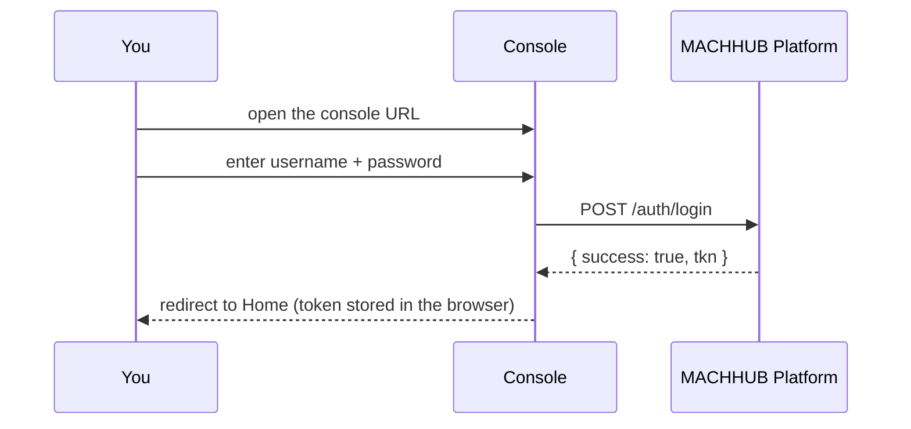

After MACHHUB is installed and running, you need a user account to sign in to the
console.

## The admin domain

MACHHUB always has a built-in administrative [domain](/concepts/domains/),
`domains:machhub_admin`. This is the default tenant for requests that don't specify a
`Domain` header, and where administration (users, groups, applications) happens.

Two group names are reserved:

- **`superuser`** — bypasses all permission checks.
- **`member`** — the baseline group.

## Sign in for the first time

MACHHUB provisions an **administrator account** when it first runs. The default
credentials are username **`admin`** and password **`admin`**. Once you're in, you can
add more [users and groups](/console/users/) from the console.

:::caution[Change the default password]
Change the default `admin` password immediately after your first sign-in. Leaving it at
`admin` exposes the platform to anyone who can reach the console.
:::

1. Open the console in a browser.
2. Enter your username and password and **Sign In**.
3. You land on the **Home** dashboard.

From here, continue with [Using the Console](/console/overview/) — create
[collections](/console/collections/), build your [Unified Namespace](/console/namespace/),
and add [users and groups](/console/users/).

:::tip[Try it free, or activate a license]
A fresh install reports **No active license**. To evaluate for free, click
**Start 2-Hour Trial** on the License banner. To activate a full license, follow the
steps under **Settings → License** — see [Licensing](/concepts/licensing/).
:::
