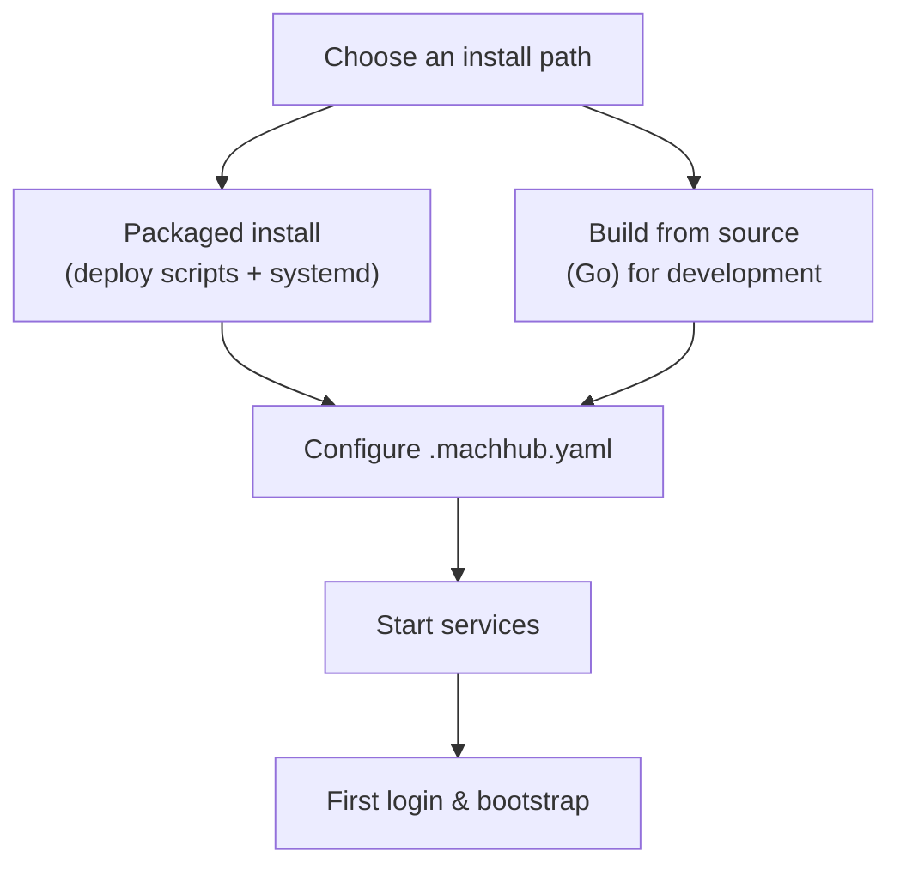

MACHHUB is **self-hosted**. The entire platform is the **MACHHUB EDGE** binary, which
you run on a server close to your equipment — a cloud VM, an industrial PC, or a
Raspberry Pi.

:::note[Heads up]
This section documents installing and operating the server. If you only want to
*build an app* against an existing MACHHUB instance, skip to the
[SDK](/sdk/initialization/). If you only want to *use* the platform, see
[Using the Console](/console/overview/).
:::

## What you get

A MACHHUB EDGE installation runs:

- the **`machhub`** binary (REST API + embedded MQTT broker + embedded NATS + static
  console), and
- **SurrealDB** as the data store and Historian.

On a production Linux install these run as **`systemd`** services
(`machhub.service`, `surreal.service`).

## Requirements

| | Recommendation |
| --- | --- |
| OS | Linux (production). ARM64 is supported (e.g. Raspberry Pi). |
| Database | SurrealDB v2 (installed alongside EDGE). |
| Ports | REST API (default `80`), MQTT broker (`1883` TCP) and MQTT-over-WebSocket, NATS (`4222`), SurrealDB RPC (`7018`, internal). |
| Build (from source) | Go 1.22+ (the project builds with newer Go toolchains). |

The exact ports are configurable — see the [Configuration reference](/install/configuration/).

## Ways to install



- **Packaged install** — the project provides deployment scripts that lay out a
  Debian-style tree (`/usr/bin/machhub`, `/srv/machhub/static`,
  `/etc/machhub/.machhub.yaml`) and install `systemd` units. Best for real
  deployments, including Raspberry Pi.
- **Build from source** — clone the API repository and run it with Go for local
  development. See [Run from source](/install/run-from-source/).

## Run from source (development)

For local development you can run the server directly with Go, pointing at a dev
config:

```bash
go run . start -c "./config.dev.yaml"
```

A development SurrealDB can be started locally (the project includes helper scripts
for this). In development mode the binary serves the console from `./static` and logs
at debug level.

:::tip
The exact one-liner is also wrapped in the repository's `scripts/dev/devRun.sh`.
:::

## The rest of this section

- [Configuration reference](/install/configuration/) — the `.machhub.yaml` file, env
  vars, ports, auth keys, storage, and CORS.
- [First login & bootstrap](/install/first-login/) — the admin domain and your first
  user.
- [Upgrades & backups](/install/upgrades-backups/) — updating EDGE and protecting your
  data.

Once your server is running, head to [Using the Console](/console/overview/) or the
[SDK Quickstart](/start-here/quickstart/).
