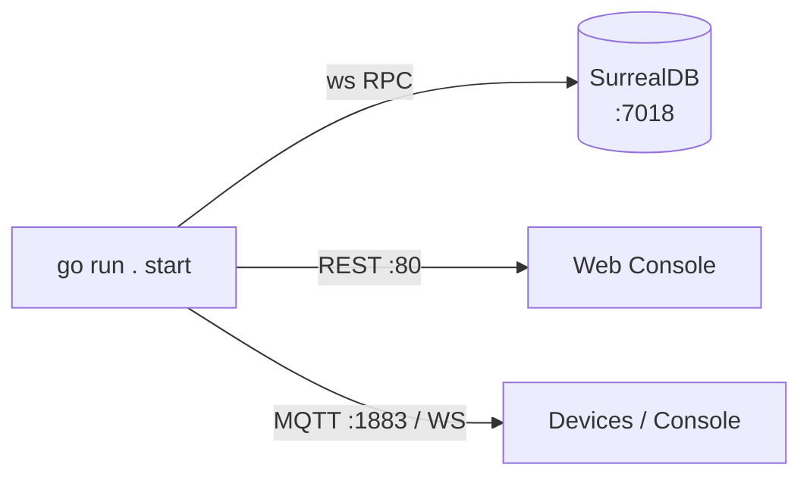

For development you can run the EDGE server directly from source with Go, pointing it
at a development configuration.

## Prerequisites

- **Go 1.22+** (the project builds with current Go toolchains).
- **SurrealDB** for the datastore.

## Start the server

From the API project root:

```bash
go run . start -c "./config.dev.yaml"
```

The repository also wraps this in a helper script:

```bash
./scripts/dev/devRun.sh
```

In development mode the binary detects it is running under `go run`, serves the web
console from the local `./static` directory, and logs at debug level.

## Start a development SurrealDB

EDGE stores its data in SurrealDB. For local development, start a SurrealDB instance
(the repository includes a helper, `scripts/dev/devStartDB.sh`) that listens on the
RPC port the config expects (`ws://localhost:7018/rpc`).



## Create your first user

The platform bootstraps an admin domain. To add a user from the CLI, the project
provides an `add user` command (and a `scripts/dev/devAddUser.sh` helper). See
[First login & bootstrap](/install/first-login/).

:::note
Exact dev scripts and ports come from the API repository's `scripts/dev/` directory
and `config.dev.yaml`; adjust to match your checkout.
:::

## Next

- [Configuration reference](/install/configuration/)
- [First login & bootstrap](/install/first-login/)
- [Using the Console](/console/overview/)
