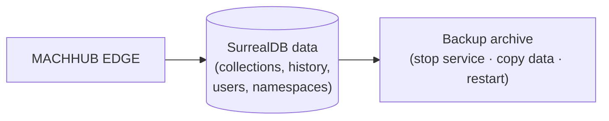

This page covers operating an EDGE installation: building for deployment, the runtime
services, and protecting your data.

## Production build

EDGE is built as a single binary. The repository's build script produces a
deployment archive, including for **ARM64** targets such as a Raspberry Pi:

```bash
./scripts/dev/devBuild.sh
# packs node-red, cross-compiles for linux/arm64, lays out a Debian-style tree,
# and produces machhub-edge.tar.gz
```

The resulting layout follows a standard system path convention:

```
/usr/bin/machhub               # the binary
/srv/machhub/static            # the compiled web console
/etc/machhub/.machhub.yaml     # configuration
```

Deployment scripts live in `scripts/deployment/` (install, update, and component
installers for SurrealDB and Node-RED).

## Services

In a packaged install, EDGE and its datastore run as `systemd` units:

| Service | Role |
| --- | --- |
| `machhub.service` | the EDGE binary (`/usr/bin/machhub start`) |
| `surreal.service` | the SurrealDB datastore |

Manage them with the usual tools:

```bash
sudo systemctl status machhub
sudo systemctl restart machhub
journalctl -u machhub -f
```

## Upgrading

Use the deployment `update` script to replace the binary and console assets, then
restart the services. Because the single migration is a no-op (SurrealDB is
schemaless and tables are created on demand), upgrades generally do not require a
manual migration step — but always back up first.

## Backups



All persistent data — collections and records, the Historian time-series, users,
groups, and the Unified Namespace — lives in **SurrealDB**. To back up:

1. Stop (or quiesce) the EDGE service.
2. Copy the SurrealDB data directory.
3. Restart the service.

:::caution[Verify for your deployment]
Exact paths, the SurrealDB data location, and update steps depend on how you packaged
EDGE. Confirm them against your install before relying on a backup/restore procedure,
and test a restore on a non-production machine.
:::

The console also exposes backup download/upload in some builds; prefer a tested,
file-level backup of the SurrealDB data for disaster recovery.
