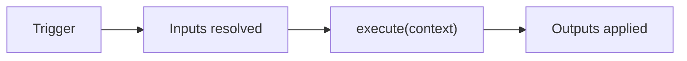
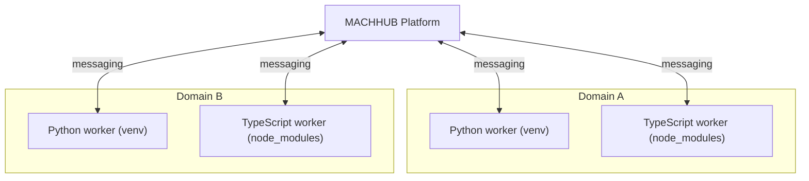

A **Process** is a [serverless function](/concepts/processes-and-flows/) that MACHHUB
runs for you. You write only the function body; the platform resolves your **inputs**
beforehand, runs your **code** in an isolated worker, and applies your **outputs**
afterward. (Processes are distinct from [Flows](/concepts/processes-and-flows/), which
are Node-RED pipelines.)



## Anatomy

A process record is defined by these fields:

| Field | Meaning |
| --- | --- |
| `name` | Domain-scoped name, stored as `domainKey.processName` |
| `language` | `python` or `typescript` |
| `enabled` | Whether automatic (triggered) execution is on |
| `log_enabled` | Whether execution logging is on |
| `code` | Your `execute` body |
| `version` | Auto-incremented on each code change |
| `triggers` | What causes the process to run |
| `inputs` | Data resolved before your code runs |
| `outputs` | What is done with the return value after your code runs |

## Triggers

A trigger determines when a process runs. A process may have several, or none (in
which case it is run manually).

| Trigger | Runs when… | Key config |
| --- | --- | --- |
| `cron` | A cron schedule fires | `cron_expression` (e.g. `*/5 * * * *`) |
| `interval` | A fixed interval elapses | `interval_value` + `interval_unit` |
| `tag_change` | A subscribed [tag](/concepts/unified-namespace/) changes | `tag` (supports MQTT wildcards `+` and `#`) |
| `http` | A request hits the process endpoint | `endpoint` (→ `POST /process/<slug>`) |
| `manual` | You run it explicitly (console **Run**, or the SDK) | — |

:::caution[A `tag_change` trigger does not inject the value]
When a process fires on `tag_change`, the new value is **not** automatically placed in
`context.inputs`. Add a **tag input** with the same tag path to read the current value
into `context.inputs`. (The raw decoded value is also available at
`trigger.data.payload`.)
:::

## Inputs

Inputs are resolved **before** your code runs and injected into `context.inputs`,
keyed by the input's `name`.

| Type | Reads | Config |
| --- | --- | --- |
| `tag` | The current value of a tag | `tag` (wildcards return a map keyed by concrete topic) |
| `sql` | The result of a domain-scoped database query | `query` |

```
name: "temperature"     type: "tag"   config.tag:   "sensors/room1/temperature"
→ context.inputs.temperature = 25.4

name: "latestReading"   type: "sql"   config.query: "SELECT * FROM myapp.readings ORDER BY created_dt DESC LIMIT 1;"
→ context.inputs.latestReading = [{ id: "...", value: 25.4 }]
```

A wildcard tag input (`sensors/+/temperature`) resolves to a map:
`{ "sensors/room1/temperature": 25.4, "sensors/room2/temperature": 22.1 }`.

## Outputs

Outputs are processed **after** your code returns, using the return value.

| Type | Action | Config | Templating |
| --- | --- | --- | --- |
| `sql` | Execute a query | `query` | `{{output.field}}` → `returnValue.field` |
| `tag_write` | Write a value to a tag | `tag`, `field` | dot-notation, e.g. `result.value` |

```
# SQL output
config.query: "UPDATE myapp.status SET value = '{{output.status}}' WHERE id = 'myapp.status:main';"

# Tag write — writes returnValue.status to the tag
config.tag:   "alerts/room1/status"
config.field: "status"        # dot-notation: "result.nested.value" also works
```

## Languages

Processes run in **Python** or **TypeScript**. The platform wraps your body:

```ts
// TypeScript
async function execute(context: ProcessContext): Promise<any> {
  const { inputs, trigger } = context;
  // YOUR CODE HERE
}
```

```python
# Python
def execute(context):
    inputs = context['inputs']
    trigger = context['trigger']
    # YOUR CODE HERE
```

The `context` carries `inputs`, `trigger` (`type`, `config`, and runtime-only `data`),
plus `timestamp`, `domain_id`, and `process_name`. See
[Python processes](/processes/python/) and
[TypeScript processes](/processes/typescript/) for full examples.

## Per-domain workers and versioning

Each [domain](/concepts/domains/) runs its **own isolated** Python and TypeScript
worker processes:

- Workers **start** automatically when the first process for a domain is created or
  enabled, and **stop** when the last one is deleted or disabled.
- Workers **restart** after package installation (`pip install` / `npm install`).
- Each domain has its own isolated Python and TypeScript environments, and
  communicates with the API internally, per domain.

Saving a code change **auto-increments** the process `version` and creates a new file
— processes are version-controlled.



## Related

- [Python processes](/processes/python/),
  [TypeScript processes](/processes/typescript/),
  [Invoking a process](/processes/invoking/)
- Concept: [Processes & Flows](/concepts/processes-and-flows/)
- SDK: [Processes](/sdk/processes/)
