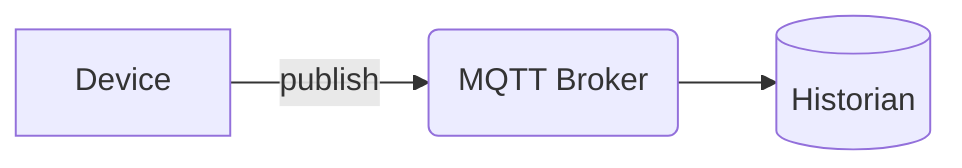

This site is intentionally **easy to edit**. Content is plain **Markdown** (`.md`) —
or **MDX** (`.mdx`) when a page needs components — built with
[Astro Starlight](https://starlight.astro.build/). You do not need to know Astro to
write docs; if you can write Markdown, you can edit this site.

## Run it locally

```bash
# from the repository root
npm install
npm run dev      # start a local dev server with hot reload
npm run build    # produce the static site in ./dist
npm run preview  # preview the built site
```

## Where pages live

```
src/content/docs/
  index.mdx                 # the splash home page
  start-here/               # → "Start Here" sidebar group
  concepts/                 # → "Core Concepts"
  install/                  # → "Install & Self-Hosting"
  console/                  # → "Using the Console"
  sdk/                      # → "TypeScript SDK"
  frameworks/               # → "Framework Guides"
  processes/                # → "Authoring Processes"
  config-formats/           # → "Configuration Formats"
  api/                      # → "REST API Reference"
  designer/                 # → "MACHHUB Designer (VS Code)"
  skills/                   # → "AI Agent Skills"
  reference/                # → "Reference"
```

Each top-level folder maps to a sidebar group (configured in `astro.config.mjs`).
The sidebar is **auto-generated** from the files in each folder, so to add a page you
just create a Markdown file in the right folder — no sidebar edits required.

## Add a new page

Create a `.md` file with **front matter** at the top:

```md
---
title: My New Page
description: A one-sentence summary used for SEO and link previews.
sidebar:
  order: 3          # controls position within its sidebar group
---

Your content starts here.
```

The page URL follows the file path: `concepts/historian.md` → `/concepts/historian/`.

## Callouts (asides)

Use Starlight's aside syntax for notes, tips, and warnings:

```md
:::note
Useful context.
:::

:::tip[Custom title]
A helpful tip.
:::

:::caution
Something to be careful about.
:::

:::danger
A serious warning.
:::
```

## Diagrams (Mermaid)

Write a fenced code block with the `mermaid` language — it renders as a diagram and
follows light/dark mode automatically:

````md

````

Use diagrams freely for architecture, sequences, and data models.

## Code blocks

Fenced code blocks get syntax highlighting and a copy button:

````md
```ts
await sdk.collection('products').getAll();
```
````

## Images and screenshot placeholders

Put images in `src/assets/` (optimized) or `public/img/` (served as-is) and reference
them. Until a screenshot is captured, use a labeled placeholder so the gap is obvious:

```md
<figure>
  <div class="mh-shot">📷 Screenshot to capture: <strong>Console home</strong></div>
</figure>
```

See the [screenshot & GIF shot-list](/reference/shot-list/) for the full capture
checklist and replace the placeholders as real assets arrive.

## Style guidelines

- Prefer short sentences and task-oriented headings.
- Link concepts the first time they appear (e.g. [Collections](/concepts/collections/)).
- Keep terminology consistent: **Processes** are serverless functions; **Flows** are
  Node-RED. Tags live in the **Unified Namespace**.
- Show real, runnable code where you can.
