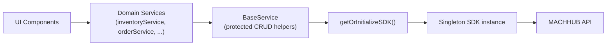

The MACHHUB SDK is powerful, but calling it directly from your UI quickly becomes hard
to maintain. This page describes the recommended architecture: a **single SDK
instance** behind a thin service layer, an **abstract `BaseService`** with shared CRUD
helpers, and **domain services** that extend it. This keeps business logic out of your
components, makes everything testable, and gives you strong typing at the boundaries.

## The core rule: never call the SDK from a component

Components should call a service. Services own all SDK access.

```typescript
// ❌ WRONG - Direct SDK in component
import { getOrInitializeSDK } from './sdk.service';

async function loadItems() {
  const sdk = await getOrInitializeSDK();
  const items = await sdk.collection('items').getAll();
  return items;
}

// ✅ CORRECT - Use service layer
import { inventoryService } from './services';

async function loadItems() {
  const items = await inventoryService.getAllItems();
  return items;
}
```

Why route everything through services?

- **Separation of concerns** — business logic stays out of the UI.
- **Testability** — mock a service instead of the whole SDK.
- **Reusability** — share logic across components.
- **Maintainability** — change the implementation without touching the UI.
- **Type safety** — strong typing at service boundaries.



## The singleton SDK service

The SDK must be initialized **once** and reused everywhere — see
[Install & Initialize](/sdk/initialization/) for the full setup. The singleton exposes
a `getOrInitializeSDK()` helper that every service calls, plus a `reset()` method that
is handy in tests.

```typescript
// services/sdk.service.ts
import { SDK } from '@machhub-dev/sdk-ts';

class SDKService {
  private static instance: SDKService | null = null;
  private sdk: SDK | null = null;
  private isInitialized = false;
  private initPromise: Promise<boolean> | null = null;

  private constructor() {
    this.sdk = new SDK();
  }

  public static getInstance(): SDKService {
    if (!SDKService.instance) {
      SDKService.instance = new SDKService();
    }
    return SDKService.instance;
  }

  public async initialize(): Promise<boolean> {
    if (this.isInitialized) return true;
    if (this.initPromise) return this.initPromise;

    this.initPromise = (async () => {
      try {
        if (!this.sdk) this.sdk = new SDK();
        const success = await this.sdk.Initialize();
        this.isInitialized = success;
        return success;
      } catch (error) {
        console.error('Error initializing SDK:', error);
        this.isInitialized = false;
        return false;
      } finally {
        this.initPromise = null;
      }
    })();

    return this.initPromise;
  }

  public getSDK(): SDK {
    if (!this.isInitialized || !this.sdk) {
      throw new Error('SDK not initialized. Call initialize() first.');
    }
    return this.sdk;
  }

  public async getOrInitializeSDK(): Promise<SDK> {
    if (!this.isInitialized) {
      const success = await this.initialize();
      if (!success) throw new Error('Failed to initialize SDK');
    }
    return this.getSDK();
  }

  public get initialized(): boolean {
    return this.isInitialized;
  }

  public reset(): void {
    this.sdk = null;
    this.isInitialized = false;
    this.initPromise = null;
  }
}

export const sdkService = SDKService.getInstance();

export async function getOrInitializeSDK(): Promise<SDK> {
  return sdkService.getOrInitializeSDK();
}
```

:::note
`initPromise` makes concurrent callers share a single in-flight initialization, so the
SDK connects exactly once even if several services request it simultaneously.
:::

## The abstract BaseService

`BaseService` centralizes the CRUD plumbing so domain services don't repeat it. Its
helpers are `protected` — they are an implementation detail of subclasses, not a public
API. Note that `update` performs a **PATCH** (partial update), and that `update`/`delete`
build the full RecordID (`application_id.collection:id`) before calling the SDK.

```typescript
// filepath: src/services/base.service.ts
import { getOrInitializeSDK } from './sdk.service';
import type { SDK } from '@machhub-dev/sdk-ts';

export interface PaginationOptions {
  page?: number;
  limit?: number;
}

export interface FilterOptions {
  field: string;
  operator: 'eq' | 'ne' | 'gt' | 'lt' | 'gte' | 'lte' | 'in' | 'nin' | 'contains';
  value: any;
}

export interface SortOptions {
  field: string;
  direction: 'asc' | 'desc';
}

export abstract class BaseService {
  protected async getSDK(): Promise<SDK> {
    return await getOrInitializeSDK();
  }

  protected async getAllRecords<T>(
    collectionName: string,
    options?: {
      pagination?: PaginationOptions;
      filters?: FilterOptions[];
      sort?: SortOptions;
      fields?: string[];
    }
  ): Promise<T[]> {
    try {
      const sdk = await this.getSDK();
      let query = sdk.collection(collectionName);

      // Apply filters
      if (options?.filters) {
        for (const filter of options.filters) {
          query = query.filter(filter.field, filter.operator, filter.value);
        }
      }

      // Apply sorting
      if (options?.sort) {
        query = query.sort(options.sort.field, options.sort.direction);
      }

      // Apply pagination
      if (options?.pagination) {
        const { page = 1, limit = 100 } = options.pagination;
        query = query.offset((page - 1) * limit).limit(limit);
      }

      // Apply field selection
      if (options?.fields) {
        query = query.fields(options.fields);
      }

      return await query.getAll();
    } catch (error) {
      console.error(`Error fetching ${collectionName}:`, error);
      throw error;
    }
  }

  protected async getRecordById<T>(
    collectionName: string,
    id: string,
    options?: { expand?: string[]; fields?: string[] }
  ): Promise<T | null> {
    try {
      const sdk = await this.getSDK();
      const fullId = `myapp.${collectionName}:${id}`;
      let query = sdk.collection(collectionName);

      if (options?.expand) query = query.expand(options.expand);
      if (options?.fields) query = query.fields(options.fields);

      return await query.getOne(fullId);
    } catch (error) {
      console.error(`Error fetching ${collectionName} ${id}:`, error);
      return null;
    }
  }

  protected async createRecord<T>(
    collectionName: string,
    data: Partial<T>
  ): Promise<T> {
    try {
      const sdk = await this.getSDK();
      return await sdk.collection(collectionName).create(data);
    } catch (error) {
      console.error(`Error creating ${collectionName}:`, error);
      throw error;
    }
  }

  protected async updateRecord<T>(
    collectionName: string,
    id: string,
    updates: Partial<T>
  ): Promise<T> {
    try {
      const sdk = await this.getSDK();
      const fullId = `myapp.${collectionName}:${id}`;
      return await sdk.collection(collectionName).update(fullId, updates);
    } catch (error) {
      console.error(`Error updating ${collectionName} ${id}:`, error);
      throw error;
    }
  }

  protected async deleteRecord(
    collectionName: string,
    id: string
  ): Promise<void> {
    try {
      const sdk = await this.getSDK();
      const fullId = `myapp.${collectionName}:${id}`;
      await sdk.collection(collectionName).delete(fullId);
    } catch (error) {
      console.error(`Error deleting ${collectionName} ${id}:`, error);
      throw error;
    }
  }

  protected extractId(value: any): string {
    if (typeof value === 'object' && value?.ID) {
      return value.ID;
    }
    if (typeof value === 'string' && value.includes(':')) {
      return value.split(':')[1];
    }
    return value;
  }
}
```

:::note
Some templates expose `filter` operators as raw symbols (`'='`, `'CONTAINS'`, …) and
others as named aliases (`'eq'`, `'contains'`, …) that they map internally. The raw
operators are canonical — see [SDK → Collections](/sdk/collections/) for the full table.
The same applies to pagination: `offset`/`limit` are canonical; a few templates use
`skip` as a synonym for `offset`.
:::

### The `extractId` helper

Reference fields come back from the API in different shapes (a `{ ID }` object, or a
`application_id.collection:id` string). `extractId` normalizes any of them to the bare
record id for display. The full rules — including when you must keep the full id — are
covered in [Record IDs](/sdk/record-id/).

```typescript
protected extractId(value: any): string {
  if (typeof value === 'object' && value?.ID) {
    return value.ID;
  }
  if (typeof value === 'string' && value.includes(':')) {
    return value.split(':')[1];
  }
  return value;
}
```

## Domain services extend BaseService

A domain service wraps a single collection, exposes a clean public API, and converts
between API shapes and your app's model. Each service is exported as a **singleton
instance**.

```typescript
// services/inventory.service.ts
import { BaseService, type FilterOption } from './base.service';
import { getOrInitializeSDK } from './sdk.service';

export interface Item {
  id: string;
  name: string;
  sku: string;
  quantity: number;
  price: number;
  categoryId?: any;
  image?: string;
  status: 'active' | 'inactive' | 'discontinued';
  created_dt?: Date;
  updated_dt?: Date;
}

class InventoryService extends BaseService {
  private collectionName = 'items';

  /** Get all items */
  async getAllItems(): Promise<Item[]> {
    try {
      return await this.getAllRecords<Item>(this.collectionName);
    } catch (error) {
      console.error('Error fetching items:', error);
      throw error;
    }
  }

  /** Get items with category data expanded */
  async getItemsWithCategory(): Promise<Item[]> {
    try {
      const sdk = await getOrInitializeSDK();
      return await sdk
        .collection(this.collectionName)
        .expand('categoryId')
        .getAll() as Item[];
    } catch (error) {
      console.error('Error fetching items with categories:', error);
      throw error;
    }
  }

  /** Get low stock items */
  async getLowStockItems(threshold: number = 10): Promise<Item[]> {
    try {
      const sdk = await getOrInitializeSDK();
      return await sdk
        .collection(this.collectionName)
        .filter('quantity', '<', threshold)
        .filter('status', '=', 'active')
        .sort('quantity', 'asc')
        .getAll() as Item[];
    } catch (error) {
      console.error('Error fetching low stock items:', error);
      throw error;
    }
  }
}

// Export singleton instance
export const inventoryService = new InventoryService();
```

### Transform API shapes into your model

When a service needs to expose clean ids (or convert dates), add a private
`transform*` mapper and run results through it. This keeps RecordID handling in one
place:

```typescript
private transformProduct = (raw: any): Product => {
  return {
    id: this.extractId(raw.id),
    name: raw.name,
    sku: raw.sku,
    price: raw.price,
    categoryId: raw.categoryId ? this.extractId(raw.categoryId) : undefined,
    stock: raw.stock,
    isActive: raw.isActive,
    createdAt: new Date(raw.createdAt),
    updatedAt: new Date(raw.updatedAt)
  };
};
```

## Centralize exports with a service index

Re-export every service (and its types) from one file so components import from a single
location.

```typescript
// services/index.ts

// Core Services
export { sdkService, getOrInitializeSDK } from './sdk.service';

// Base Service
export { BaseService } from './base.service';
export type { FilterOptions, PaginationOptions, SortOptions } from './base.service';

// Domain Services
export { inventoryService } from './inventory.service';
export type { Item } from './inventory.service';

export { categoryService } from './category.service';
export type { Category } from './category.service';
```

```typescript
// Import everything from one place
import { inventoryService, categoryService, type Item } from './services';

const items = await inventoryService.getAllItems();
const categories = await categoryService.getAllCategories();
```

## Error handling at two levels

Handle (log and re-throw) errors in the service, and decide what to do about them in the
component.

```typescript
// Service level — log and re-throw
class ProductService extends BaseService {
  async getProduct(id: string): Promise<Product | null> {
    try {
      return await this.getRecordById<Product>('products', id);
    } catch (error) {
      console.error('Error fetching product:', error);
      throw error; // Re-throw for component handling
    }
  }
}
```

```typescript
// Component level — react to status codes
try {
  const product = await productService.getProduct(id);
  if (!product) return;
} catch (error: any) {
  if (error.status === 401) {
    window.location.href = '/login';
  } else if (error.status === 404) {
    console.error('Product not found');
  } else {
    console.error('Failed to load product');
  }
}
```

## Recommended project structure

Group code under `src/lib/` by responsibility: `services`, `models`, `stores`, and
`utils`.

```
src/
├── lib/
│   ├── services/
│   │   ├── index.ts                 # Central export
│   │   ├── sdk.service.ts           # SDK singleton
│   │   ├── base.service.ts          # Base service class
│   │   ├── inventory.service.ts     # Domain service
│   │   ├── category.service.ts      # Domain service
│   │   ├── order.service.ts         # Domain service
│   │   └── auth.service.ts          # Auth service
│   │
│   ├── models/
│   │   ├── item.ts                  # Item interface & types
│   │   ├── category.ts              # Category interface & types
│   │   └── order.ts                 # Order interface & types
│   │
│   ├── stores/
│   │   ├── auth.store.ts            # Auth state
│   │   ├── cart.store.ts            # Cart state
│   │   └── ui.store.ts              # UI state
│   │
│   └── utils/
│       ├── validation.ts            # Validation helpers
│       └── formatting.ts            # Formatting helpers
│
├── pages/                           # Or components/views per framework
│   ├── app.ts                       # Initialize SDK here
│   └── items/
│       ├── list.ts                  # Use inventoryService
│       └── detail.ts                # Use inventoryService
│
└── app.d.ts                         # Global types
```

## Testing services

Because the SDK lives behind the singleton, you can reset it between tests, and you can
mock domain services wholesale.

```typescript
import { describe, test, expect, beforeEach, afterEach } from 'vitest';
import { sdkService } from './sdk.service';
import { BaseService } from './base.service';

class TestService extends BaseService {
  async getAll() {
    return this.getAllRecords('test_collection');
  }
}

describe('BaseService', () => {
  let testService: TestService;

  beforeEach(() => {
    testService = new TestService();
  });

  afterEach(() => {
    sdkService.reset();
  });

  test('getAllRecords returns data', async () => {
    const result = await testService.getAll();
    expect(Array.isArray(result)).toBe(true);
  });
});
```

```typescript
// Mock a domain service in a component test
import { vi } from 'vitest';
import * as services from './services';

vi.spyOn(services.inventoryService, 'getAllItems').mockResolvedValue([
  { id: '1', name: 'Item 1', quantity: 10 },
  { id: '2', name: 'Item 2', quantity: 20 }
] as any);
```

## Checklist

- [ ] A single `SDKService` singleton; everything goes through `getOrInitializeSDK()`.
- [ ] No direct SDK access in components — always a service.
- [ ] All domain services extend `BaseService`; CRUD helpers stay `protected`.
- [ ] A service index re-exports every service from one location.
- [ ] Domain models defined as TypeScript interfaces.
- [ ] Errors logged-and-re-thrown in services; handled in components.
- [ ] Services exported as singleton instances and are mockable.

## Next

- Read and write data with [SDK → Collections](/sdk/collections/).
- Understand identifiers in [Record IDs](/sdk/record-id/).
- Add login and sessions with [Authentication](/sdk/authentication/).
