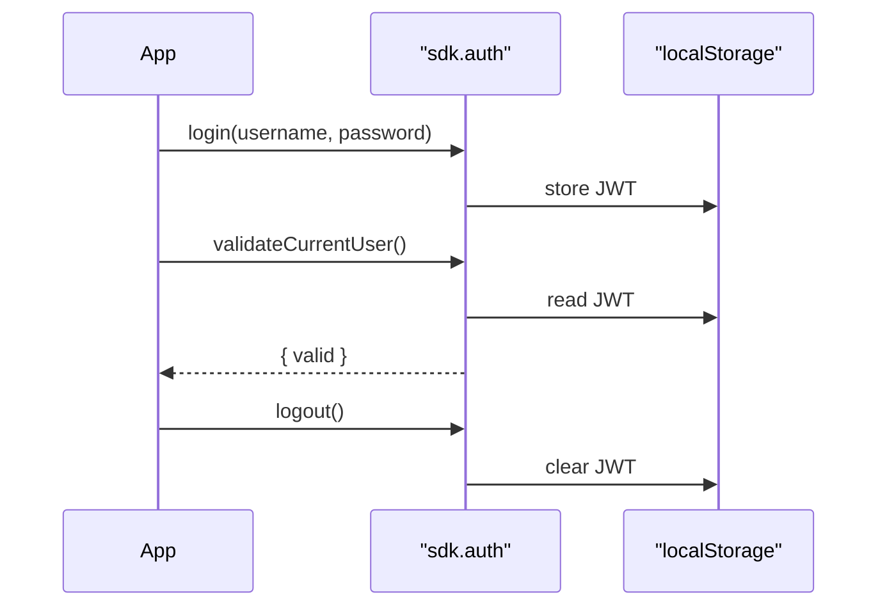

The `sdk.auth` namespace handles login, logout, the current user, and JWT validation. In
the browser the SDK stores the JWT in `localStorage`, so the session survives page
reloads. For permissions, groups, and user administration, see
[Authorization](/sdk/authorization/).

## Login and logout

```typescript
import { getOrInitializeSDK } from './sdk.service';

const sdk = await getOrInitializeSDK();

// Login — stores the JWT (localStorage in the browser)
await sdk.auth.login('username', 'password');

// Logout — clears the stored JWT
await sdk.auth.logout();
```

## The current user

```typescript
// Get the current authenticated user
const currentUser = await sdk.auth.getCurrentUser();
console.log(currentUser);
// { id, username, email, firstName, lastName, ... }

// Get the decoded JWT payload
const jwtData = await sdk.auth.getJWTData();
console.log(jwtData);
// { user_id, username, exp, ... }
```

## Validating the session

Check whether the stored JWT is still valid (for example on app load or before a
protected action), or validate an arbitrary token.

```typescript
// Validate the current user's JWT — returns { valid: boolean }
const { valid } = await sdk.auth.validateCurrentUser();
if (!valid) {
  window.location.href = '/login';
}

// Validate a specific JWT token
await sdk.auth.validateJWT(token);
```



## Auth service example

Wrap auth in a service, consistent with the
[service-layer architecture](/sdk/architecture/). The service can cache the current user
in memory and expose a simple boolean for session checks.

```typescript
// filepath: src/services/auth.service.ts
import { getOrInitializeSDK } from './sdk.service';
import type { SDK } from '@machhub-dev/sdk-ts';

class AuthService {
  private sdk: SDK | null = null;
  private currentUser: any = null;

  private async getSDK(): Promise<SDK> {
    if (!this.sdk) {
      this.sdk = await getOrInitializeSDK();
    }
    return this.sdk;
  }

  /** Login user — stores JWT in localStorage (or in-memory for Node.js) */
  async login(username: string, password: string): Promise<void> {
    const sdk = await this.getSDK();
    await sdk.auth.login(username, password);
    this.currentUser = await sdk.auth.getCurrentUser();
  }

  /** Logout user — clears stored JWT */
  async logout(): Promise<void> {
    const sdk = await this.getSDK();
    await sdk.auth.logout();
    this.currentUser = null;
  }

  /** Get current authenticated user */
  async getCurrentUser() {
    if (this.currentUser) return this.currentUser;
    const sdk = await this.getSDK();
    this.currentUser = await sdk.auth.getCurrentUser();
    return this.currentUser;
  }

  /** Validate current session. Returns false if JWT is expired or missing. */
  async validateSession(): Promise<boolean> {
    try {
      const sdk = await this.getSDK();
      const { valid } = await sdk.auth.validateCurrentUser();
      return valid;
    } catch {
      return false;
    }
  }

  /** Get decoded JWT payload */
  async getJWTData(): Promise<any> {
    const sdk = await this.getSDK();
    return sdk.auth.getJWTData();
  }
}

export const authService = new AuthService();
```

## Error handling

Distinguish an **environment** problem (no `localStorage`, i.e. not running in a
browser) from a **credentials** problem (wrong username or password).

```typescript
try {
  await sdk.auth.login(username, password);
} catch (error) {
  if (error.message.includes('localStorage')) {
    console.error('Browser environment required for authentication');
  } else if (error.message.includes('credentials')) {
    console.error('Invalid username or password');
  } else {
    console.error('Login failed:', error.message);
  }
}
```

:::caution[The SDK is client-side]
Authentication relies on `localStorage`, so it must run in the browser. In SSR
frameworks, perform login on the client only.
:::

## Checklist

- [ ] Login and logout implemented through a service.
- [ ] Session validated (`validateCurrentUser`) on app load.
- [ ] Current user fetched and stored in app state.
- [ ] Errors distinguished: `localStorage` (environment) vs `credentials`.
- [ ] Logout clears cached user state.

## Next

- Gate features by permission in [Authorization](/sdk/authorization/).
- Review the full API surface in the [Cheat Sheet](/sdk/cheatsheet/).
