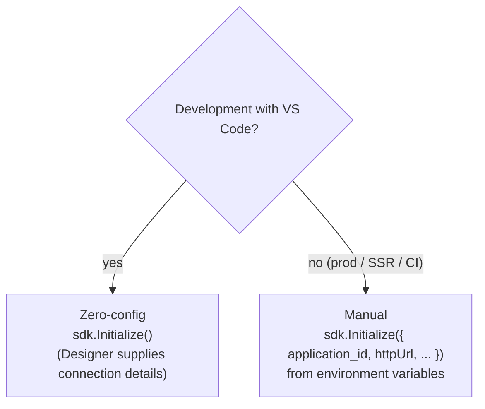

The official client is **`@machhub-dev/sdk-ts`** — a fully type-safe TypeScript SDK
for everything MACHHUB exposes: collections, auth, tags, historian, processes, and
more.

## Install

```bash
npm install @machhub-dev/sdk-ts
```

## Initialize

You create one `SDK` instance and call **`Initialize`** (note the capital **I**) once,
before using any feature.

```ts
import { SDK } from '@machhub-dev/sdk-ts';

const sdk = new SDK();
const ok = await sdk.Initialize(/* config? */); // returns Promise<boolean>
```

`Initialize` accepts an optional `SDKConfig`:

```ts
interface SDKConfig {
  application_id: string;   // Required — your application identifier
  developer_key?: string;   // Optional — developer authentication key
  httpUrl?: string;         // Optional — HTTP API endpoint
  mqttUrl?: string;         // Optional — MQTT broker (real-time)
  natsUrl?: string;         // Optional — NATS messaging server
}
```

### Two initialization modes



**Zero-config (development).** With the
[MACHHUB Designer](/designer/overview/) VS Code extension installed, call
`Initialize` with no arguments — the extension detects your local server and supplies
the connection details:

```ts
await sdk.Initialize();
```

**Manual (production / SSR / CI).** Provide connection details explicitly, typically
from environment variables:

```ts
await sdk.Initialize({
  application_id: process.env.MACHHUB_APP_ID!,
  httpUrl: process.env.MACHHUB_HTTP_URL,   // e.g. https://your-server:80
  mqttUrl: process.env.MACHHUB_MQTT_URL,   // e.g. wss://your-server:1884
});
```

| Variable | Purpose |
| --- | --- |
| `MACHHUB_APP_ID` | Your application identifier (`application_id`). |
| `MACHHUB_DEVELOPER_KEY` | Optional developer key. |
| `MACHHUB_HTTP_URL` | REST API endpoint. |
| `MACHHUB_MQTT_URL` | MQTT broker (use `wss://` in the browser). |
| `MACHHUB_NATS_URL` | NATS endpoint (if used). |

:::note[Dev vs prod URLs]
Local dev typically uses `http://localhost:80`, `mqtt://localhost:1883`. In the
browser/production, use secure WebSocket transports, e.g. `wss://your-server:1884`
for MQTT.
:::

## Use one shared instance (recommended)

Create the SDK **once** and reuse it everywhere. A small singleton avoids opening
multiple connections and makes the SDK easy to consume from a service layer:

```ts
import { SDK, type SDKConfig } from '@machhub-dev/sdk-ts';

let sdk: SDK | null = null;
let initPromise: Promise<boolean> | null = null;

export async function getOrInitializeSDK(config?: SDKConfig): Promise<SDK> {
  // The SDK is browser/client-side. Guard SSR environments.
  if (typeof window === 'undefined') throw new Error('SDK requires a browser environment');

  if (!sdk) sdk = new SDK();
  if (!initPromise) initPromise = sdk.Initialize(config);

  const ok = await initPromise;
  if (!ok) throw new Error('Failed to initialize MACHHUB SDK');
  return sdk;
}
```

:::caution[The SDK is client-side]
The SDK is designed to run in the browser. In SSR frameworks (Next.js, Nuxt,
SvelteKit) initialize it on the client only, and call the REST API directly from the
server when you need server-side data. Each [framework guide](/frameworks/overview/)
shows the exact pattern.
:::

## Next

- Structure your app with the [service-layer architecture](/sdk/architecture/).
- Start reading and writing data in [SDK → Collections](/sdk/collections/).
