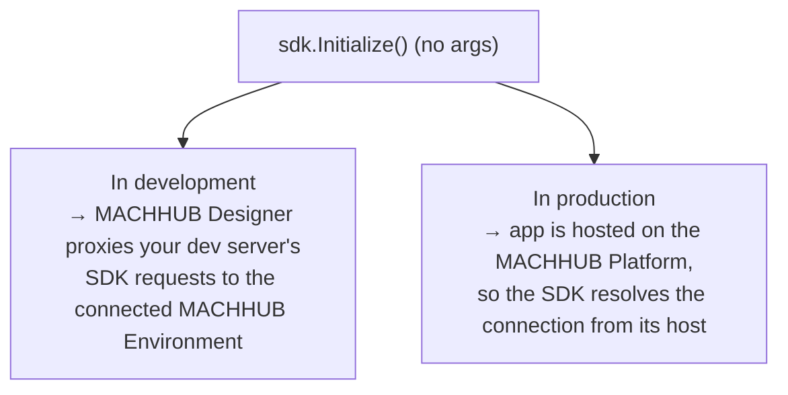

The official client is **`@machhub-dev/sdk-ts`** — a fully type-safe TypeScript SDK
for everything MACHHUB exposes: collections, auth, tags, historian, processes, and
more.

## Install

```bash
npm install @machhub-dev/sdk-ts
```

## Initialize

You create one `SDK` instance and call **`Initialize`** (note the capital **I**) once,
before using any feature.

```ts
import { SDK } from '@machhub-dev/sdk-ts';

const sdk = new SDK();
const ok = await sdk.Initialize(/* config? */); // returns Promise<boolean>
```

`Initialize` accepts an optional `SDKConfig`:

```ts
interface SDKConfig {
  application_id: string;   // Required — your application identifier
  developer_key?: string;   // Optional — developer authentication key
  httpUrl?: string;         // Optional — HTTP API endpoint
  mqttUrl?: string;         // Optional — MQTT broker (real-time)
  natsUrl?: string;         // Optional — messaging server URL
}
```

### No connection config (recommended)

**Call `Initialize` with no arguments — in both development and production.** This is
the recommended default. The SDK resolves the connection for you:

```ts
await sdk.Initialize();
```



- **In development**, the [MACHHUB Designer](/designer/overview/) extension proxies your
  dev server's SDK requests to the connected MACHHUB Platform (your **MACHHUB
  Environment**).
- **In production**, you deploy the app to the MACHHUB Platform (via the Designer), so
  it is served *by* the platform and the SDK reads its connection from the host
  automatically.

Either way, you don't hardcode URLs or keys.

### Manual config (only when you need it)

Pass an explicit `SDKConfig` **only** in these cases:

- You want to **hardcode** the connection in the frontend.
- You need to connect to a **different domain or server** than the one hosting the app.
- You **host the application yourself**, outside the MACHHUB Platform.

```ts
await sdk.Initialize({
  application_id: process.env.MACHHUB_APP_ID!,
  httpUrl: process.env.MACHHUB_HTTP_URL,   // e.g. https://your-server:80
  mqttUrl: process.env.MACHHUB_MQTT_URL,   // e.g. wss://your-server:1884
});
```

| Variable | Purpose |
| --- | --- |
| `MACHHUB_APP_ID` | Your application identifier (`application_id`). |
| `MACHHUB_DEVELOPER_KEY` | Optional developer key. |
| `MACHHUB_HTTP_URL` | REST API endpoint. |
| `MACHHUB_MQTT_URL` | MQTT broker (use `wss://` in the browser). |
| `MACHHUB_NATS_URL` | Messaging server URL (optional). |

:::note[Manual URLs]
Local dev typically uses `http://localhost:80`, `mqtt://localhost:1883`. In the
browser/production, use secure WebSocket transports, e.g. `wss://your-server:1884`
for MQTT.
:::

## Use one shared instance (recommended)

Create the SDK **once** and reuse it everywhere. A small singleton avoids opening
multiple connections and makes the SDK easy to consume from a service layer:

```ts
import { SDK, type SDKConfig } from '@machhub-dev/sdk-ts';

let sdk: SDK | null = null;
let initPromise: Promise<boolean> | null = null;

export async function getOrInitializeSDK(config?: SDKConfig): Promise<SDK> {
  if (!sdk) sdk = new SDK();
  if (!initPromise) initPromise = sdk.Initialize(config);

  const ok = await initPromise;
  if (!ok) throw new Error('Failed to initialize MACHHUB SDK');
  return sdk;
}
```

:::tip[Works on client and server]
The SDK runs in both browser and server contexts, so you can initialize and call it
during server-side rendering as well as on the client. Each
[framework guide](/frameworks/overview/) shows the idiomatic setup.
:::

## Next

- Structure your app with the [service-layer architecture](/sdk/architecture/).
- Start reading and writing data in [SDK → Collections](/sdk/collections/).
