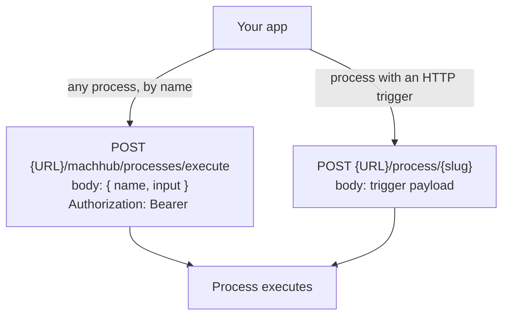

Processes are MACHHUB's **serverless functions** (Python or TypeScript) that run on the
backend, triggered by `cron`, `interval`, `tag_change`, `http`, or `manual`. This page
covers how to **call** a process from your app. To **author** processes — writing the
`execute(context)` body, configuring triggers, inputs, and outputs — see
[Processes overview](/processes/overview/).

## The `sdk.processes` namespace

After the SDK is initialized, three methods manage and invoke processes from the
frontend.

### `execute(name, input?)`

Runs a process by its domain-scoped name, regardless of which triggers it has
configured. The provided `input` keys are merged into `context.inputs`. Returns the
process's return value directly.

```typescript
execute(name: string, input?: Record<string, any>): Promise<any>
```

```typescript
const sdk = await getOrInitializeSDK();

// No input
const result = await sdk.processes.execute('processName');

// With input
const oee = await sdk.processes.execute('calculateOEE', {
  lineId: 'line1',
  shift: 'morning'
});
```

### `getProcesses()`

Returns all processes belonging to the current domain.

```typescript
getProcesses(): Promise<Process[]>
```

```typescript
const processes: Process[] = await sdk.processes.getProcesses();

for (const p of processes) {
  console.log(p.name, p.language, p.enabled, p.version);
}
```

### `changeTriggers(id, triggers)`

Replaces a process's entire trigger list with the provided array. Passing `[]` removes
all triggers. Returns the updated `Process`.

```typescript
changeTriggers(id: RecordID, triggers: ProcessTrigger[]): Promise<Process>
```

```typescript
import type { ProcessTrigger } from '@machhub-dev/sdk-ts';

const newTriggers: ProcessTrigger[] = [
  {
    type: 'cron',
    config: { cron_expression: '0 * * * *' }   // every hour
  },
  {
    type: 'tag_change',
    config: { tag: 'sensors/+/temperature' }
  }
];

const updated: Process = await sdk.processes.changeTriggers('processes:abc123', newTriggers);
```

The `id` accepts the `"processes:xxx"` string or a `RecordID` object — see
[Record IDs](/sdk/record-id/).

## Calling a process over HTTP

When you cannot use the SDK, processes can be reached directly over HTTP. There are two
forms.



### Execute by name

`POST {URL}/machhub/processes/execute` with a JSON body of `{ name, input }`. Send the
JWT (stored by the SDK in `localStorage['machhub_token']`) as a `Bearer` token.

```typescript
const MACHHUB_URL = import.meta.env.VITE_MACHHUB_HTTP_URL ?? 'http://localhost:80';

function getAuthHeader(): Record<string, string> {
  const token = localStorage.getItem('machhub_token');
  return token ? { Authorization: `Bearer ${token}` } : {};
}

const response = await fetch(`${MACHHUB_URL}/machhub/processes/execute`, {
  method: 'POST',
  headers: {
    'Content-Type': 'application/json',
    ...getAuthHeader()
  },
  body: JSON.stringify({ name: 'calculateKpi', input: { line: 'line1' } })
});

const result = await response.json();
```

### Call an HTTP-triggered endpoint

A process configured with an HTTP trigger exposes `POST {URL}/process/{slug}`. The
request body is passed to the process.

```typescript
// For a process with an HTTP trigger endpoint "my-endpoint"
const response = await fetch(`${MACHHUB_URL}/process/my-endpoint`, {
  method: 'POST',
  headers: { 'Content-Type': 'application/json' },
  body: JSON.stringify({ param1: 'value1' })
});
const result = await response.json();
```

:::note[Async outputs]
For execute-by-name and HTTP-triggered calls, the process **return value is sent to the
caller immediately**; configured outputs (SQL writes, tag writes) then run in the
background. This keeps HTTP latency low.
:::

## Type exports

The processes API types are exported from `@machhub-dev/sdk-ts`:

```typescript
import {
  Process,           // main process record interface
  ProcessTrigger,    // { type: TriggerType; config: TriggerConfig }
} from '@machhub-dev/sdk-ts';

import type {
  ProcessLanguage,   // 'python' | 'typescript'
  TriggerType,       // 'cron' | 'interval' | 'tag_change' | 'http' | 'manual'
  TriggerConfig,     // cron_expression, interval_value/unit, tag, endpoint
} from '@machhub-dev/sdk-ts';
```

## Next

- Author processes (code, triggers, inputs, outputs) in
  [Processes overview](/processes/overview/).
- Trigger server-side logic from tag changes with [Real-Time Tags](/sdk/realtime/).
- Caching and data-transform patterns in [Advanced](/sdk/advanced/).
