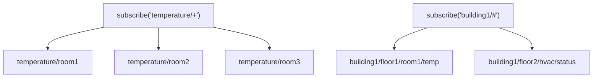

Tags are live signals in the Unified Namespace (UNS), delivered over MQTT. The
`sdk.tag` namespace lets you list tags, read the latest value, publish new values, and
subscribe to updates — including wildcard subscriptions across a topic hierarchy.

## Tag operations

### List and read

```typescript
import { getOrInitializeSDK } from './sdk.service';

const sdk = await getOrInitializeSDK();

// List all available tags
const tags = await sdk.tag.getAllTags();
console.log(tags); // ['temperature/room1', 'humidity/room1', ...]

// Get the current value of a tag
const current = await sdk.tag.getValue('temperature/room1');
```

### Publish

```typescript
// Publish a simple value
await sdk.tag.publish('temperature/room1', 25.5);

// Publish an object
await sdk.tag.publish('sensor/data', {
  value: 25.5,
  unit: 'celsius',
  timestamp: new Date().toISOString(),
  status: 'normal'
});
```

## Subscribing

The callback receives the value and, optionally, the concrete topic that fired (useful
with wildcards).

```typescript
// Single tag
await sdk.tag.subscribe('temperature/room1', (data) => {
  console.log('Temperature update:', data);
});

// With the topic name
await sdk.tag.subscribe('temperature/room1', (data, topic) => {
  console.log(`Update from ${topic}:`, data.value);
});
```

## Wildcard subscriptions

MQTT topics are hierarchical (`/`-separated). Two wildcards let one subscription match
many topics.

### Single-level wildcard `+`

Matches exactly **one** level.

```typescript
// All rooms' temperature
await sdk.tag.subscribe('temperature/+', (data, topic) => {
  console.log(`${topic}: ${data.value}`);
  // Matches: temperature/room1, temperature/room2
  // Does NOT match: temperature/building/room1
});

// All sensor types in room1
await sdk.tag.subscribe('+/room1', (data, topic) => {
  console.log(`${topic}: ${data.value}`);
  // Matches: temperature/room1, humidity/room1, pressure/room1
});
```

### Multi-level wildcard `#`

Matches **all** remaining levels.

```typescript
// ALL sensor data under sensor/
await sdk.tag.subscribe('sensor/#', (data, topic) => {
  console.log(`${topic}:`, data);
  // Matches: sensor/temp, sensor/room1/temp, sensor/building/floor1/room1/temp
});

// Everything under building1/
await sdk.tag.subscribe('building1/#', (data, topic) => {
  console.log(`${topic}:`, data);
});
```



## Unsubscribing

Always unsubscribe when a component unmounts to prevent memory leaks. Pass the topics to
remove as an array.

```typescript
// Unsubscribe specific tags
sdk.tag.unsubscribe(['temperature/room1', 'humidity/room1']);

let sdk: SDK;

async function setupSubscription() {
  sdk = await getOrInitializeSDK();
  await sdk.tag.subscribe('temperature/room1', handleUpdate);
}

// Call when the component/page unmounts
function cleanup() {
  if (sdk) {
    sdk.tag.unsubscribe(['temperature/room1']);
  }
}

setupSubscription();
```

## Common patterns

```typescript
// Dashboard: subscribe to all building sensors
async function setupDashboard() {
  const sdk = await getOrInitializeSDK();
  await sdk.tag.subscribe('building1/#', (data, topic) => {
    updateDashboard(topic, data);
  });
}

// Alert on threshold: persist a record when a value crosses a limit
await sdk.tag.subscribe('temperature/+', async (data, topic) => {
  if (data.value > 85) {
    await sdk.collection('alerts').create({
      type: 'temperature_high',
      sensor: topic,
      value: data.value,
      threshold: 85,
      timestamp: new Date()
    });
  }
});
```

:::tip[Store time-series in the Historian, not Collections]
Use Collections only for alerts and anomalies, master tag lists, and configuration.
Send **all** time-series readings to the [Historian](/sdk/historian/), which is built
for historical queries, trends, and aggregation. Writing every tag update into a
collection will not scale.
:::

## Checklist

- [ ] Subscriptions set up through a service.
- [ ] `unsubscribe([...])` called on cleanup/unmount.
- [ ] Wildcards (`+`, `#`) used where appropriate.
- [ ] Incoming data validated before processing.
- [ ] Alerts stored in Collections; time-series stored in the Historian.

## Next

- Query historical tag data in [Historian](/sdk/historian/).
- Run server-side logic on tag changes with [Processes](/sdk/processes/).
