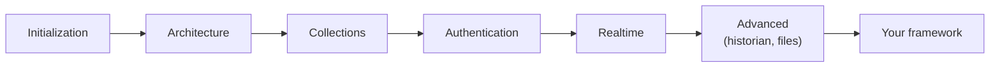

MACHHUB publishes a set of **AI agent skills** — structured guides and
**production-ready templates** that your AI coding assistant can use to scaffold
MACHHUB apps correctly. They live in the open-source
[`machhub-dev/skills`](https://github.com/machhub-dev/skills) repository.

The skills encode the same material as this documentation (SDK usage, framework
integration, config formats) in a form an agent can apply directly — so asking
*"initialize the MACHHUB SDK in my Angular project"* yields idiomatic, working code.

## What's included

- **Core SDK skills** — initialization, architecture, collections, authentication,
  authorization, realtime, file handling, processes, and advanced features.
- **Framework skills** — Angular, Next.js/React, Nuxt/Vue, and SvelteKit/Svelte.
- **Config-format skills** — Collection JSON and Permission JSON generation.
- **55 templates** — ready-to-copy `.ts`/`.tsx`/`.vue`/`.svelte`/`.py` files.

## Install the skills

Clone the repository:

```bash
git clone https://github.com/machhub-dev/skills.git
```

Then place the skill folders where your assistant looks for them:

| Tool | Project-level | User-level (global) |
| --- | --- | --- |
| **GitHub Copilot** | `.github/skills/` | `~/.copilot/skills/` |
| **Cursor** | `.cursor/skills/` | `~/.cursor/skills/` |
| **Claude** | `.claude/skills/` | `~/.claude/skills/` |

For example, to add them to a project for Copilot:

```bash
mkdir -p .github/skills
cp -r /path/to/skills/machhub-* .github/skills/
```

No further configuration is needed — assistants discover skills in those folders
automatically.

## Suggested learning path



## Pairs with the Designer

The skills work hand-in-hand with the [MACHHUB Designer](/designer/overview/)
extension's zero-config initialization: the skills generate the code, and the Designer
supplies the connection details in development.

:::note
The skills are released under the Mozilla Public License 2.0. Contributions
(bug fixes, new skills, improved templates) are welcome via pull request.
:::
