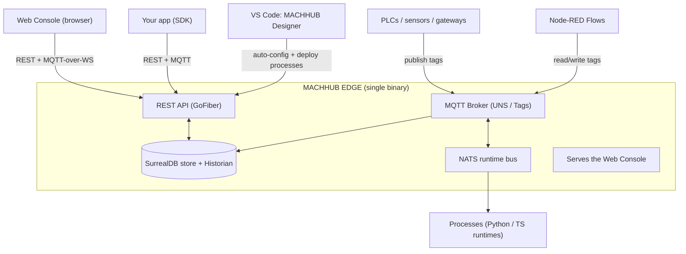

**MACHHUB** is a self-hostable **Industrial IoT (IIoT) platform** and *unified data
fabric*. It gives manufacturing and operations teams one place to **collect**,
**model**, **store**, **automate**, and **serve** their data — and gives developers
a type-safe SDK to build applications on top of it.

The whole platform ships as **MACHHUB EDGE**: a single Go binary that runs close to
your equipment (a cloud VM, an industrial PC, or a Raspberry Pi) and bundles
everything you need.

## Who is it for?

- **Operators & administrators** configure the platform through the **web console** —
  building data models, wiring up the Unified Namespace, enabling history, and
  managing users.
- **Application developers** use the **`@machhub-dev/sdk-ts`** SDK (and the
  **MACHHUB Designer** VS Code extension) to build dashboards, line-side apps, and
  integrations.
- **Integrators & device engineers** publish and subscribe to live **Tags** over
  MQTT, and bridge to other brokers with **Upstreams**.

## The building blocks

| Concept | What it is |
| --- | --- |
| **Domain** | A tenant/workspace. Data, users, groups, and namespaces all belong to a domain. The built-in admin domain is `domains:machhub_admin`; each app you create is an *Application* domain. |
| **Collection** | A typed data table (schema + records) with fields, relations, and indexes. Think "your database, modeled in the console." |
| **Unified Namespace (UNS)** | A hierarchical tree of **namespaces → folders → tags** that mirrors your plant. Every **tag** maps to an MQTT topic. |
| **Tag** | A single live signal (a leaf in the UNS). You publish/subscribe to its value over MQTT in real time. |
| **Historian** | Time-series storage. Any tag can be *historized* (on-change or sampled) with a retention policy, then queried or exported. |
| **Process** | A **serverless function** (Python or TypeScript) that runs on the platform. Triggered by a schedule, a tag change, an HTTP call, or manually. |
| **Flow** | A **Node-RED** visual automation that reads and writes UNS tags through custom MACHHUB nodes. |
| **Upstream** | An MQTT bridge that forwards parts of your UNS to (or from) another broker. |
| **SDK** | The official TypeScript client, `@machhub-dev/sdk-ts`, for building apps against all of the above. |
| **Designer** | A VS Code extension that auto-configures the SDK and helps author Processes. |

:::note[Processes vs. Flows]
These are **two different features**. **Processes** are serverless *functions* you
write in code; **Flows** are *Node-RED* visual pipelines. See
[Processes & Flows](/concepts/processes-and-flows/) for the full comparison.
:::

## How the pieces fit together

## What you can build

- **Real-time dashboards** that subscribe to tags and render live values and charts.
- **OEE / DAQ / quality apps** backed by Collections and the Historian.
- **Automations** — alerting, data transforms, ERP/MES integrations — as Processes or Flows.
- **Edge-to-cloud pipelines** that bridge selected tags upstream over MQTT.

## Where to go next

- New to the platform? Continue with the [Quickstart](/start-here/quickstart/).
- Want the mental model first? Read [Architecture](/concepts/architecture/).
- Self-hosting? Jump to [Install & Self-Hosting](/install/overview/).
- Building an app? Go to [SDK initialization](/sdk/initialization/).
