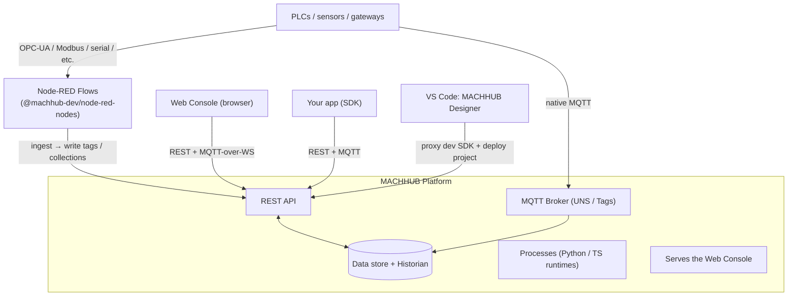

**MACHHUB** is a self-hostable **Industrial IoT (IIoT) platform** and *unified data
fabric*. It gives manufacturing and operations teams one place to **collect**,
**model**, **store**, **automate**, and **serve** their data — and gives developers
a type-safe SDK to build applications on top of it.

The whole product ships as **MACHHUB Platform**: a single self-contained service that
runs at **any level of your deployment stack** — from a Raspberry Pi on the plant floor
all the way up to an enterprise server or a cloud VM — and bundles everything you need.

| Deployment level | Typical host                             |
| ---------------- | ---------------------------------------- |
| **Edge**         | Raspberry Pi, industrial PC, PLC gateway |
| **On-line**      | Line-side server, MES host               |
| **On-site**      | Site/plant-level server, on-premise rack |
| **Enterprise**   | Corporate data center                    |
| **Cloud**        | Cloud VM or managed container            |

## Who is it for?

- **Administrators** manage users and domains through the **web console**.
- **Application developers** build data models (Collections) using the console, then
  use the **`@machhub-dev/sdk-ts`** SDK and the **MACHHUB Designer** VS Code extension
  to build dashboards, line-side apps, and Manufacturing Execution System (MES) applications.
- **Integrators & device engineers** wire the Unified Namespace, enable Historian on
  tags, publish and subscribe to live **Tags** over MQTT, and bridge to other MACHHUB
  instances with **Upstreams**.

## The building blocks

| Concept                     | What it is                                                                                                                                                                            |
| --------------------------- | ------------------------------------------------------------------------------------------------------------------------------------------------------------------------------------- |
| **Domain**                  | A tenant/workspace. Data, users, groups, and namespaces all belong to a domain. The built-in admin domain is `domains:machhub_admin`. |
| **Application**              | A user-developed app you build and deploy on MACHHUB, with its own runtime (start/stop, served on a port). Today each Application is backed by an application-type domain; the two are being separated. |
| **Collection**              | A typed data table (schema + records) with fields, relations, and indexes. Think "your database, modeled in the console."                                                             |
| **Unified Namespace (UNS)** | A hierarchical tree of **namespaces → folders → tags** that mirrors your plant. Every **tag** maps to an MQTT topic.                                                                  |
| **Tag**                     | A single live signal (a leaf in the UNS). You publish/subscribe to its value over MQTT in real time.                                                                                  |
| **Historian**               | Time-series storage. Any tag can be *historized* (on-change or sampled) with a retention policy, then queried or exported.                                                            |
| **Process**                 | A **serverless function** (Python or TypeScript) that runs on the platform. Triggered by a schedule, a tag change, an HTTP call, or manually.                                         |
| **Flow**                    | A **Node-RED** visual pipeline for ingesting data from physical devices — PLCs, sensors, and other sources not natively supported by MACHHUB. Flows use the `@machhub-dev/node-red-nodes` library to read/write **Tags** and interact with **Collections** and the database, bridging device data into the platform. |
| **Upstream**                | An MQTT bridge that mirrors parts of your UNS to (or from) another **MACHHUB instance** (e.g. an edge MACHHUB up to a central one).                                                    |
| **SDK**                     | The official TypeScript client, `@machhub-dev/sdk-ts`, for building apps against all of the above.                                                                                    |
| **Designer**                | A VS Code extension that connects to a MACHHUB Platform (your *MACHHUB Environment*), manages source/builds in a sidebar, deploys your project from the editor, and proxies your dev server's SDK requests to the platform. |

:::note[Processes vs. Flows]
These are **two different features**. **Processes** are serverless *functions* you
write in code; **Flows** are *Node-RED* visual pipelines. See
[Processes & Flows](/concepts/processes-and-flows/) for the full comparison.
:::

## How the pieces fit together

## What you can build

- **Real-time dashboards** that subscribe to tags and render live values and charts.
- **OEE / DAQ / quality apps** backed by Collections and the Historian.
- **Manufacturing Execution System (MES) apps** — work orders, traceability, and
  production tracking on Collections, tags, and the Historian.
- **Warehouse Management System (WMS) apps** — inventory, locations, and
  receiving/picking workflows backed by Collections.
- **Automations** — alerting, data transforms, ERP/MES integrations — as Processes.
- **Device ingestion pipelines** — bridge PLCs, sensors, and unsupported protocols into the platform via Node-RED Flows.
- **Edge-to-cloud pipelines** that bridge selected tags upstream over MQTT.

## Where to go next

- New to the platform? Continue with the [Quickstart](/start-here/quickstart/).
- Want the mental model first? Read [Architecture](/concepts/architecture/).
- Self-hosting? Jump to [Install & Self-Hosting](/install/overview/).
- Building an app? Go to [SDK initialization](/sdk/initialization/).
